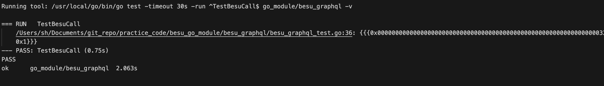
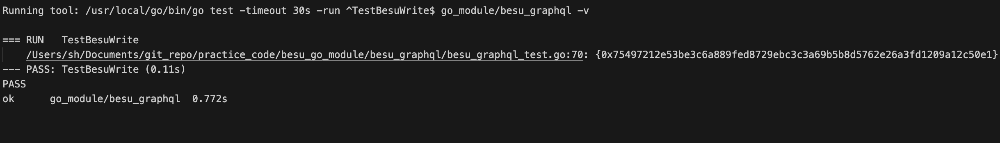

# [GraphQL] Hyperledger Besu GraphQL (1/2) - 단일 요청


:link: [Hyperledger Besu 소개](https://dev-ote.tistory.com/37)


Hyperledger Besu로 요청을 보낼 때, GraphQL을 사용하여 조금 더 효율적으로 요청하고자 한다. GraphQL의 주요 특징으로 overfetching 해결과 underfetching 방지가 있다. 이는 하나의 요청만으로도 필요한 데이터들만 골라서 여러 종류의 데이터를 가져올 수 있게 해준다. 기존 방식으로는 불필요한 데이터를 함께 받으면서, 여러 요청을 Besu에 호출해야 하기에, GraphQL을 사용하면 요청 처리에 있어서 더 효율적으로 개선될 것이라 기대된다.

Besu에 Grapqhl를 사용했을 때 어느 정도로 효율성이 높아지는지와, 사용함에 있어서의 불편함과 한계점에 대해서 알아보고자 한다. 이를 위해 아래 두 개의 작업에 대해서 GraphQL을 사용하고자 한다. 

1. 특정 블록 번호에서의 스마트 컨트랙트 데이터 다중 조회 
2. 다중 서명 트랜잭션 전송 

작업의 두 개의 포스트로 나누어서 정리할 것이며, 이번 포스트에서는 Besu의 `schema.graphql` 파일을 살펴보며, 위 두 가지 작업에 필요한 내용과 Graphql을 통한 단건 요청을 하는 법에 대해서 정리할 것이다. 다음 포스트에서는 Graphql을 통한 다중 요청을 보내는 법을 정리하고자 한다.


## schema.graphql 주요 부분


:link: [Besu GraphQL 전체 스키마](https://github.com/hyperledger/besu/blob/main/ethereum/api/src/main/resources/schema.graphqls)


#### Type Query

```
type Query {

  block(number: Long, hash: Bytes32): Block

  blocks(from: Long, to: Long): [Block!]!

  pending: Pending!

  transaction(hash: Bytes32!): Transaction

  logs(filter: FilterCriteria!): [Log!]!

  gasPrice: BigInt!

  maxPriorityFeePerGas: BigInt!

  syncing: SyncState

  chainID: BigInt!
}
```

Besu 서버로부터 Query로 데이터를 가져올 수 있는 최상위 객체들이 명시되어 있는 부분이다.

- `block(number: Long, hash: Bytes32): Block`
  - 주어진 number 혹은 hash값에 대응되는 block 정보를 반환한다.
  - 인자가 둘 다 주어지지 않을 경우, 가장 최신의 block을 반환한다.
- `blocks(from: Long, to: Long): [Block!]!`
  - from 이상 to 이하의 번호들에 대한 block들을 반환한다.
  - to 값이 없을 경우, 가장 최신의 block 번호가 기본값으로 설정된다.
- `pending: Pending!`
  - 현재의 보류 상태를 반환한다.
- `transaction(hash: Bytes32!): Transaction`
  - hash 값으로 특정되는 트랜잭션을 반환한다.
- `logs(filter: FilterCriteria!): [Log!]!`
  - 주어진 필터 정보와 매칭되는 로그들을 반환한다.
- `gasPrice: BigInt!`
  - 트랜잭션이 채굴되는 것을 보장하는 가스 가격의 추정치를 반환한다.
- `maxPriorityFeePerGas: BigInt!`
  - 트랜잭션이 채굴되는 것을 보장하는 가스 tip 추정치를 반환한다.
- `syncing: SyncState`
  - 현재의 동기화 상태에 대한 정보를 반환한다.
- `chainID: BigInt!`
  - chain ID 값을 반환한다.


현재는 "특정 블록 번호에서의 다중 데이터 조회"를 수행하기 위해 `block` object만을 주로 살펴볼 것이다. 추가적인 기능이 필요 시, 반환되는 Object 정의를 보고 필요한 Object에 대한 argument와 field들을 명시하며 쿼리를 추가 생산해야 한다.


#### Blcok 조회를 위한 필요 스키마

```
type Block {
  
  # 기타 field 생략 
  
  call(data: CallData!): CallResult
}

input CallData {
  from: Address
  to: Address
  gas: Long
  gasPrice: BigInt
  maxFeePerGas: BigInt
  maxPriorityFeePerGas: BigInt
  value: BigInt
  data: Bytes
}

type CallResult {
  data: Bytes!
  gasUsed: Long!
  status: Long!
}
```

- `Block`
  - 특정 블록 번호에서 스마트 컨트랙트의 데이터를 조회하기 위해, 명시한 블록에서 스마트 컨트랙트의 조회 함수를 실행하기 위해 사용할 Object이다.
  - `call` field에 `CallData` type을 argument로 전달하면, `CallResult` type을 반환한다.
- `CallData`
  - `input` 타입으로 `Block`의 `call` 필드의 인자로만 사용된다.
  - 모든 field들은 선택적(optional)이며, 호출할 대상에 따라 필요한 field들을 정의해야만 정상적으로 호출할 수 있다.
  - 스마트 컨트랙트의 데이터를 조회를 위해서는 컨트랙트 주소가 들어가는 `to` 필드와 실행할 메소드와 파라미터들을 인코딩한 값이 들어가는 `value` 필드를 채워야 한다.

- `CallResult`
  - `data` : 메소드 실행 결과 값이 byte 타입으로 반환된다. (디코딩 필요)
  - `gasUsed` : 메소드 수행에 사용된 gas 양이 반환된다.
  - `status` : 결과 상태 값이 반환되며, 1일 시 성공, 0일 시 실패를 의미한다.


### 상태 변경을 위한 Mutation

"다중 서명 트랜잭션 전송" 작업은 besu의 상태 변경을 일으키는 작업이기에 Mutation을 확인해본다.

```
type Mutation {
  sendRawTransaction(data: Bytes!): Bytes32!
}
```

- 상태 변경을 일으키는 Mutation Type으로는 `sendRawTransaction`만이 존재한다.
- `sendRawTransaction`의 argument로는 **서명된** 트랜잭션이 필요하다.

​	:bulb: GraphQL에서 서명 작업은 불가하며, 여러 개의 서명된 트랜잭션을 한 번에 반영시키는 것은 가능하다.

- 결과값으로는 Transaction Hash를 반환한다.


## 단일 Besu Graphql Querying


### 환경

Besu에 Graphql 요청을 보내기 위해서는 Besu 네트워크와 Client 세팅이 필요하다. 

우선, Besu 네트워크는 이전 포스트에서 작업한 환경을 그대로 사용한다.

- :link: [[Hyperledge Besu] Hyperledge Besu Docker Node로 Private Network 생성하기](https://dev-ote.tistory.com/61)

설정 완료 후, 터미널에서 besu graphql 포트에 graphql 스키마를 조회하는 쿼리를 날려봄으로써 설정이 잘 되었는지 확인할 수 있다.

```sh
curl -X POST -H "Content-Type: application/json" --data '{ "query": "{__schema { queryType { fields { name } }}}"}' http://localhost:8547/graphql
```


Client의 경우 GraphQL로 스마트 컨트랙트 조회/변경 요청을 보내고자하여, 컨트랙트의 작업이 필요하다. 이에 Client 설정도 이전 포스트에서 컨트랙트 관련 작업한 환경을 이어서 사용한다.

- :link: [[Hyperledger Besu] 스마트 컨트랙트 (Golang))](https://dev-ote.tistory.com/62)

Client는 Go언어로 작성하였으며, Graphql 요청을 작업에는 `go-ethereum`과 `machinebox/graphql` 라이브러리를 사용한다.


### 단일 조회

#### call query 작성

schema.graphql에 정의된 모습대로 쿼리의 틀을 작성한다. `blockNumber`와 `callData`를 변수로 받는다.

```go
var callQuery = `
	query getCall($blockNumber: Long, $callData: CallData!) {
		block(number: $blockNumber){
			call1 : call(data: $callData){
						data, 
						gasUsed, 
						status
					}
			}
		}
`
```


#### input CallData 정의

변수로 입력해야 할 `callData`에 관한 내용을 struct type으로 정의한다. 이때, 모든 field를 정의할 필요는 없고 사용에 필수적인 field들만 정의하여도 무방하다.

```go
type Call struct {
	To   string `json:"to"`
	Data string `json:"data"`
}
```


#### CallResult 정의

응답 데이터의 스키마에 맞게 struct를 정의해둔다. 응답 결과의 스키마를 사전에 알기 힘들다면, 별도의 struct를 정의하지 않고 `json.RawMessage`로 응답 결과를 받을 변수를 정의해 string으로 변환해 조회해 볼 수 있다.

```go
type BlockCallResp struct {
	Block struct {
		CallResp struct {
			Data    string `json:"data"`
			GasUsed string `json:"gasUsed"`
			Status  string `json:"status"`
		} `json:"call1"`
	} `json:"block"`
}

```


#### Graphql 조회 쿼리 생성 및 요청

정의한 변수와 type을 가지고, 외부에서 변수를 받아 쿼리를 생성해서 요청을 보내는 메소드를 작성한다.

```go
var client = graphql.NewClient(config.Config.Network.GraphqlUrl) // Besu의 Graphl url 및 포트 정보

func BesuCall(bn *big.Int, callData Call) (BlockCallResp, error) {

	req := graphql.NewRequest(callQuery)

	req.Var("blockNumber", bn)
	req.Var("callData", callData)

	var res BlockCallResp

	err := client.Run(context.Background(), req, &res)
	if err != nil {
		return BlockCallResp{}, fmt.Errorf("client run 에러 %w", err)
	}

	return res, nil
}
```


### 단일 변경

#### mut query 작성

`mutData`를 변수로 받는다. 이때, `mutData`는 RLP-encoded transaction 값으로, `go-ethereum`의 `rlp.EncodeToBytes` 함수를 통해서 트랜잭션을 인코딩한 결과값을 사용한다.

```go
var mutQuery = `
	mutation($mutData: Bytes!) {
		tx: sendRawTransaction(data: $mutData)
		}
`
```


#### mutation 응답 정의

```go
type MutResp struct {
	Hash string `json:"tx"`
}
```


#### Graphql 변경 쿼리 생성 및 요청

조회의 경우와 동일하게 필요한 변수를 파라미터로 받아 쿼리를 생성해서 요청을 보내는 함수를 작성한다.

```go
func BesuWrite(tx string) (MutResp, error) {

	req := graphql.NewRequest(mutQuery)

	req.Var("mutData", tx)

	var txHash MutResp

	err := client.Run(context.Background(), req, &txHash)
	if err != nil {
		return MutResp{}, fmt.Errorf("client run 에러 %w", err)
	}

	return txHash, nil

}
```


### 테스트

#### 조회

```go
func TestBesuCall(t *testing.T) {

	abi, err := transaction.AgeInfoStrageMetaData.GetAbi()
	if err != nil {
		t.Error(err)
	}

	data, err := abi.Pack("getAge", "Jo")
	if err != nil {
		t.Error(err)
	}

	rtn, err := BesuCall(nil, Call{
		To:   cntr_addr,
		Data: "0x" + hex.EncodeToString(data),
	})
	if err != nil {
		t.Error(err)
	}

	t.Log(rtn)
}
```




#### 변경

```go
func TestBesuWrite(t *testing.T) {

	abi, err := transaction.AgeInfoStrageMetaData.GetAbi()
	if err != nil {
		t.Error(err)
	}

	data, err := abi.Pack("setAge", "min", big.NewInt(29))
	if err != nil {
		t.Error(err)
	}

	address := common.HexToAddress(cntr_addr)

	account := config.Config.Accounts["account1"]

	tx, err := transaction.CreateSignedTx(account.PrivateKey[2:], &address, nil, data)
	if err != nil {
		t.Error(err)
	}

	encoded, err := rlp.EncodeToBytes(tx)
	if err != nil {
		t.Error(err)
	}

	rtn, err := BesuWrite("0x" + common.Bytes2Hex(encoded))
	if err != nil {
		t.Error(err)
	}

	t.Log(rtn)
}
```




## 전체 코드

:link: https://github.com/ChoSanghyuk/practice_code/tree/master/besu_go_module/besu_graphql

