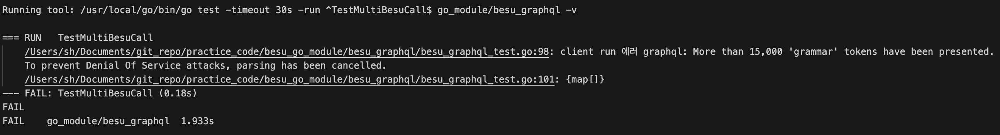
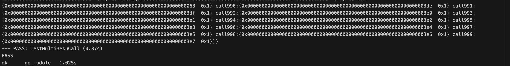
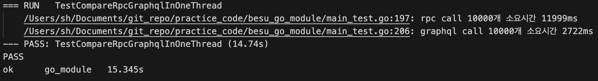
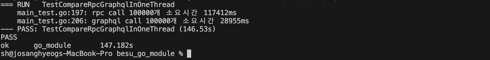
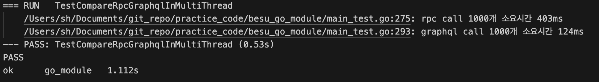
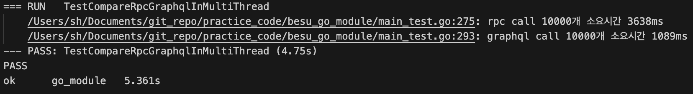
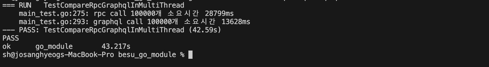

# [GraphQL] Hyperledger Besu GraphQL (2/2) - 다중 요청


이전 포스트에 이어서 Graphql을 통한 다중 요청을 보내는 법을 정리하고자 한다. Graphql 쿼리에 다중 요청을 담아서 보냈을 때, 개별적인 rpc call를 통한 방식에 비해서 어느 정도 효율성이 개선되는지 확인해 볼 것이다.


## Graphql 기대 효과

우선, Graphql을 사용하였을 때 효율성이 개선될 것이라 기대되는 이유로는 다음 3가지가 있다.

1.. 네트워크 부하 감소

여러 개의 요청을 개별적인 rpc call로 보낸다는 것은 매 요청마다 connection 연결, 요청 전송, 응답 대기, connection 해제의 작업을 반복해야 함을 의미한다. 하지만 하나의 graphql 쿼리에 여러 요청을 담아서 보낸다면, 한번의 사이클로 모든 요청을 처리할 수 있다. Graphql을 사용하면, 네트워크 통신에 필요한 작업을 최소화 시킬 수 있다.

2.. 서버의 작업 최적화

개별적인 rpc call은 서버에서도 매 요청을 개별적으로 처리함을 의미한다. 이 경우, 매 요청마다 반복적으로 수행되는 작업이 존재할 수 있다. 하지만, Graphql 요청으로 모든 요청을 한번에 담아 보낸다면, 서버 내부적으로 요청 처리를 최적화 시키는 로직을 기대해 볼 수 있다.

3.. 불필요한 데이터 fetch 방지

Graphql의 overfetching 방지는 여러 개의 요청을 담아 보내야할 때 더 효과적이다. 불필요한 데이터까지 받아오는 rpc call은 개별적인 요청의 횟수가 증가할 수록 부하가 증가하는 것에 비해, Graphql은 불필요한 데이터는 받아오지 않는다.


## 다중 Besu Graphql Querying


### 다중 조회

다중 요청을 한번에 담아 보내는 쿼리도 단일 쿼리와 유사하게 작성한다. 차이점으로는 요청의 개수가 동적으로 정해질 수 있게끔, variable과 call을 동적으로 생성할 수 있도록 코드를 작성한다.

```go
type MultiCallsResp struct {
	Block map[string]CallResp `json:"block"`
}

var multiCallQuery = `
	query getCall($blockNumber: Long%s) {
		block(number: $blockNumber){
			%s
		}
	}
	fragment callFields on CallResult {
		data, 
		status
	}
`
var callForm = `
	call%d : call(data: $callData%d){
		...callFields
	}
`
var callVariableForm = "$callData%d: CallData!"


func BesuMultiCall(bn *big.Int, callDatas []Call) (MultiCallsResp, error) {

	var varBuilder strings.Builder
	var callBuilder strings.Builder

  // 파라미터로 받은 callData의 수에 따라, 변수와 call 요청을 동적으로 생성
	for i := range len(callDatas) { 

		varBuilder.WriteString(", ")
		varBuilder.WriteString(fmt.Sprintf(callVariableForm, i))

		callBuilder.WriteString(fmt.Sprintf(callForm, i, i))

	}

  // 동적으로 생성한 변수 영역과 와 call 요청들로 query 작성
	query := fmt.Sprintf(multiCallQuery, varBuilder.String(), callBuilder.String())

	req := graphql.NewRequest(query)

  // 변수 입력
	req.Var("blockNumber", bn)

	for i, call := range callDatas {
		req.Var(fmt.Sprintf("callData%d", i), call)
	}

	var res MultiCallsResp

	err := client.Run(context.Background(), req, &res)
	if err != nil {
		return MultiCallsResp{}, fmt.Errorf("client run 에러 %w", err)
	}

	return res, nil
}


```


### 다중 변경

다중 변경 함수도 다중 조회 함수와 같은 방식으로 작성한다.

```go
var multiMutQuery = `
	mutation(%s) {
		%s
	}
`
var mutForm = "tx%d: sendRawTransaction(data: $mutData%d) "
var mutVariableForm = "$mutData%d: Bytes!"

func BesuMultiWrite(txs []string) (map[string]string, error) {

	var varBuilder strings.Builder
	var callBuilder strings.Builder

	for i := range len(txs) {
		varBuilder.WriteString(fmt.Sprintf(mutVariableForm, i))
		callBuilder.WriteString(fmt.Sprintf(mutForm, i, i))

		if i < len(txs)-1 {
			varBuilder.WriteString(", ")
			callBuilder.WriteString(", ")
		}
	}

	query := fmt.Sprintf(multiMutQuery, varBuilder.String(), callBuilder.String())

	fmt.Println(query)
	req := graphql.NewRequest(query)

	for i, tx := range txs {
		req.Var(fmt.Sprintf("mutData%d", i), tx)
	}

	var res map[string]string

	err := client.Run(context.Background(), req, &res)
	if err != nil {
		return nil, fmt.Errorf("client run 에러 %w", err)
	}

	return res, nil
}
```


### 테스트

1000개의 조회 요청을 하나의 쿼리로 담아 요청을 보낸다.

```go
func TestMultiBesuCall(t *testing.T) {

	n := 1000

	abi, err := transaction.AgeInfoStrageMetaData.GetAbi()
	if err != nil {
		t.Error(err)
	}

	callDatas := make([]Call, n)

	for i := range n {
		data, err := abi.Pack("getAge", fmt.Sprintf("name%d", i))
		if err != nil {
			t.Error(err)
		}
		callDatas[i] = Call{
			To:   cntr_addr,
			Data: "0x" + hex.EncodeToString(data),
		}
	}

	rtn, err := BesuMultiCall(nil, callDatas)
	if err != nil {
		t.Error(err)
	}

	t.Log(rtn)
}
```




테스트를 수행해본 결과, "More than 15,000 'grammar' tokens have been presented."라는 메시지와 함께 서비스 거부 공격을 방지하기 위하여 요청이 취소되었다는 에러가 반환됨을 알 수 있다. 여기서 토큰이란, 쿼리를 구성하는 가장 작은 단위들로, 키워드, 문장 부호와 같은 것들을 의미한다. Besu에서는 하나의 쿼리가 너무 많은 요청을 담지 못 하도록 크기를 제한하고 있음을 알 수 있다.

이와 유사하게, 요청의 사이즈를 조절하다 보면 "maximum query complexity exceeded 204 > 200" 라는 에러 메시지가 나올 때가 있다. Graphql 서버는 쿼리의 complexity score을 계산하여, 특정 복잡도를 넘어서는 쿼리는 에러를 반환하도록 설정하고 있다. Besu의 복잡도 제한은 200으로 해당 복잡도 밑으로 쿼리를 생성하여 요청을 보내야 한다.

:bulb: complexity limit은 besu ~~에 하드 코딩으로 값이 200으로 설정되어 있다. 이 값을 수정해서 build한다면 더 복잡한 쿼리로 요청을 보낼 수 있지만, Besu의 부하를 막기 위한 값이기에 신중하게 고려하여 값을 변경해야 할 것이다.


Mutation 요청 시 알아낸것


Besu는 transaction gas limit을 보고 한 블랙에 담을 트랜잭션의 개수를 정한다.

한 블록이 생성되기 전에 Mutation 쿼리가 complexity limit을 초과하는 양으로 보내진다면 에러가 발생한다. (요청을 몇번에 나누어서 보내는 것과 상관 없이, 블록이 새로 생성되기 전까지 몇개의 Mutation이 왔느냐가 기준)




















