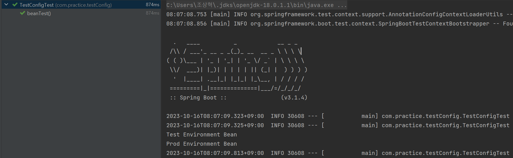

# [Spring] @TestConfiguration


토비의 스프링 3.1을 읽던 중 운영과 테스트 환경에서의 컨텍스트 분리에 대한 개념을 배웠다.

해당 책에서는 `@Profile`를 통해서 테스트용 Context를 설정하는 방식으로 분리하였지만, 추가적으로 `@TestConfiguration`를 통해서 분리시키는 방법도 존재하여 `@TestConfiguration`에 대해서 정리해보고자 한다.


## 개념

`@TestConfiguration`은 **테스트에 대한 추가적인 빈이나 커스텀을 정의**하는 데 사용할 수 있는 `@Configuration`이다. 

공식 문서를 살펴보면, `@Configuration` 클래스와 달리 `@TestConfiguration`을 사용해도 `@SpringBootConfiguration`의 자동 감지를 막지 않는다고 되어 있다. 이는 테스트에서 `@TestConfiguration`를 사용하더라도,  `@TestConfiguration`에 등록된 빈 뿐만 아니라 실제 운영 환경에서 등록되는 빈들도 모두 등록됨을 의미한다.


## 사용 방법

`@TestConfiguration`를 사용하는 방식에는 두 가지가 있다.

첫 번째는 별도의 `@TestConfiguration` 클래스를 생성하여 테스트용 빈들을 모두 등록시키는 것이다. 여러 테스트 파일에서 공통으로 사용할 수 있는 테스트용 빈들을 선언하는 방식이다. 이때,  테스트 클래스에서 `@Import`를 통해 해당 Config 클래스를 등록시켜야지만 테스트 기동 시 `@TestConfiguration` 클래스 내 빈들이 등록된다.

:bulb: `@Import`

- 한 개 혹은 그 이상의 명시된 Configuration 클래스들의 컴포넌트들을 Import 한다.

   (`@Import(Config1.class)` 혹은 `@Import({Config1,class, Config2.class}) 처럼 사용) `

- `@Configuration` 이외의 리소스(ex xml 파일)를 가져와야 하는 경우 `@ImportResource` 어노테이션을 대신 사용 한다.


두 번째는 테스트 클래스에 `static inner class`를 만드는 것이다.  `static inner class`를 포함한 테스트 파일에서만 해당 빈을 사용하는 방식이다.


### [ 예제 코드 ]

#### 빈으로 등록시킬 오브젝트의 클래스 코드

```java
public class MyBean {

    private String words;

    public MyBean(String words){
        System.out.println(words);
        this.words = words;
    }

    public String getWords(){
        return words;
    }
}
```

환경별로 어떤 빈들이 생성되는지 확인하기 위하여, 생성자가 호출될 때 어떤 문자열을 주입받았는지 프린트하도록 하였다.


#### 운영환경에서 사용할 빈

```java
@Configuration
public class AppConfig {

    @Bean
    public MyBean myBean(){
        return new MyBean("Prod Environment Bean");
    }
}
```


#### CASE 1. 별도의 `@TestConfiguration` 클래스 생성

```java
@TestConfiguration
public class TestConfig {

    @Bean
    public MyBean myTestBean(){
        return new MyBean("Test Environment Bean");
    }
}
```

```java
@SpringBootTest
@Import(TestConfig.class)
public class TestConfigTest {

    @Autowired
    private MyBean myTestBean;

    @Test
    public void beanTest(){
        assertTrue(myTestBean.getWords().equals("Test Environment Bean"));
    }
}
```


#### CASE 2. static inner class 생성

```java
@SpringBootTest
public class TestConfigTest {

    @Autowired
    private MyBean myTestBean;

    @Test
    public void beanTest(){
        assertTrue(myTestBean.getWords().equals("Test Environment Bean"));
    }
    
    @TestConfiguration
    static class TestConfig {

        @Bean
        public MyBean myTestBean(){
            return new MyBean("Test Environment Bean");
        }
    }
}
```


### [ 실행 결과 ]

#### 어플리케이선 구동시


실제 프로젝트를 기동할 때에는 `@TestConfiguration` 클래스에 등록된 bean들은 생성되지 않는다.


#### 테스트 코드 실행 시



하지만, 테스트 코드를 실행할 때에는 `@TestConfiguration` 클래스 뿐만 아니라 `@Configuration` 클래스의 빈들도 모두 등록되어진다. 하지만 테스트 코드에서는 `@TestConfiguration` 클래스의 빈이 사용되어 테스트가 통과되었다.


## 주의사항

테스트 케이스 실행 시에는 `@TestConfiguration` 클래스 뿐만 아니라 `@Configuration` 클래스의 빈들도 모두 등록되어지기 때문에, **테스트용으로 사용되는 빈을 운영에서 등록되는 빈과 같은 이름으로 짓는다면 빈 충돌로 인해서 에러가 발생**하게 된다.  빈 충돌 에러를 피하기 위해서는 두 가지 방법을 사용할 수 있다.


### 1. 서로 다른 이름을 가진 운영과 테스트 환경의 빈

첫번째는, `@TestConfiguration` 클래스에 등록되는 빈은 `@Configuration` 클래스의 빈과 다른 이름으로 등록하고, 테스트에서는  `@TestConfiguration`에 등록된 빈을 사용하는 방식이다.

Spring은 `@Autowired`로 빈을 주입할 때 1.대상의 파라미터 타입을 보고 주입 가능한 타입의 빈을 모두 찾고, 2. 주입 가능한 빈이 두 개 이상인 경우 프로퍼티와 동일한 이름의 빈이 있는지 찾아서 주입한다.

그렇기 때문에, 위에서 사용한 예제 코드에서처럼 두 환경에서의 빈 이름을 다르게 지은 다음, 테스트에서는 `@TestConfiguration` 클래스의 빈 이름으로 프로퍼티를 명명한다면, 테스트에서는  `@TestConfiguration`에 등록된 빈을 사용할 수 있다.


### 2. 테스트 환경에서는 운영 환경의 빈 미생성

두번째는 `@profile`룰 통해서 빈이 생성되는 환경을 지정하는 방식이다. 

예를들어, `@Configuration` 클래스를 `@Profile("production")`로 빈 설정 환경을 "production"이라고 지정한다면, 해당 클래스의 빈들은 다른 환경에서는 생성되지 않는다. `@Profile`이 지정되지 않은 `@Configuration` 클래스는 default 환경으로 지정되어, 모든 환경에서 빈을 생성한다.


#### `@Profile` 지정된 `@Configuration` 클래스

```java
@Configuration
@Profile("production")
public class AppConfig {

    @Bean
    public MyBean myBean(){
        return new MyBean("Prod Environment Bean");
    }
}
```


#### `@Profile` 지정 후 테스트 케이스 실행 결과


이처럼 `@Configuration`에 `@Profile`를 지정한다면, "Prod Environment Bean"을 출력하는 빈은 생성되지 않았음을 확인할 수 있다.


#### :bulb: 어플리케이선 구동 시 profile 지정 방법

추가로, `@Profile`를 지정하였다면 본 어플리케이션을 구동할 때에도 profile이 지정을 해줘야 빈들이 생성된다. 어플리케이션의 profie은 다음과 같이 지정가능하다.


### 참고자료

- yeonk.log, Spring | @TestConfiguration과 @Import, https://velog.io/@tjddus0302/Spring-TestConfiguration%EC%99%80-Import
- docs.spring.io, Annotation Interface TestConfiguration, https://docs.spring.io/spring-boot/docs/current/api/org/springframework/boot/test/context/TestConfiguration.html
- baeldung,Spring @Import Annotation,https://www.baeldung.com/spring-import-annotation


