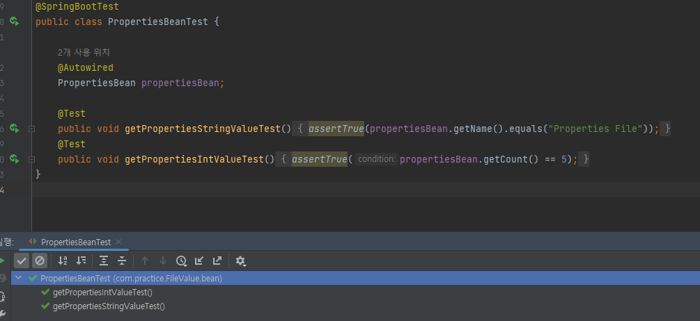
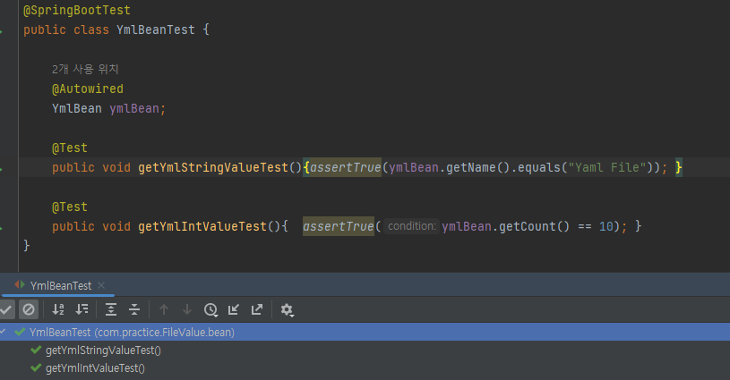
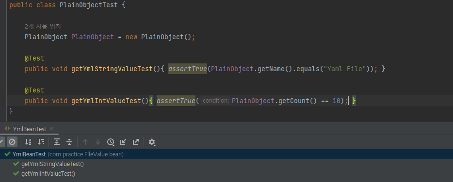

# [Spring] 설정 파일 읽어오기


자주 변경이 필요한 설정 정보들은 소스 상에서 하드코딩으로 값을 적는 것보다, 별도의 설정 파일에 저장해두고 소스 상에서 설정 파일의 값을 읽어서 사용하는 것이 유용하다. 

우선, 불필요한 java 소스 수정을 방지한다. 만약 설정값들을 소스 상에 하드 코딩으로 박아둔다면, 환경별 혹은 시기별로 다른 설정값을 요구할때마다 java 소스를 수정해야 할 것이다. 이는, 다른 java 소스를 건드릴 수 있는 위험도를 높이며, 하드코딩된 값이 여러 군데에 걸쳐 박혀있다면 작업의 복잡도를 높이게 된다. 하지만 설정값을 소스에서 분리시킨다면, java 소스를 본연의 기능에만 집중하고 설정 값은 외부에서 받아와, 보다 응집도가 높고, 관심사가 분리된 코드를 작성할 수 있다. 

또한, 환경에 유연하게 대처가 가능하다. 만약 테스트 환경과 운영 환경이 요구하는 설정값이 다른 경우, 설정 파일은 테스트 환경에서 실행되는 영역과 운영 환경에서 실행되는 영역으로 구분이 가능하다. 테스트 환경하고 실행하고 운영 환경에 프로젝트를 배포할 때, 어떤 것도 바꾸지 않아도 된다. 또한, 새로한 환경이 추가된다 하더라도, 기존의 값들은 전혀 건드릴 필요 없이 새로운 환경용 설정 파일만 작성하면 될 것이다. 

따라서, 프로젝트 실행 환경(profile)에 따라 달라지는 DB 정보, kafka 등의 외부 모듈의 설정값들 뿐만 아니라, 내가 작성한 소스에서의 모듈 수행 주기, sql문이 select할 row 수 같은 값들도 설정 파일로 분리시켜두면 좋을 것이다.


이에, properties 파일과 yml 파일에 설정해둔 값을 project에서 어떻게 가져올 수 있는지 정리해본다.

## properties 파일에서 읽어오기

간단하게 다음과 같은 설정이 파일이 있다고 하자.

```properties
# application2.properties
PropertiesBean.field.name: Properties File
PropertiesBean.field.count: 5 
```


기본적으로 스프링의 `@PropertySource`를 사용해서 properties 파일의 값을 가져올 수 있다.

```java
@Component
@PropertySource("/application2.properties")
public class PropertiesBean {

    @Value("${PropertiesBean.field.name}")
    private String name;
    
    private int count;

    @Autowired
    public PropertiesBean(Environment env){
        this.count = env.getProperty("PropertiesBean.field.count", Integer.class);
    }

    public String getName(){
        return this.name;
    }

    public int getCount(){
        return this.count;
    }

}
```

우선, `@PropertySource`에서 설정 파일의 경로를 지정해준다. default 시작 위치는 프로젝트의 `src/main/resources` 폴더이다.

값을 가져오는 방법으로는 두가지가 있다. 

첫번째는 `Environment ` 객체를 사용하는 방법이다. `@PropertySource`로 등록한 리소스로부터 가져오는 프로퍼티 값은 컨테이너가 관리하는 `Environment` 타입의 환경 오브젝트에 저장된다. DI받은 `Environment`의 `getProperty()` 메소드를 이용하여 프로퍼티 값을 가져온다.

```java
<T> T getProperty(String key, Class<T> targetType); 
```


두번째 방법은 `@Value`로 그대로 값을 주입받는 것이다. `${}` 치환자에 키값을 입력하면 프로퍼티 소스로부터 값을 필드에 주입받을 수 있다.


## yml 파일 읽어오기


 `@PropertySource`는 기본적으로 yml 파일을 로드하지 않는다.

 `@PropertySource`를 통해서 yml 파일을 읽어오기 위해서는, `PropertySourceFactory`  구현 클래스를 통해 로드해 올 수 있다.

```java
public class YmlLoadFactory implements PropertySourceFactory {
    @Override
    public PropertySource<?> createPropertySource(String name, EncodedResource resource) throws IOException {

        YamlPropertiesFactoryBean factory = new YamlPropertiesFactoryBean();
        factory.setResources(resource.getResource());

        Properties properties = factory.getObject();

        return new PropertiesPropertySource(resource.getResource().getFilename(), properties);
    }
}
```


별도 정의한 Factory 클래스를  `@PropertySource`에 명시하면, yml 파일도 properties와 똑같이 사용 가능하다.

```yaml
# application1.yml
YmlBean:
  field:
    name: Yaml File
    count: 10
```

```java
@Component
@PropertySource(value = "/application1.yml", factory = YmlLoadFactory.class)
public class YmlBean {

    private String name;
    @Value("${YmlBean.field.count}")
    private int count;

    @Autowired
    public YmlBean(Environment env){
        this.name = env.getProperty("YmlBean.field.name", String.class);
    }

    public String getName() { return name;}
    public int getCount(){
        return count;
    }
    
}
```


### :bulb: [번외] Java 소스에서 yml 파일 읽어오기

위의 방법들은 Spring 컨테이너로부터 환경 오브젝트를 주입받는 방식으로 정의한 객체를 Spring Bean으로 등록하는 경우에만 사용할 수 있다. Bean으로 등록하지 않을 경우에는 직접 파일을 읽어와서 사용해야 한다.

```java
public class PlainObject {
    private String name;
    private int count;

    public PlainObject(){
        try {
            Map<String, Object> config = new Yaml().load(new FileInputStream("src/main/resources/application1.yml"));
            Map<String, Object> yamlBeanConfig = (Map<String, Object>) config.get("YmlBean");
            Map<String, Object> yamlBeanFieldConfig = (Map<String, Object>) yamlBeanConfig.get("field");
            this.name = (String) yamlBeanFieldConfig.get("name");
            this.count = (int) yamlBeanFieldConfig.get("count");
        } catch (FileNotFoundException e) {
            throw new RuntimeException(e);
        }
    }

    public String getName() { return name;}
    public int getCount(){
        return count;
    }
}
```

`Yaml` 객체의 `load()` 메소드를 사용하면 경로의 yml 파일을 `Map<String, Object>` 타입으로 반환해준다. yml 파일은 보통 중첩 맵 구조로 되어 있기 때문에 위처럼 접근하고자는 위치까지 중첩을 풀어주면서 접근해야한다. 


## 테스트 결과


### [PropertiesBeanTest]




### [YmlBeanTest]




### [PlainObjectTest]




## 참고자료

- 이일민, 토비의 스프링 3.1, 7장. 프링 핵심 기술의 응용

- pooney, Spring boot @PropertySource로 yml 로드 방법, https://pooney.tistory.com/88

