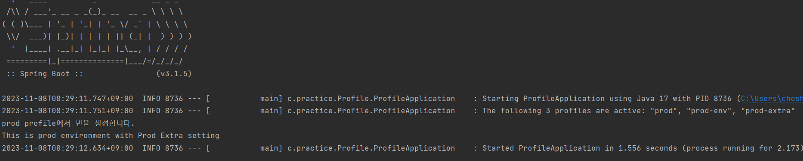
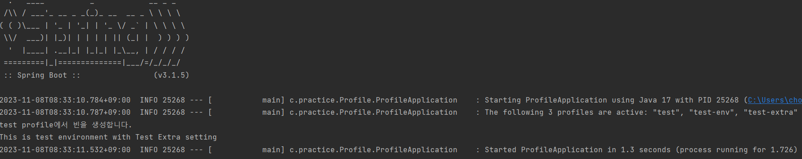
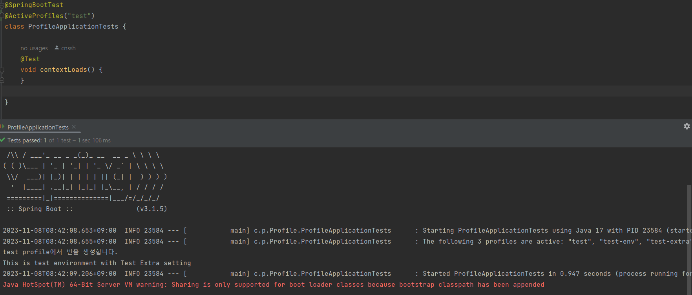

# profile별 yml 파일 설정정보 및 Bean 다르게 설정하기 (@Profile)


저번에는 `@TestConfiguration`을 통해 Test 코드에서만 사용할 Bean을 정의하는 법에 대해서 정리하였다.

하지만, 새로운 개발건에서는 Application 실행, test 코드 실행 이 두가지 경우만 구분하는 것이 아닌, 좀 더 여러 환경별로 분리시켜 테스트를 해야할 필요성이 생겼다. 이에 설정파일과 Bean 생성을 환경별로 세팅하고, 테스트 코드에서 특정 환경을 활성화 시키는 법에 대해서 정리해보고자 한다.


## profile별 설정 정보 분리 (yml 파일)

Spring 프로젝트에서 `application.yml` 파일에 설정 정보들을 작성할 때, 한 파일을 여러 영역으로 구분하고 특정 영역이 특정 profile에서만 적용되게끔 설정할 수 있다. 또한, 특정 profile들을 group으로 묶어서 group 단위로 활성화 시킬 수가 있다.

```yml

spring:
  profiles:
    group:
      prod: prod-env, prod-extra
      test: test-env, test-extra
    active: prod
    
---

spring:
  config:
    activate:
      on-profile: "prod-env"

custom:
  word : "This is prod environment"

---
spring:
  config:
    activate:
      on-profile: "prod-extra"

custom:
  extra : "Prod Extra setting"
  
---

spring:
  config:
    activate:
      on-profile: "test-env"

custom:
  word : "This is test environment"
  
---
spring:
  config:
    activate:
      on-profile: "test-extra"

custom:
  extra : "Test Extra setting"
```

- `spring.profiles.group` : 특정 profiles들을 하나의 group으로 묶는다.
  - `test` profile으로 실행될 때, `test-env`, `test-extra` profile이 같이 활성화된다.
  - `prod` profile으로 실행될 때, `prod-env`, `prod-extra` profile이 같이 활성화된다.
- `spring.profiles.active` : 어플리케이션이 실행될 때 default로 실행될 profile을 지정한다.
  - 어플리케이션을 실행할 때, 기본적으로 `prod` profile으로 실행된다.
- `---` : 하나의 yml 파일을 별도의 영역으로 분할시킨다.
- `spring.config.activate.on-profile` : 구분지어진 영역이 어떤 환경에서 활성화시킬지를 명시한다.
  - `test-env` 와`prod-env` profile에서는 `custom.env` 값을 명시하고, `test-extra` 와`prod-extra` profile에서는 `custom.extra` 값을 명시하였다.
  - 실전 프로젝트에서는 주로 DB나 외부 모듈의 설정 단위로 profile를 구분지어서 사용할 수 있다.


## 환경 별 Bean 설정하기 : `@Profile`

### [ 개요 ]

`@Profile`은 실행환경에 따라 빈 구성이 달라지는 내용을 프로파일로 정의해서 만들어두고, 실행 시점에 어떤 프로파일의 빈 설정을 사용할지 지정하게 한다. 

프로파일은 설정 클래스(`@Configuration`) 단위로 지정하며, 프로파일이 지정되어 있지 않은 빈 설정은 default 프로파일로 취급되어 항상 적용된다. `@Profile`이 붙은 설정 클래스는 `@Import`, `@ContextConfiguration`과 상관없이 현재 컨테이너의 활성 프로파일 목록에 자신의 프로파일 이름이 들어 있지 않으면 무시된다.

또한, `@Profile`에서는 `!` ,`&`, `|` 과 같은 논리 연사자나 `@Profile({"test", "prod"})`와 같이 profile 리스트를 사용하여, 특정 조건이나 복수의 프로파일을 지정할 수 있다.


예를 들어, 다음과 같은 예제 클래스를 `prod`, `test` profile에 따라 다르게 빈으로 등록하고, 실행하면 다음과 같다

### [소스]

#### 빈 등록 대상 Class
```java
public class MyBean {

    String word;

    public MyBean(String env, String setting){
        this.word = String.format("%s with %s", env, setting);
        System.out.println(word);
    }
}
```


#### prod profile용 Bean 등록

```java
@Configuration
@Profile("prod")
@PropertySource(value = "/application.yml", factory = YmlLoadFactory.class)
public class ProdConfig {

    @Value("${custom.word}")
    String word;
    @Value("${custom.extra}")
    String extra;

    @Bean
    public MyBean myBean(){
        System.out.println("prod profile에서 빈을 생성합니다.");
        MyBean myBean = new MyBean(word, extra);
        return myBean;
    }
}
```

:heavy_check_mark: application.yml 파일에서의 prod 프로파일에서 지정하는 custom 값을 가져옵니다


#### test profile용 Bean 등록

```java
@Configuration
@Profile("test")
@PropertySource(value = "/application.yml", factory = YmlLoadFactory.class)
public class TestConfig {

    @Value("${custom.word}")
    String word;
    @Value("${custom.extra}")
    String extra;

    @Bean
    public MyBean myBean(){
        System.out.println("test profile에서 빈을 생성합니다.");
        MyBean myBean = new MyBean(word, extra);
        return myBean;
    }
}

```

:heavy_check_mark: application.yml 파일에서의 test 프로파일에서 지정하는 custom 값을 가져옵니다


### [실행 결과]
#### prod profile로 실행한 결과




#### test profile로 실행한 결과




## 테스트 코드에서 활성화할 Profile 지정

실제 어플리케이션 구동에서는 application.yml 파일에서 `spring.profiles.active` 값을 지정하거나, Run Configuration에서 환경 변수 값 설정을 통해 활성화할 profile을 지정할 수 있었다.

이에 반해, 테스트 코드에서 활성화할 profile을 지정하기 위해서는 `@ActiveProfiles`를 사용하면 된다.

테스트 클래스 위에 `@ActiveProfiles("프로파일이름")`를 설정한다면, 해당 프로파일의 환경대로 테스트를 해볼 수 있다.


### `@ActiveProfiles` 예시 코드

```java
@SpringBootTest
@ActiveProfiles("test")
class ProfileApplicationTests {

	@Test
	void contextLoads() {
	}

}
```


### 실행 결과




## 참고자료

- zzang9ha, Spring Boot profiles 설정하기, https://zzang9ha.tistory.com/415
- 새로비, [Spring] 스프링 @Profile 어노테이션을 통한 환경 설정(Spring Environment Configuration, @Profile), https://engkimbs.tistory.com/entry/Spring-%EC%8A%A4%ED%94%84%EB%A7%81-Profile-%EC%96%B4%EB%85%B8%ED%85%8C%EC%9D%B4%EC%85%98%EC%9D%84-%ED%86%B5%ED%95%9C-%ED%99%98%EA%B2%BD-%EC%84%A4%EC%A0%95Spring-Environment-Configuration-Profile