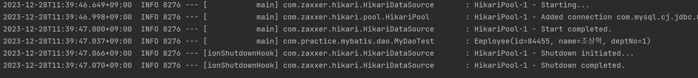

# [Spring] MyBatis 사용하기 (feat. 다중 datasource)


취업 준비 때에는 JPA를 위주로 공부하였지만 회사에 들어오고보니 MyBatis로 프로젝트를 수행하는 경우가 훨씬 많았다. 기존 프로젝트의 DB 스택이 이미 MyBatis로 짜여져 있는 경우들이 많았고, 신규 건을 진행할 때에도 주로 DB에서 조회 가능한 쿼리가 그대로 프로젝트 내에 명시되는 것이 요구사항으로 내려왔다. 

MyBatis를 사용할 경우, 특정 DB에 종속적이고, 비지니스 로직이 java 소스와 sql에 이원화되며, 코드의 재사용성이 낮아서 선호하진 않지만, 기존 SM 개발자분들은 java 소스보다 SQL 코드로 로직을 보시는 것을 선호하여 MyBatis를 주로 사용하게 되는 것 같다.

아무튼, MyBatis로 Spring 프로젝트를 수행하는 경우가 빈번하게 있어, MyBatis 설정법을 정리해보고자 한다.


## 개요

[Mybatis 홈페이지](https://mybatis.org/mybatis-3/ko/index.html)에 나와있는 기본 개요는 아래와 같다.

> 마이바티스는 개발자가 지정한 SQL, 저장프로시저 그리고 몇가지 고급 매핑을 지원하는 퍼시스턴스 프레임워크이다. 마이바티스는 JDBC로 처리하는 상당부분의 코드와 파라미터 설정 및 결과 매핑을 대신해준다. 마이바티스는 데이터베이스 레코드에 원시타입과 Map 인터페이스 그리고 자바 POJO 를 설정해서 매핑하기 위해 XML과 애노테이션을 사용할 수 있다.

정리하자면, MyBatis는 SQL문을 직접 Spring 프로젝트 내에서 사용할 수 있도록 해주는 프레임워크로, SQL 문의 파라미터나 결과값을 Java 변수 타입과 매핑시켜준다. MyBatis는 소스 코드에 내장돼있는 SQL을 별도의 파일로 분리시켜 사용하게 하며, 이를 통해 단순하고 반복적인 JDBC 코드를 캡슐화하여 데이터베이스 프로그래밍을 간결하게 만든다.


## 환경설정

Spring 프로젝트에서 Mybatis를 사용하기 위해서는 본격적인 java 코드 작성 이전에 사전 환경 설정 작업이 필요하다. MyBatis 세팅에는 여러가지 방법이 있지만, 나는 yml 파일내에 정의된 Datasource 정보를 가져와서 설정하는 방식으로 정리하겠다.


### 1. 의존성 추가

우선 `pom.xml` 파일에 필요 의존성을 추가해야 한다.

```xml
<!-- Mybatis Spring -->
<dependency>
    <groupId>org.mybatis.spring.boot</groupId>
    <artifactId>mybatis-spring-boot-starter</artifactId>
    <version>3.0.3</version>
</dependency>
<!-- Db -->
<dependency>
    <groupId>com.mysql</groupId>
    <artifactId>mysql-connector-j</artifactId>
    <version>8.0.33</version>
</dependency>
```

`pom.xml` 파일의  `<dependencies> </dependencies>` 태그 내에 의존성을 추가해준다. Db 부분은 자신이 연결하는 DB에 따라 맞는 의존성을 추가하면 된다.


### 2. mybatis-config.xml 파일 설정

MyBatis 동작에 대한 설정 파일을 작성한다. default로 해당 파일의 위치는 `src/resources` 디렉토리에 둔다.

```xml
<?xml version="1.0" encoding="UTF-8"?>
<!DOCTYPE configuration PUBLIC "//mybatis.org//DTD Config 3.0//EN" "http://mybatis.org/dtd/mybatis-3-config.dtd" >
<configuration>

    <settings>
        <setting name="cacheEnabled" value="true"/>
        <setting name="lazyLoadingEnabled" value="true"/>
        <setting name="multipleResultSetsEnabled" value="true"/>
        <setting name="mapUnderscoreToCamelCase" value="true"/>
        <setting name="callSettersOnNulls" value="true"/>
        <setting name="jdbcTypeForNull" value="NULL"/>
        <setting name="logImpl" value="SLF4J"/>
        <setting name="defaultExecutorType" value="REUSE"/>
    </settings>

    <typeAliases>
<!--        <typeAlias alias="Employee" type = "com.practice.mybatis.entity.Employee"/>-->
        <package name = "com.practice.mybatis.entity"></package>
    </typeAliases>

    <typeHandlers>
        <typeHandler handler="org.apache.ibatis.type.ClobTypeHandler" jdbcType="CLOB" javaType="java.lang.String"/>
    </typeHandlers>

<!--<mappers>-->
<!--    <mapper resource="sql/sql-*.xml"/>-->
<!--</mappers>-->

</configuration>
```


#### 2-1) settings  설정 값 설명

| 설정                      | 설명                                                         | 가능한값들                             | 기본값 |
| ------------------------- | ------------------------------------------------------------ | -------------------------------------- | ------ |
| cacheEnabled              | 설정에서 각 매퍼에 설정된 캐시를 전역적으로 사용할지 말지에 대한 여부 | true/false                             | true   |
| lazyLoadingEnabled        | 지연로딩을 사용할지에 대한 여부                              | true/false                             | false  |
| multipleResultSetsEnabled | 한 개의 구문에서 여러 개의 ResultSet을 허용할지의 여부<br />:bulb: `;`으로 구분된 여러 개의 SELECT문 한번에 실행 시 반환 | true/false                             | true   |
| mapUnderscoreToCamelCase  | 전통적인 데이터베이스 칼럼명 형태인 A_COLUMN을 CamelCase형태의 자바 프로퍼티명 형태인 aColumn으로 자동으로 매핑하도록 함 | true/false                             | False  |
| callSettersOnNulls        | 가져온 값이 null일 때 setter나 맵의 put 메소드를 호출할지를 명시 Map.keySet() 이나 null값을 초기화할때 유용하다 | true/false                             | false  |
| jdbcTypeForNull           | JDBC타입을 파라미터에 제공하지 않을때 null값을 처리한 JDBC타입을 명시 | JdbcType 이늄(NULL, VARCHAR, OTHER 등) | OTHER  |
| logImpl                   | 마이바티스가 사용할 로깅 구현체를 명시<br />(미설정 시, 마이바티스가 사용할 로깅 구현체를 자동으로 찾는다.) | SLF4J, LOG4J2 , 등                     |        |
| defaultExecutorType       | - SIMPLE : 특별히 하는 것이 없음<br />- REUSE : PreparedStatement를 재사용. 반복 사용 시 유리<br />- BATCH : 하나의 배치에서 여러 개의 쿼리 실행 시 유리 | SIMPLE, REUSE, BATCH                   | SIMPLE |

:bulb: jdbcTypeForNull

Mybatis가 sql을 수행할 때 값을 정확하게 넣기 위해서는 파라미터의 JDBC type을 알고 있어야 한다. 파라미터에 `null`이 들어왔을 때, JDBC type을 무엇으로 설정할 지에 대한 명시이다. value를 null로 지정 시, JDBC의 `Types.NULL` 사용한다. 하지만, 보통의 경우 JDBC driver가 자동으로 잘 지정하기에 특별한 경우를 제외하곤 꼭 지정할 필욘 없다.


#### 2-2) typeAliases

```xml
    <typeAliases>
<!--        <typeAlias alias="Employee" type = "com.practice.mybatis.entity.Employee"/>-->
        <package name = "com.practice.mybatis.entity"></package>
    </typeAliases>
```

타입 별칭으로, mapper xml 파일에서 타이핑을 줄이기 위해서 사용된다. SQL문의 파라미터나 결과값에 매핑되는 것이 POJO일 경우, 본래라면 mapper 파일에는 패키지 이름을 포함한 Entity의 전체 이름을 명시해야 한다. 하지만 typeAliases에서 별칭을 지정할 경우, 패키지 명을 생략하고 간략하게 명시할 수 있게된다.

먼저, `<typeAlias alias="Employee" type = "com.practice.mybatis.entity.Employee"/>` 는 개별 Entity에 대해서 타입 별칭을 지정하는 방식이며, 이는 mapper 파일에서 `Employee`만 명시해도 `com.practice.mybatis.entity.Employee`로 인식한다는 의미이다.

혹은, `<package name = "ooo.ooo.ooo.online"></package>` 로 패키지로 지정하면, 해당 패키지 내의 엔티티들은 패키지를 생략하고 명시가 가능하다는 의미이다.


### 2-3) typeHandlers

```xml
<typeHandlers>
    <typeHandler handler="org.apache.ibatis.type.ClobTypeHandler" jdbcType="CLOB" javaType="java.lang.String"/>
</typeHandlers>
```

Java Type과 JDBC Type간 상호 변환을 정의한다. default typeHandler가 존재하며, custum으로 생성해서 명시하는 것도 가능하다. 여기에서는 JDBC TYPE 중 `CLOB`을 java의 `String` 타입과 상호 변환함을 명시하였다.


### 2-4) mappers

```xml
<mappers>
    <mapper resource="sql/sql-employee.xml"/>
</mappers>
```

SQL 구문이 작성되어 있는 mapper 파일의 경로를 명시한다. 위처럼 하나의 파일을 명시할 수 있다. 

:heavy_check_mark: 여기서는 파일을 하나씩 설정하는 것이 아닌 추후 경로 내 모든 mapper 파일들을 한번에 설정하기 위해 주석 처리 하였다.


### 3. yml 파일 설정

프로젝트 내 접근할 DB를 `application.yml` 내에 명시해준다. default로 해당 파일의 위치는 `src/resources` 디렉토리에 둔다.

```yaml
spring:
  datasource:
      driver-class-name : com.mysql.cj.jdbc.Driver
      url: jdbc:mysql://localhost:3300/localapp
      username: root
      password: root
```


#### 4. mapper 파일 작성하기

프로젝트 내에서 사용할 SQL 구문들을 xml 파일로 작성한다. 파일 경로는 resources/sql 폴더를 생성하여 위치시켰다.

```xml
<?xml version="1.0" encoding="UTF-8"?>
<!DOCTYPE mapper PUBLIC "//mybatis.org/DTD Mapper 3.0//EN" "http://mybatis.org/dtd/mybatis-3-mapper.dtd" >
<mapper namespace="O.Employee">

    <select id="retrieveById"
            resultType="Employee"
            parameterType = "Long">
        SELECT * FROM EMPLOYEES WHERE ID = #{id}
    </select>
    
</mapper>
```

`resultType`에는 반환된 결과값을 변환할 java 객체를 명시한다. `parameterType`에는 `#{}`로 입력되는 파라미터의 타입을 명시한다.


## MyBatis 사용하기

Spring 프로젝트에서 MyBatis를 사용하는 방식에도 여러가지가 있지만, 근본적인 동작 방식은 `SqlSessionFactory` 객체에서 Session을 가져오고, 해당 Session 객체에서 매핑된 SQL 구문을 실행하는 것이다. 

이에 여기서는 `application.yml` 파일에 설정해둔 DB 정보와 `mybatis-config.xml` 파일에 설정한 MyBatis 설정 정보들로 `SqlSessionFactory` 객체를 Bean으로 생성하였다. 그 다음 `SqlSessionFactory` Bean를 Dao 클래스에서 받아, Dao 내에서 사용할 session을 생성한다. 마지막으로, Dao내 메소드에서 session과 mapper 파일을 매핑해서 SQL문을 실행할 수 있도록 하였다.


### 1. Entity 생성

mapper 파일에서 resultType 혹은 parameterType으로 사용될 Entity들을 정의한다.

```java
@Data // 편의상 lombok 사용
@ToString
public class Employee {
    private Long id;
    private String name;
    private int deptNo;

    public Employee(){

    }
}

```


### 2. `SqlSessionFactory` 객체 Bean 등록

```java
package com.practice.mybatis.config;

@Configuration
public class Config {

    @Bean
    public SqlSessionFactory sqlSessionFactory(DataSource dataSource) throws Exception {
        SqlSessionFactoryBean factory = new SqlSessionFactoryBean();
        // application.yml 파일에 등록 datasource 정보로 DB를 등록한다.
        factory.setDataSource(dataSource);
        // mybatis-config.xml 파일에 명시된 MyBatis 설정들을 등록한다.
        factory.setConfigLocation(new PathMatchingResourcePatternResolver().getResource("/mybatis-config.xml"));
        // 프로젝트에서 사용할 Mapper 파일들을 등록한다. 
        // 이때 *와 같이 wildcard를 사용하여 폴더 내 모든 mapper 파일의 등록이 가능하다.
        Resource[] resources = new PathMatchingResourcePatternResolver()
                .getResources("classpath:sql/*.xml");
        factory.setMapperLocations(resources);
        return factory.getObject();
    }

}

```

:heavy_check_mark: 2-4) mappers에서 하나씩 mapper 파일을 등록하는 것이 아닌, `setMapperLocations` 메소드에서 폴더 내 모든 mapper 파일들을 등록하게 하였다.


### 3. Dao 세팅

```java
package com.practice.mybatis.dao;

@Repository
@Slf4j
public class MyDao {

    private SqlSession session;

    @Autowired
    public MyDao(SqlSessionFactory sqlSessionFactory){
        this.session = sqlSessionFactory.openSession();
    }

    public Employee retrieveEmployeeById(Long id){
        return session.selectOne("O.Employee.retrieveById", id);
    }

}

```

`SqlSessionFactory` 주입받아, `session`을 생성하였으며, `session`을 통해 mapper 클래스 내 SQL문을 실행시킨다.

`selectOne` 메소드를 포함한 session의 메소드들은 주로 첫번째 인자로, mapper내 SQL문 정보를 받으며, 두번째 인자로 parameter 정보를 입력받는다(파라미터가 없을 경우, 두번째 인자는 생략 가능하다).  SQL문 정보는 `{mapper파일 namespace}.{개별SQL문 id}` 값으로 명시한다.


### 테스트

작성한 dao가 정상적으로 작동하는지 볼 수 있게 junit 테스트 코드를 작성한다.

```java
@SpringBootTest
@Slf4j
public class MyDaoTest {

    @Autowired
    MyDao dao;

    @Test
    public void retrieveEmployeeByIdTest(){
        Employee employee = dao.retrieveEmployeeById(84455L);
        log.info("{}", employee);
        assertTrue(employee.getName().equals("조상혁"));
    }

}

```

**DB 조회 결과**


**테스트 결과**




## 추가) 다중 datasource 사용


추가로, 여러 개의 DB와 연결해서 사용해야하는 경우에 대해서 설정하는 법을 알아보겠다.

위에서 살펴보았듯이, `SqlSessionFactory`에 Datasource 정보를 세팅해두고, session을 받아와 DB에 접근을 하였다. 이는 SqlSessionFactory 인스턴스마다 한 개의 DB만 사용할 수 있을 말한다. 즉, 여러 개의 DB 정보를 설정하기 위해서는 DB 개수만큼  SqlSessionFactory 인스턴스의 생성이 필요하다.


### 1. application.yml 수정

```yaml
spring:
  datasource:
    datasource-local:
      driver-class-name : com.mysql.cj.jdbc.Driver
      jdbc-url: jdbc:mysql://localhost:3300/localapp
      username: root
      password: root
    datasource-test:
      driver-class-name: com.mysql.cj.jdbc.Driver
      jdbc-url: jdbc:mysql://localhost:3300/testapp
      username: root
      password: root
```

나의 경우에는 datasource를 localapp 스키마를 가지는 datasource-local과 testapp 스키마를 가지는 datasource-test로 구분지어 등록하였다. 여기서 중요한 것은 **꼭 DB url을 `jdbc-url` 키에 매핑**시켜야 한다는 것이다.


### 2. config 수정

우선, 내가 명명지은 datasource들을 직접 Bean으로 등록시켜줘야 한다. 그 후, 각각의 Datasource를 사용하는 `SqlSessionFactory`를 생성해준다.

```java
@Configuration
@Slf4j
public class Config {

    @Bean
    @ConfigurationProperties(prefix= "spring.datasource.datasource-local")
    public DataSource dataSourceLocal() {
        return DataSourceBuilder.create().build();
    }
    
    @Bean
    @ConfigurationProperties(prefix= "spring.datasource.datasource-test")
    public DataSource dataSourceTest() {
        return DataSourceBuilder.create().build();
    }

    @Bean
    public SqlSessionFactory sqlSessionFactoryLocal(@Qualifier("dataSourceLocal") DataSource dataSource) throws Exception {
        SqlSessionFactoryBean factory = new SqlSessionFactoryBean();
        factory.setDataSource(dataSource);
        factory.setConfigLocation(new PathMatchingResourcePatternResolver().getResource("/mybatis-config.xml"));
        Resource[] resources = new PathMatchingResourcePatternResolver()
                .getResources("classpath:sql/*.xml");
        factory.setMapperLocations(resources);
        return factory.getObject();
    }

    @Bean
    public SqlSessionFactory sqlSessionFactoryTest(@Qualifier("dataSourceTest") DataSource dataSource) throws Exception {
        SqlSessionFactoryBean factory = new SqlSessionFactoryBean();
        factory.setDataSource(dataSource);
        factory.setConfigLocation(new PathMatchingResourcePatternResolver().getResource("/mybatis-config.xml"));
        Resource[] resources = new PathMatchingResourcePatternResolver()
                .getResources("classpath:sql/*.xml");
        factory.setMapperLocations(resources);
        return factory.getObject();
    }


}

```

:bulb: `@ConfigurationProperties` : prefix를 통해서 application.yml에서 어떤 부분을 가져올지 명시할 수 있다.


### 3. Dao 수정

우선, `SqlSessionFactory` 타입의 Bean이 여러 개 생성되기 때문에, 기존 `MyDao`에도 어떤 `SqlSessionFactory` Bean을 사용할 지 명시한다.

```java
@Repository
@Slf4j
public class MyDao {

    private SqlSession session;

    @Autowired
    public MyDao(@Qualifier("sqlSessionFactoryLocal") SqlSessionFactory sqlSessionFactory){
        this.session = sqlSessionFactory.openSession();
    }

    public Employee retrieveEmployeeById(Long id){
        return session.selectOne("O.Employee.retrieveById", id);
    }

}
```


또한, 새로 추가한 DB에 대해서 접근할 Dao도 별도로 생성해준다.

```java
@Repository
@Slf4j
public class TestDao {
    private SqlSession session;

    @Autowired
    public TestDao(@Qualifier("sqlSessionFactoryTest") SqlSessionFactory sqlSessionFactory){
        this.session = sqlSessionFactory.openSession();
    }

    public Employee retrieveEmployeeById(Long id){
        return session.selectOne("O.Employee.retrieveById", id);
    }
}
```


### 테스트

신규로 추가한 testapp에는 test라는 이름으로 정보를 등록해 두었다.


그 다음, TestDao에 대해서 테스트 코드를 작성해서 돌려주면 성공한 것을 볼 수 있다.


전체 코드 : https://github.com/ChoSanghyuk/practice_code/tree/master/mybatis


## 참고자료

- MyBatis,https://mybatis.org/mybatis-3/ko/index.html

- Knowledge Repository, [JAVA/WEB] 웹 프로젝트에 MyBatis 세팅 및 적용하기,https://atoz-develop.tistory.com/entry/JAVAWEB-%EC%9B%B9-%ED%94%84%EB%A1%9C%EC%A0%9D%ED%8A%B8%EC%97%90-MyBatis-%EC%84%B8%ED%8C%85-%EB%B0%8F-%EC%A0%81%EC%9A%A9%ED%95%98%EA%B8%B0

- JW공부스토리, [Spring] Spring MyBatis 설정, https://jwkim96.tistory.com/62

- SI Supply Depot, Springboot Multi Datasource 설정 및 사용법, https://oingdaddy.tistory.com/378
