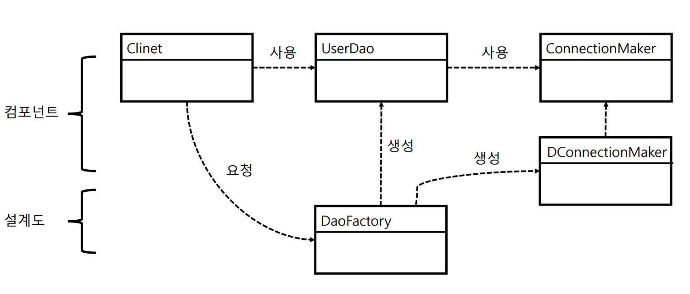
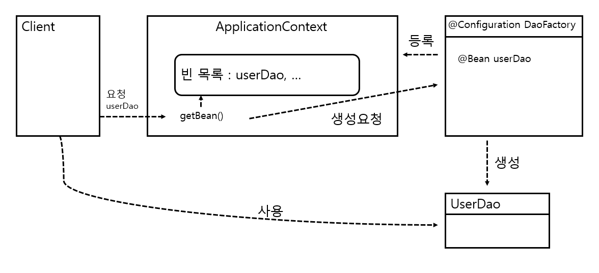

# [토비의 스프링] 1장. 오브젝트와 의존관계


"토비의 스프링 3.1"을 읽고서 내용을 정리한 글입니다. 

잘못된 사례부터 시작하여, 점차 코드를 개선해 나가며 내용을 설명했던 본래 글과 다르게, 해당 장에서 반복적이고 공통적으로 등장하는 주제들을 내용 중심으로 정리하고자 합니다.


## 들어가며

해당 장은 객체 지향적인 설계를 할 때, 오브젝트들과 오브젝트들의 의존 관계를 어떻게 설계하면 좋을지에 관한 내용을 다루고 있다. 

객체 지향적 설계 원칙 중 **단일 책임 원칙**에 따르면 객체는 하나의 관심사에 집중되어야 한다. 하지만 대규모 프로그램을 설계하면, 객체들은 독립적으로 자신의 관심사를 수행하는 것이 아닌, 다른 객체들과의 관계(의존)를 통해서 수행하는 경우가 자주 존재한다. 하지만 이러한 관계 또한 하나의 관심사로써, 객체 내에서 **직접적인 의존관계를 가지는 것은 자신의 핵심 관심사 외의 다른 관심사를 가지는 것**이다. 

의존관계가 필수인 상황에서, 어떻게 스프링은 객체들이 핵심 관심사에 집중할 수 있게 만들어 주는지가 이 장의 핵심 내용이다. 


## 관심사의 분리

객체의 응집도를 높이기 위해서 필요한 과정은 관심사를 분리시키는 것이다.  응집도란 모듈에 포함된 내부 요소들이 연관돼 있는 정도를 말하며, 하나의 관심사(목적)를 위해 긴밀하게 협력하는 가를 나타낸다. 관심이 같은 것끼리는 모으고, 관심이 다른 것은 따로 떨어져 있게 함으로써 응집도를 높일 수 있다. 

관심사를 분리시킴으로 얻을 수 있는 장점은 변화의 폭을 최소한으로 줄일 수 있다는 것이다. 변화는 대체로 한가지 관심에 대해서 일어난다. 관심사가 분리되어 있다면, 추후 프로그램에 대한 요구사항이 변하였을 때, 프로그램의 변경을 최소화 시킬 수 있다. 

해당 장에서는 관계 생성에 관한 관심사를 분리시키는 방법에 집중되어 있다. 


관계 생성에 관한 관심사를 분리 시키는 방법으로는 크게 세 가지가 있다. 

### 1. 상속을 통한 확장

첫번째는 **상속을 통한 확장**이다. 공통적인 기능은 부모 클래스에서 정의하고, 상황에 따라 달라지는 관심사는 자식 클래스에서 정의한다. 이때 활용되는 디자인 패턴은 **템플릿 메소드 패턴**으로, 변하지 않는 기능은 슈퍼클래스에 두고, 자주 변경되면 확장할 기능은 서브클래스에서 구현하는 패턴이다. 

예를 들어, DAO가 수행하는 SQL은 정해져있지만 Connection 연결만이 상황에 따라 달라질 때, 공통적인 SQL 수행 부분은 부모 클래스에서 정해두고, A Connection과 관계를 맺을 지, B Connection과 관계를 맺을지는 자식 클래스에서 결정하는 방식이다. 이때, 부모 클래스에서는 Connection 연결 부분을 추상 메소드나 오버라이딩이 가능한 protected 메소드로 남겨둠으로써, 자식 클래스에서 오버라이딩이 가능하게 한다.

하지만, 상속을 통한 방법은 다중 상속이 불가능하다는 점과 상하위 클래스끼리 두 가지 다른 관심사에 대해 긴밀하게 결합되어 있다는 한계가 존재한다. 


### 2. 인터페이스를 통한 확장

두번째로는 **인터페이스를 통한 확장**이다. 클래스 사이의 관계는 코드에 다른 클래스 이름이 나타나기 때문에 생성된다. 반면에, 다형성을 통한 인터페이스 타입으로 참조한다면 느슨한 관계를 유지할 수 있다. 모델링 시점에는 존재하지 않았던 관계를 런타임 시점 때 생성하는 것이다. 이때 활용되는 디자인 패턴은 **전략 패턴**으로 , 자신의 기능 맥락에서 필요에 따라 변경이 필요한 알고리즘을 인터페이스 통째로 외부로 분리시키는 방법이다. 

예를 들어, DAO가 어떤 Connection을 사용할지 결정해주는 ConnectionMaker라는 인터페이스를 필드로 가지고, 해당 인터페이스를 통해 Connection을 주입받는 방식이다. 이렇게 될 경우, 모델링 시점에는 DAO와 구체적인 Connection 클래스와의 관계가 드러나지 않지만, ConnectionMaker를 구현하는 클래스에 의해, 특정  Connection과 관계를 가지게 될 것이다.


```java
public class UserDao {
    private ConnectionMaker connectionMaker; // 인터페이스를 통한 Connection 생성
    
    public UserDao(){
        connectionMaker = new DConnectionMaker(); // 특정 클래스 이름 등장하는 단점 존재
    }
    
    public void add(User user) {
        Connection c = connectionMaker.makeConnection();
    }
}
```

하지만 이 방법을 통해서도, 여전히 클래스 내부에서 다른 클래스의 이름이 등장하게 되어, UserDao는 핵심 관심사(SQL 수행)에 대한 변경 뿐만 아니라, 연결되어야 할 Connection의 종류가 바뀔 때마다 수정이 불가피해진다. 


### 3. 제어권의 이전 

세 번째로는 제 3자에게 제어권을 위임하는 것이다. 이를 제어의 역전(IoC)라고 하는 데, 제어의 역전이란 프로그램의 제어 흐름 구조가 뒤바뀌는 것으로, **능동적인 주체에서 수동적인 주체**로 바뀌는 것을 의미한다.  

능동적인 주체란, 오브젝트가 자신이 사용할 클래스(필드)를 결정하고, 언제/어떻게 그 오브젝트를 만들지를 스스로 관장하는 것이다. 이와 반대로 수동적인 주체란, 모든 제어 권한을 자신이 아닌 다른 대상에게 위임하여, 자신이 사용할 클래스를 제 3자에 의해서 주입받아 사용하는 것이다. 


이때 사용되는 것이 **팩토리**이다.  팩토리란 객체의 생성 방법을 결정하고 반환하는 역할을 수행한다. 팩토리를 통한다면, 컴포넌트 역할을 하는 오브젝트와 애플리케이션 구조를 결정하는 오브젝트를 분리시킬 수 있다. 



[토비의 스프링 그림 1-8 오브젝트 팩토리를 활용한 구조]

제어권의 이전(제어의 역전)을 통한다면, UserDao는 연결되어야 할 Connection의 종류가 바뀔 때마다 더 이상 코드를 수정할 필요가 없어진다. 


## 스프링의 IoC 및 DI


스프링은 프레임워크로써, 제어의 역전 개념이 적용되어져있다. 

라이브러리와 프레임워크를 비교하자면, 라이브러리의 경우, 애플리케이션 코드가 애플리케이션 흐름을 제어한다. 이에 반해, 프레임워크는 애플리케이션 코드가 프레임워크에 의해 사용되며, 프레임워크가 흐름을 주도한다. 이처럼, 프레임워크에는 분명한 제어의 역전 개념이 적용되어야 한다.


### 오브젝트 팩토리를 이용한 스프링 IoC

팩토리를 스프링이 관리하는데, 다음과 같은 용어가 사용된다.

- **빈** : 스프링이 제어권을 가지고 직접 만들고 관계를 부여하는 오브젝트
- **빈 팩토리** : 빈의 생성과 관계 생성 같은 제어를 담당
- **애플리케이션 컨텍스트** : IoC 방식을 따라 만들어진 일종의 빈 팩토리. (빈 팩토리와 동의어처럼 사용)

스프링에서 빈 팩토리를 생성할 때에는 다음 두가지 어노테이션이 적용된다.

- **@Configuration** : 빈 팩토리를 위한 오브젝트 설정을 담당하는 클래스
- **@Bean** : 오브젝트 만들어주는 메소드

```java
@Configuration
public class DaoFactory {
    
    @Bean
    public UserDao userDao(){
        return new UserDao(connectionMaker());
    }
    
    @Bean
    public ConnectionMaker connectionMaker(){
        return new DConnectionMaker();
    }
}
```

[토비의 스프링 리스트 1-18 스프링 빈 팩토리가 사용할 설정정보를 담은 DaoFactory 클래스]

@Configuration이 붙은 DaoFactory 클래스는 스프링에 의해 빈 팩토리로 동작을 하며, @Bean이 붙은 userDao, connectionMaker 메소드는 빈으로 등록되어 관리된다. 여기서, 메소드 이름이 곧 빈 이름으로 등록이 된다.


이렇게 등록된 빈은 애플리케이션 컨텍스트를 활용하여 가져올 수 있다.

```java
public class UserDaoTest {
    public static void main(String[] args) throws ClassNotFoundException, SQLException {
        Application context = new AnnotationConfigApplicationContext(DaoFactory.class);
        UserDao dao = context.getBean("userDao", UserDao.class);
        // ...
    }
}
```

[토비의 스프링 리스트 1-19 애플리케이션 컨텍스트를 적용한 UserDaoTest]

이때, getBean()은 기본적으로 Object 타입으로 리턴하기 때문에 본 클래스로 다시 캐스팅이 필요하다.


[토비의 스프링 1. 그림 1-9 애플리케이션 컨텍스트가 동작하는 방식]


애플리케이션 컨텍스트는 위의 그림처럼 동작을 한다. 

DaoFactory는 객체의 생성 및 관계 설정을 담당한다. ApplicationContext는 팩토리에 요청이 온 빈의 생성 요청을 보내고, 등록된 빈 목록을 관리한다. 이로 인해서, Client는 ApplicationContext에 요청을 보내 빈을 가져올 수 있다. 


### 의존 관계 주입(DI)

DI란 오브젝트 레퍼런스를 외부로부터 주입받아, 여타 오브젝트와 다이내믹하게 의존관계를 생성하는 것으로, 폭넓게 사용되는 IoC라는 개념에서 스프링이 제공하는 IoC 방식의 핵심을 일컫는 개념이다.

이러한 DI에는 다음과 같은 3가지 조건이 존재한다.

1. 클래스 모델이나 코드에는 런타임 시점의 의존관계가 드러나지 않는다.
2. 런타임 시점의 의존관계는 컨테이너나 팩토리 같은 제 3의 존재가 결정한다.
3. 사용할 오브젝트에 대한 레퍼런스를 외부에서 제공한다.


첫번째 조건은 구현 클래스에 직접적으로 의존하는 것이 아닌 인터페이스와 의존관계를 가지는 것을 의미한다. 의존한다는 것은 의존대상이 변하면 자신에게 영향이 미친다는 것이다. 만약 인터페이스와 의존관계를 가진다면,  구현 클래스와의 느슨한 관계를 유지할 수 있어, 변화에 낮은 영향도를 가질 수 있다.(낮은 결합도) 


### 의존 관계 검색

스프링이 제공하는 Ioc 방법에는 의존 관계 주입 뿐만 아니라 의존 관계 검색이라 불리는 것도 있다. 해당 개념은 오브젝트에 대한 레퍼런스를 외부로부터 주입받는 것이 아니라, 스스로 검색을 이용한 방법이다. 

```java
public UserDao(){
    DaoFacotry daoFactory = new DaoFactory();
    this.connectionMaker = daoFactory.connectionMaker(); // ConnectionMaker는 인터페이스
}
```

해당 방법은 여전히 구체적인 connectionMaker는 알지 못하지만, IoC 컨테이너인 DaoFacotry에 요청하는 방식이다. 스프링의 애플리케이션 컨텍스트라면 미리 정해놓은 이름을 전달해서 그 이름에 해당되는 오브젝트 반환하게 된다. 

이 방식은 클래스 코드 내에 팩토리 클래스가 등장하여 의존 관계가 생성되기 때문에 권장되지는 않는다. 하지만 Spring 서버로 동작 시,  main()역할을 하는 서블릿에서 스프링 컨테이너에 담긴 오브젝트를 사용하기 위해서는 한 번은 의존 관계 검색을 통해서 오브젝트를 가져와아야 하는 경우에 해당 방식이 사용된다.


### 의존 관계 주입 응용

의존 관계 주입은 관심사의 분리 외적으로도 활용될 수 있다.

첫번째 사례로는 **기능 구현의 교환**이다. 예를 들어서, 테스트에서 운영으로 전환 시 다른 DB 환경으로 교체가 필요할 때, DAO가 connection 정보와 직접적으로 의존한다면 대규모 수정 불가필 할 것이다. 하지만, 테스트와 운영 환경의 ConnectionMaker 구현 클래스들을 사전에 생성해두고, DI를 활용한다면, 테스트에서 운영으로 전환 시 팩토리 내의 레퍼런스 전달부분만 수정하면 될 것이다.


두번째 사례로는 **부가기능 추가**이다. dao가 connection을 맺는 횟수를 카운팅하는 기능을 추가하고 싶다하자. 이 경우 기존 ConnectionMaker를 수정하는 것이 아니라 카운팅 기능이 추가된 ConnectionMaker 구현 클래스를 생성하고, 팩토리의 레퍼런스 전달 부분만 수정한다면 기존의 dao와 ConnectionMaker의 소스 수정 없이, 새로운 기능을 추가할 수 있다.


## 마무리

결국 이 장은 핵심은 추상화와 다형성을 통해 객체간 낮은 결합도와 높은 응집도를 유지하는 것이다. 스프링은 이러한 객체 지향적 설계를 더 편하게 할 수 있도록 도와주는 도구일 뿐이다. 단순히 스프링을 사용하는 것만으로 객체 지향적 설계가 되지 않으며, 스프링의 최대 관심사인 DI를 통한 관계(관심사)의 분리가 구현되지 않는다.

스프링이 제공하는 도구들이 어떠한 맥락에서 나왔는지를 생각하며, 목적에 맞게 사용할 수 있도록 훈련이 필요할 것이다. 


