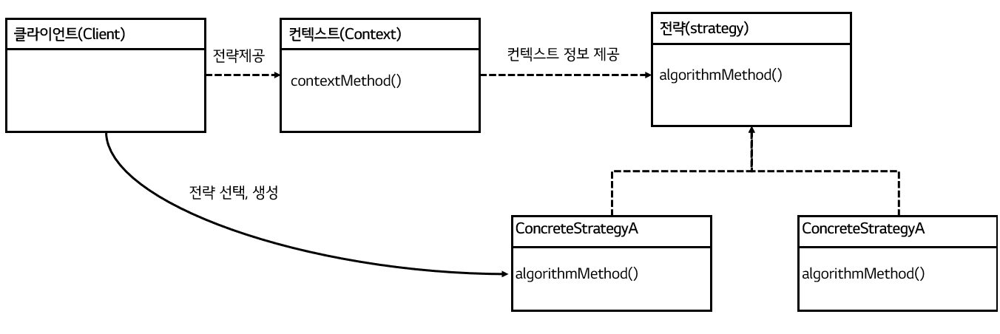

# [토비의 스프링] 3장. 템플릿


"토비의 스프링 3.1" 3장 템플릿 단원을 읽고 정리한 글입니다.

개념들에 대한 요약 정리와 함께 해당 개념을 적용한 코드를 책에서 발췌 혹은 변형하여 사용하였습니다.


### 들어가며

템플릿이란, 변경이 거의 일어나지 않으며, 일정한 패턴으로 유지되는 특성을 가지는 부분을 자유롭게 변경되는 성질을 가진 부분으로부터 독립시켜서 효과적으로 활용할 수 있도록 하는 방법을 의미한다. 해당 장에서는 템플릿의 기본적인 종류와 어떻게 적용할 수 있는지 그리고  Java의 JDBCTemplate의 원리에 대해서 설명한다.


## 변하지 않는 코드와 변하는 코드의 분리

변하지 않는 코드와 변하는 코드를 분리하기 위해 다음과 같은 패턴들을 적용시켜 볼 수 있다.

- 템플릿 메소드 패턴
- 전략 패턴
- 템플릿 콜백 패턴

위의 패턴들의 개념을 정리하고, 아래의 UserDao 클래스 코드에 적용시켜 보겠다.

```java
public class UserDao() {
    
    public void add(User user) throws SQLException {
        Connection c = null;
        PreparedStatement ps = null;

        try {
            c = dataSource.getConnection();
            ps =  c.preparedStatement("insert into users(id, name, password) values(?,?,?)");
        ps.setString(1, user.getId());
        ps.setString(2, user.getName());
        ps.setString(3, user.getPassword());
            ps.executeUpdate();
        } catch(SQLException e){
            throw e;
        } finally {
            if(ps != null) {try {ps.close();} catch (SQLException e) {}}
            if(c != null) {try {c.close();} catch(SQLException e) {}}
        }
    }
    
    
    public void deleteAll() throws SQLException {
        Connection c = null;
        PreparedStatement ps = null;

        try {
            c = dataSource.getConnection();
            ps = c.preparedStatement("delete from users"); 
            ps.executeUpdate();
        } catch(SQLException e){
            throw e;
        } finally {
            if(ps != null) {try {ps.close();} catch (SQLException e) {}}
            if(c != null) {try {c.close();} catch(SQLException e) {}}
        }
    }
}


```


### 템플릿 메소드 패턴

상속을 통해 기능을 확장해서 사용하는 패턴이다. 변하지 않는 부분은 슈퍼 클래스에 두고, 변하는 부분은 추상 메소드로 정의하여, 서브클래스에서 오버라이딩하여 새롭게 정의한다.

템플릿 메소드 패턴은 두가지 단점이 존재한다.

첫번째로는 접근에 제한이 많다. 변하지 않는 부분을 사용하기 위해서는 부모 클래스를 상속받아야만 하기에, 새로운 로직이 추가될 때마다 새로운 자식 클래스들을 생성해야 한다.

두번째로는 확장 구조가 설계하는 시점에서 고정된다. 컴파일 시점에 클래스간 의존 관계가 결정되어 있기에, 관계에 대한 유연성이 떨어진다.


#### 템플릿 메소드 패턴 예제 코드

```java
// 1. 추상 클래스 선언
abstract class  UserDao {
    // 변하는 부분은 추상 메소드로 선언
    abstract protected PreparedStatement makeStatement(Connection c) throws SQLException;
    // 변하지 않는 부분만 따로 분리
    public void execute() throws SQLException {
        Connection c = null;
        PreparedStatement ps = null;

        try {
            c = dataSource.getConnection();
            ps = makeStatement(c); // 변하는 부분은 추상 메소드로부터 주입
            ps.executeUpdate();
        } catch(SQLException e){
            throw e;
        } finally {
            if(ps != null) {try {ps.close();} catch (SQLException e) {}}
            if(c != null) {try {c.close();} catch(SQLException e) {}}
        }
    }
}
```

```java
// 2. 로직 별 구현 클래스 선언 (add)
// User Insert를 하기 위해서는 UserAddDao 라는 구체적인 클래스와 관계를 생성해야 한다.
public class UserAddDao extends UserDao {
    User user;
    
    public UserAddDao(User user){
        this.user = user; // 구현 메소드에서 사용될 인자를 생성자를 통해 받아옴
    }
    @Override
    protected PreparedStatement makeStatement(Connection c) throws SQLException{
         PreparedStatement ps= c.preparedStatement("insert into users(id, name, password) values(?,?,?)");
        ps.setString(1, user.getId());
        ps.setString(2, user.getName());
        ps.setString(3, user.getPassword());
     }
}
```

```java
// 2. 로직 별 구현 클래스 선언 (delete)
// User delete 하기 위해서는 UserDeleteDao 라는 구체적인 클래스와 관계를 생성해야 한다.
public class UserDeleteDao extends UserDao {
    @Override
    protected PreparedStatement makeStatement(Connection c) throws SQLException{
         PreparedStatement ps= c.prepareStatement("delete from users");
		 return ps;
     }
}
```


### 전략 패턴

변하는 부분을 별도의 클래스로 만들고, 추상화된 인터페이스를 통해 위임하는 패턴이다. 오브젝트를 아예 둘로 분리하고, 클래스 레벨에서는 인터페이스를 통해서만 의존하여, 유연하고 확장성 뛰어나게 설계할 수 있다.

변하지는 않는 코드를 Context, 변하는 코드를 Strategy로 부른다. Context는 그때그때의 로직에 따라서 Strategy를 사용하게 되는데, 이때 어떤 전략을 사용하게 될지는 앞단의 Client가 결정하는 것이 일반적이다. Context 내부에서 특정 Strategy 클래스에 의존하는 것이 아닌, Strategy 선택 권한은 Client에 위임하여 Context와 Strategy를 분리시킬 수 있다. 해당 구조는 DI의 구조와 동일하다.




[그림 3-3] 전략 패턴에서 Client의 역할


현재 구조에서도 두가지 단점이 존재한다.

첫번째로는, 템플릿 메소드 패턴과 유사하게, 새로운 로직이 추가될 때마다 Strategy 구현 클래스 클래스들을 생성해야 한다.

두번째로는, 클라이언트에서 Strategy에 전달할 부가적인 정보(User)가 있을 경우, Strategy 구현 클래스는 오브젝트를 전달받는 생성자와 이를 저장할 인스턴스 변수를 생성해야 한다. 이는 Strategy 클래스의 사용을 특정  오브젝트에 국한하게 만든다.


#### 전략 패턴 예제 코드

```java
// 1. 변하는 로직을 담은 Interface 생성
public interface StatementStrategy {
    PreparedStatement makePreparedStatement(Connection c) throws SQLException;
}
```

```java
// 2. Interface 구현 클래스 생성 (add)
public class AddStatement implements StatementStrategy {
    User user;
    
    public AddStatement(User user){
        this.user = user; // 구현 메소드에서 사용될 인자를 생성자를 통해 받아옴
    }
    
    @Override
    protected PreparedStatement makePreparedStatement(Connection c) throws SQLException{
         PreparedStatement ps= c.preparedStatement("insert into users(id, name, password) values(?,?,?)");
        ps.setString(1, user.getId());
        ps.setString(2, user.getName());
        ps.setString(3, user.getPassword());

        return ps;
     }
}
```

```java
// 2. Interface 구현 클래스 생성 (delete)
public class DeleteAllStatement implements StatementStrategy {
    @Override
    public PreparedStatement makePreparedStatement(Connection c) throws SQLException {
        PreparedStatement ps= c.prepareStatement("delete from users");
		return ps;
    }
}
```

```java
// 3. context 클래스 생성
public class UserContext {
    
    // 어떤 전략을 사용할 지는 제3자에게 위임
    public void execute(StatementStrategy strategy) throws SQLException {
        Connection c = null;
        PreparedStatement ps = null;

        try {
            c = dataSource.getConnection();
            ps = strategy.makePreparedStatement(c); // 변하는 부분은 Interface로 분리
            ps.executeUpdate();
        } catch(SQLException e){
            throw e;
        } finally {
            if(ps != null) {try {ps.close();} catch (SQLException e) {}}
            if(c != null) {try {c.close();} catch(SQLException e) {}}
        }
    }
    
}
```

```java
// 4. Client 클래스 생성
public class UserDao {
    UserContext userContext; // 해당 코드에서는 UserContext 주입 받는 부분은 생략.
    
    public void add(User user) throws SQLException {
        StatementStrategy st = new AddStatement(user);
        userContext.execute(st); // context가 어떤 strategy 사용할지는  Client가 결정
    }
    
    public void deleteAll() throws SQLException {
        StatementStrategy st = new DeleteAllStatement();
        userContext.execute(st); // context가 어떤 strategy 사용할지는  Client가 결정
    }
}
```


### 템플릿/콜백 패턴

스프링에서 익명 내부 클래스를 활용하는 전략 패턴을 부르는 방식이다. 여기서 템플릿은 전략 패턴에서의 Context이다. 콜백은 Strategy 역할로 특정 로직을 담은 메소드가 실행되는 것을 목적으로 다른 오브젝트의 메소드에 전달되는 오브젝트이다. 


추가로, **익명 내부 클래스**는 이름을 갖지 않는 클래스로, **클래스 선언와 오브젝트 생성이 결합**된 형태로 만들어지는 클래스이다. 즉,  `new 인터페이스이름() { 클래스 본문 }`와 같은 방식으로 선언된다. 클래스 재사용하지 않으며, 구현한 인터페이스 타입으로만 사용할 경우 유용하다.

이렇게, 익명 내부 클래스로 전략을 생성하면 기존 전략패턴에서의 단점을 해결할 수 있다.

우선,  새로운 로직이 추가될 때마다 새로운 구현 클래스가 필요없다. 필요한 로직에 맞춰 익명 내주 클래스를 선언해 컨텍스트에 전달이 가능하다.

또한, 내부 메소드는 자신이 정의된 메소드의 로컬 변수에 직접 접근이 가능하다. **final로 선언된** 

외부 변수에 접근이 가능하여, 생성자와 인스턴스 변수를 통해 Client의 부가적인 정보를 전달받을 필요가 없다. 


템플릿/콜백 패턴의 특징으로는 다음과 같이 있다.

첫번째로, 주로 단일 메소드 인터페이스 사용한다.  Java에서는 특정 메소드를 다른 메소드의 파라미터로 넘겨주는 것이 불가능하기 때문에, 해당 메소드를 감싼 오브젝트(펑셔녈 오브젝트)로 전달하게 된다. 애초에 단일 메소드를 파라미터로 제공하는 것이 목적이었기에, 단일 메소드 인터페이스를 사용하게된다. 

두번째로, 콜백은 주로 파라미터가 존재한다. 콜백은 로직을 수행하기 위해 컨텍스트의 정보를 필요로 하는 경우가 많기 때문에, 파라미터를 통해서 컨텍스트의 정보를 전달 받는다.

세번째로, Client의 메소드 단위로 컨텍스트는 사용할 콜백 오브젝트를 새롭게 전달 받는다. 익명 내부 클래스가 컨텍스트의 파라미터로 들어가 있어, 새로 생성된 오브젝트를 전달받는다.

네번째로, **클라이언트와 콜백이 강하게 결합**되어 있다. 클라이언트에서 콜백을 생성하여 컨텍스트에 전달한다.


#### 템플릿/콜백 패턴 예제 코드

```java
// 전략 패턴의 1,3번은 동일하게 수행
// 4. Client 클래스 생성
public class UserDao {
    UserContext userContext; // 해당 코드에서는 UserContext 주입 받는 부분은 생략.
    
    // 외부 변수를 final로 선언하여 내부 클래스에서 사용할 수 있도록 함
    public void add(final User user) throws SQLException { 
        // UserContext의 execute 메소드의 파라미터로 익명 내부 클래스 선언하여 주입
        userContext.execute(new StatementStrategy() {
            public PreparedStatement makePreparedStatement(Connection c) throws SQLException {
                    PreparedStatement ps 
                        = c.preparedStatement("insert into users(id, name, password) values(?,?,?)");
                    ps.setString(1, user.getId());
                    ps.setString(2, user.getName());
                    ps.setString(3, user.getPassword());

                    return ps;
                }
            }); 
    }
    
    public void deleteAll() throws SQLException {
        userContext.execute(new StatementStrategy() {
        public PreparedStatement makePreparedStatement(Connection c) throws SQLException {
                PreparedStatement ps 
                    = c.prepareStatement("delete from users");
                return ps;
            }
		}); 
    }
}
```


## Jdbc Template

JdbcTemplate이란 스프링에서 제공하는 JDBC용 Template 클래스로, 거의 모든 종류의 JDBC에 사용 가능한 템플릿과 콜백을 제공하고 있다. JdbcTemplate은 생성자의 파라미터로 DataSource를 주입받는다. 우리가 앞서 Context로 지정한 변하지 않는 부분을 대신 구현해 주며, 개발자는 변하는 부분인 쿼리문, 쿼리 파라미터값, 콜백만 지정해주면 된다. 

:bulb: 위의 `템플릿/콜백 패턴 예제 코드`에서 query문과 파라미터를 지정하는 부분까지 외부 변수를 통해 받아오는 구조로 바뀌었다고 생각하면 된다.


### JdbcTemplate의 초기화를 위한 코드

```java
public class UserDao{
    private JdbcTemplate jdbcTemplate;
    
    public void setDataSource(DataSource dataSource){
        this.jdbcTemplate = new JdbcTemplate(dataSource);
    }
}
```


해당 장에서는 JdbcTemplate의 메소드들 자주 사용되는, `update`, `queryForObject`, `query` 메소드들에 대해서 소개된다.

### update

```java
public int update(String sql, @Nullable Object... args) throws DataAccessException
```

DML 작업을 수행하는데 사용되는 템플릿이다.

파라미터가 없는 경우에는 두번째 파라미터는 생략 가능하며, 존재하는 경우 두번째 파라미터에 입력된 순서대로 파라미터에 대입된다. 


#### JdbcTemplate Update 예제 코드1 - 파라미터가 없는 DML 실행

```java
public void deleteAll(){
    this.jdbcTemplate.update("delete from users");
}
```

#### JdbcTemplate Update 예제 코드2 - 파라미터가 있는 DML 실행

```java
public void add(User user){
    this.jdbcTemplate.update("insert into users(id, name, password) values (?,?,?)", user.getId(), user.getName(), user.getPassword());
}
```


### queryForObject

```java
public <T> T queryForObject(String sql,
                            Class<T> requiredType, 
                            @Nullable Object... args) throws DataAccessException
```

Select 해온 결과를 requiredType 인자에서 지정된 클래스 타입으로 반환하는 템플릿이다.

sql의 결과값은 single row, single colume이어야 한다.

#### queryForObject 예제 코드 1 - single row, single colmne 반환

```java
public int getCount(){
    return this.jdbcTemplate.queryForObject("select count(*) from users", Integer.class)
}
```

:bulb: 책에서 소개된 `queryForInt()`는 deprecated되었습니다.


```java
@Nullable
public <T> T queryForObject(String sql,
                            RowMapper<T> rowMapper,
                            @Nullable Object... args) throws DataAccessException
```

Select 해온 결과를 rowMapper 콜백에서 정의된 코드를 통해 `T` 타입으로 매핑한 후 반환한다.

sql의 결과값은 single row여야 하며, multi column이어도 된다.

RowMapper는 ResultSet을 받아,  `mapRow` 메소드에서 ResultSet의 결과를 추출하고 매핑하는 역할을 수행한다.

#### queryForObject 예제 코드 2 - RowMapper 적용 예시

```java
public User get(String id){
    return this.jdbcTemplate.queryForObject(
        "select * from users where id = ?", 			
        new RowMapper<User>(){							
           public User mapRow(ResultSet rs, int rowNum) throws SQLException {
               User user = new User();
               user.setId(rs.getString("id"));
               user.setName(rs.getString("name"));
               user.setPassword(rs.getString("password"));
               return user;
           }
        },
    	id);
}
```

:bulb: 책에서 소개된 `queryForObject(String sql, Object[] args, RowMapper<T> rowMapper)`는 deprecated되었습니다.


### query

```java
public <T> List<T> query(String sql, 
                         RowMapper<T> rowMapper,  
                         @Nullable  Object... args) throws DataAccessException
```

Select 해온 결과들을 rowMapper 콜백에서 정의된 코드를 통해 `T` 타입으로 매핑한 후 List에 적재하여 반환합니다.

sql의 결과값은 multi row, multi column이어도 됩니다. RowMapper는 마찬가지로 ResultSet을 받아 `mapRow` 메소드에서 ResultSet의 결과를 추출하고 매핑하는 역할을 수행합니다.  대신, ResultSet의 모든 로우를 열람하면서 로우마다 RowMapper 콜백을 호출하게 된다.

### query 예제 코드

```java
public List<User> getAll(String id){
    return this.jdbcTemplate.queryForObject("select * from users order by id",
                                           new RowMapper<User>(){
                                               public User mapRow(ResultSet rs, int rowNum) throws SQLException {
                                                   User user = new User();
                                                   user.setId(rs.getString("id"));
                                                   user.setName(rs.getString("name"));
                                                   user.setPassword(rs.getString("password"));
                                                   return user;
                                               }
                                           });
}
```

