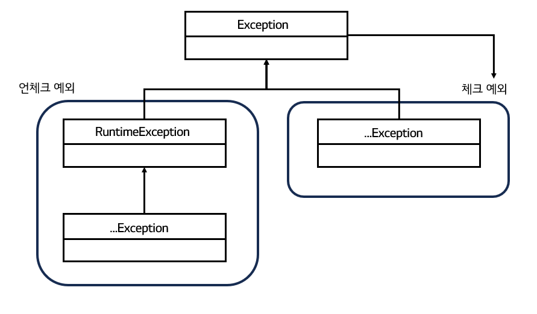

# [토비의 스프링] 4장. 예외


"토비의 스프링 3.1" 4장 예외 단원을 읽고 정리한 글입니다.


## 들어가며


예외 처리는 java 프로그래밍을 하면서 바로 접하는 문제이지만, 잘 처리하는 것은 번거롭고 어려운 일이다. 이번 단원에서는 예외 처리의 핵심 원칙과 예외의 종류, 그리고 처리 전략에 대해서 다루고 있다.

예외 처리에 있어야 명심해야할 핵심 원칙은 **모든 예외는 적절하게 복구**되거나 **작업을 중단시키고 개발자나 운영자에게 분명하게 통보**돼야 한다는 것이다. 예외 처리를 할 때 가장 실수하는 부분이 무의미하게 예외 처리를 하는 것이다. 예를 들어, 예외를 잡고서 아무것도 수행하지 않거나 무의미하고 무책임한 throws를 남발한다면 예외 처리를 했다고 할 수 없다.


## 예외의 종류와 특징

자바에서 throw를 통해 발생시킬 수 있는 예외는 크게 2가지가 있다.


첫번째는 **Error** 타입이다.

java.lang.Error 클래스의 서브클래스로, 시스템에 뭔가 비정상적인 상황이 발생했을 경우 사용된다. 주로 자바 VM에서 발생시키며, 시스템 레벨의 처리 필요하기 때문에 애플리케이션 코드에서 처리하지 않는 예외 타입이다. 대표적인 예시로는 OutOfMemoryError, ThreadDeath가 있다.


두번째는 **Exception** 타입이 있다.

java.lang.Exception의 서브클래스로 정의되며, 개발자가 작성한 애플리케이션 코드의 작업 중에 예외 상황이 발생했을 경우 사용된다.  이 Exception 타입은 다음 2가지로 분류할 수 있다. 

먼저 **체크 예외**이다.

체크 예외는 Exception 클래스의 서브클래스이면서, RuntimeException 클래스를 상속하지 않는 클래스이다. 예외 처리를 강제하는 예외이며, 일반적인 상황에서 예외라고 부를 때 나타내는 것이다. 대표 예시로는 SQLException이 있다. 

다른 하나는 **언체크 예외**이다.

RuntimeException 클래스를 상속하는 클래스로, 명시적인 예외처리를 강제하지 않는 예외이다. 대표 예시로는 NullPointerException, IllegalArgumentException가 있다. 



[그림 4-1] Exception의 두 가지 종류


## 예외 처리 방법

예외를 처리하는 방법에는 3가지가 있다.

### 1. 예외 복구

첫번째로 예외를 **복구**하는 방법이 있다. 예외 상황을 파악하고 문제를 해결하여 정상 상태로 복구하는 방식이다. 다른 작업 흐름으로 자연스럽게 유도하거나 재시도를 통해서, 본래의 작업 흐름을 이어나가는 것이다.

예를 들어, DB Connection 문제로 에러가 발생했을 때, Connection을 다시 연결하고 본래의 로직을 다시 수행하도록 처리할 수 있다.


### 2. 예외 회피

두번째로는 예외처리를  **회피**하는 것이다. 예외의 처리를 자신이 담당하지 않고 자신을 호출한 쪽으로 던져버리는 것으로 `throws`를 사용하는 것이다. 주의할 점은 긴말하게 역할을 분담하고 있는 관계가 아니라면 무책임한 회피일 수 있다는 것이다. 예외를 회피하는 것 또한 복구하는 것처럼 의도가 분명해야 한다. 

예를 들어, 3장에서 살펴본 템플릿-콜백 관계에서는 콜백이 SQLException을 처리하지 않고, 템플릿에 던져버렸었다. 이처럼 예외 회피는 긴밀하고 분명한 역할 구분이 있는 관계에서 사용되어야 한다.


### 3. 예외 전환

세번째로는 예외를 **전환**하는 것이다. 적절한 예외로 전환해서 메소드 밖으로 던져버린다. 예외 전환은 보통 2가지 케이스에서 사용된다. 

먼저 **분명한 의미를 가지는 예외로 전환**하는 케이스이다. 의미가 분명한 예외가 던져지면 서비스 계층 오브젝트에는 적잘한 복구 작업 시도할 수 있다. 예를 들어, 단순히 여러 에러 원인을 가진 `SQLException`을 외부에 던지는 것이 아닌,  `DuplicateUserIdException`와 같이 의미가 명확한 예외를 선언해서 던진다. 이때, 중첩 예외를 사용해서 전환하는 예외에 원래 발생한 예외 담는 것을 권장한다. 
 ```java
 catch(SQLException e){
     throw DuplicateUserIdException(e); 
 }
 ```

 ```java
 catch(SQLException e){
     throw DuplicateUserIdException().initCause(e);
 }
 ```

[리스트 4-10,11] 중첩 예외 1,2

다른 케이스로는 예외를 처리하고 쉽고 단순하게 만들기 위해 포장한 것이다. 이는 주로 예외 처리를 강제하는 체크 예외를 강제하지 않는 언체크 예외로 바꾸는 경우에 사용한다. 

```java
try{
    OrderHome orderHome = EJBHomeFactory.getInstance().getOrderHome();
    Order order = orderHome.findByPrimaryKey(Integer id);
} catch (NamingException ne){
    throw new EJBException(ne);
}
```

[리스트 4-12] 예외 포장

해당 코드의 경우 `EJBException`이라는 런타임 Exeption으로 던짐으로써, 별도의 Exception 처리를 하지 않아도 되며, 발생 시에는 시스템 exception으로 인식하여 트랜잭션이 자동으로 롤백된다. 


:bulb: `EJBExcpetoin` : 예상치 못한 에러로 인해, 비지니스 메소드 혹은 콜백 메소드가 정상적으로 수행되지 못 했음을 알리는 Exception 클래스


:bulb: 중첩 예외 생성을 위한 생성자 추가

```java
public class DuplicateUserIdException extends RuntimeException {
    public DuplicateUserIdException(Throwalbe cause){
        super(cuase);
    }
}
```

[리스트 4-13]  아이디 중복 시 사용하는 예외


## Spring JDBC 예외 처리 전략 - DataAccessException 

### JDBC SQLException의 한계점

우선, JDBC에서 사용하는 SQLException에는 크게 2가지 한계점이 있다.

첫번째로, SQLException의 포괄적인 사용이다. DB 작업 시에는 SQL 문법 오류, DB 커넥션, PK 중복 등 여러 원인에 의해서 Exception이 발생될 수 있다. 하지만 JDBC API는 다양한 예외를 그냥 SQLException 하나에 모두 담아버린다. 이로 인해, 예외 클래스만 보아서는 Exception이 발생한 명확한 원인을 파악할 수 없다.

두번째로, SQLException 내부의 에러 정보가 DB간 호환되지 않는다. SQLException의 `getErrorCode()` 메소드의 경우 DB에러 코드 가져올 수 있지만, DB에러 코드는 DB별로 상이하다. SQLException의 `getSQLSate()` 메소드의 경우 Open Group에서 정의한 SQL 상태 코드를 따르지만, JDBC에서 정확한 상태 코드 생성하지 못 하기 때문에 신뢰도가 떨어진다. 

따라서, JDBC API를 사용해 DAO를 정의하며 Exception 처리를 하는 경우, DAO가 특정 DB에 종속적이게 되거나, 모든 DB의 에러코드에 대한 Exception 처리를 해야되는 문제가 발생한다.


### DataAccessException 특징

이에, Spring에서는 SQLException을 대체할 수 있는 `DataAccessException`을 정의하고 있다. DataAccessException은 다음과 같은 특징이 있다. 

1번, 런타임 예외이다. 즉, 예외 처리를 강제하지 않는다.

2번, 세분화된 예외 서브 클래스들을 정의하고 있다. 예를 들어,  SQL 문법 오류시 발생하는 `BadSqlGrammarException`, DB 커넥션 오류로 인한 `DataAccessResourceFailureException`, 제약조건 위배 오류인 `DataIntegrityViolationException`, PK 중복 때의 `DuplicateKeyException` 등이 있다. 이처럼 Exception 발생 원인에 따라 명시적인 예외 클래스를 반환한다.

3번, DB별 에러코드를 서브클래스에 매핑한다. Spring은 DB별로 달랐던 에러코드를 DataAccessException의 서브 클래스들 중 하나로 매핑시켜 준다. 


### DataAccessException 장점

이러한 특징으로 인해, DataAccessException은 1.**DB에 종속되지 않은 일관된 예외 처리**와 2. **독립적이고 이상적인 DAO Interface 구현**이 가능하다. 

DataAccessException 적용 전에는 Interface를 정의할 때에도 `throws Exception`을 정의해야 했다. 인터페이스의 메소드 선언에는 없는 예외를 구현 클래스의 메소드의 throws에 넣을 수 없기 때문에, DB에 종속적이지 않는 Interface를 설계하기 위해서는 `throws Exception`과 같이 무책임한 예외 처리밖에 할 수 없었다. 하지만 DataAccessException의 경우 runtime 예외이기 때문에 Interface 메소드에서 `throws`문을 넣지 않아도 돼, 예외 종류와 상관 없는 메소드 설계가 가능해진다.
