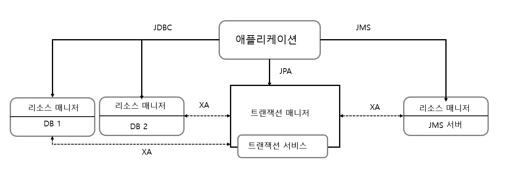

# [토비의 스프링] 5장. 추상화


"토비의 스프링 3.1" 5장 추상화 단원을 읽고 정리한 글입니다.

책에서는 4장까지 완성된 DAO에 기능 추가 및  추상화 과정을 소스를 조금씩 수정하며 설명하지만, 본 글에서는 최종 주제인 **수평/수직적 분리**에 대한 내용 위주로 정리하였습니다. 또한 테스트를 위한 추상화는 오늘날에는 Junit에서 기능을 제공하기 때문에 생략하였습니다.


## 들어가며

### 수평, 수직적 분리

이번 장의 목표는 수평, 수직 계층 구조의 객체 간 관계를 추상화를 통한 분리로 서로의 결합도를 낮추는 것이다. 

수평적 분리는 같은 계층 내에서 기능적 관심에 따라 분리하는 것이다. 예를 들어, `UserService`와 `UserDao`는 애플리케이션 로직을 담은 애플리케이션 계층에 있지만 각각 사용자 비지니스 로직과 데이터 엑세스 로직이라는 기능을 맡고 있다. 이때, 서로 다른 관심을 가지는 클래스들의 관계에서는 한쪽의 로직이 변하여도 다른 쪽의 소스에 영향을 주지 않아야 한다.

수직적 분리는 다른 계층의 특성을 갖는 코드를 분리하는 것이다. 예를 들어, `UserService`와 `UserDAO`와 같은 기능을 수행하는 계층과 `JDBC`, `JTA`, `WAS`, `Hibernate`와 같은 기술 계층을 분리하는 것이다. 애플리케이션 계층의 소스가 특정 기술에 종속되는 것이 아닌, 사용하는 기술이 변하여도 애플리케이션 계층의 소스를 수정하지 않도록 분리하는 것이다.

이러한 수평적, 수직적 분리는 모두 추상화와 DI로 구현할 수 있다. 이를 통해, 소스간 결합도를 낮추고, 자유로운 확장 구조를 생성하며,  하나의 모듈이 바뀌는 이유는 하나여야 한다는 단일 책임 원칙을 지킬 수 있다.


[그림 5-7] 계층과 책임의 분리 376


### 코드 개선 질문

이처럼 추상화는 객체 지향적으로 코드를 잘 작성하기 위해서 필수적인 개념이다. 자신의 코드가 추상화를 통해 낮은 결합도와 높은 응집도를 가진 코드인지 확인하기 위해서는 다음과 같은 질문들을 던져보면 좋다.

- 코드에 중복된 부분은 없는가
- 코드가 무엇을 하는 것인지 이해하기 불편하지 않은가
- 코드가 자신이 있어야 할 자리에 있는가
- 앞으로 변경이 일어난다면 어떤 것이 있을 수 있고, 그 변화에 쉽게 대응할 수 있게 작성되어 있는가


## 수평적 분리 예시 (feat. Service 다중 역할 코드 개선)

### 코드 배경

사용자 등록, 조회, 수정, 삭제만 있던 기존 로직에 사용자 관리의 일환으로 레벨을 조정할 수 있는 기능을 추가한다고 해보자. 사용자 레벨에는 "BASIC", "SILVER", "GOLD"가 있다. 이때, DB 상에서 해당 문자열로 레벨을 관리하는 것은 DB용량이 비효율적이므로, 1,2,3과 같은 숫자로 코드화해서 관리한다. Java 소스 상에서는 Enum을 활용해서, 레벨과 코드 숫자를 관리할 수 있다.

```java
public enum Level {
    GOLD(3), SILVER(2), BASIC(1);
    private final int value;

    public int getValue(){
        return this.value;
    }
}
```


### 높은 결합도 예시 코드

이제, 기존 User의 레벨을 높이기 위해서는 다음과 같은 코드를 짤 수 있다.

```java
public class UserService {
    // ...
    
    private void upgradeLevel(User user){
        if(user.getLevel() == Level.BASIC){
            user.setLevel(Level.SILVER);
        } else if (user.getLevel() == Level.SILVER) {
            user.setLevel(Level.GOLD);
        }
        userDao.update(user);
    }
    // ...
}
```

[리스트5-25] 레벨 업그레이드 작업 메소드


하지만, 이와 같은 소스에는 두가지 문제점이 존재한다. 

첫번째로, `UserService`에 과도한 역할이 모여있다. 다음 단계가 무엇인가 하는 로직과 사용자 level 변경 로직이 함께 존재하고 있다. 이와 같은 코드에서는 `UserService`의 기존 관심도인 각 주체에게 요청을 내린 것 이외에, Level이 추가되거나, Level간 순서에 변경이 있을 때에도 수정이 필요할 것이다.

두번째로, 예외 상황에 대한 처리가 없다. Level의 변경함에 있어 생길 수 있는 예외 상황의 처리 또한 적절한 관심사를 가진 객체에 귀속되어야 한다.


### 개선 방안

이러한 문제점을 해결하기 위해서는, 각각의 역할을 해당하는 관심사를 가지는 모듈로 이동시켜야 한다.

첫번째로, **레벨의 순서와 다음 단계 레벨이 무엇인지 결정**하는 역할은 `Level`에 이동시킬 수 있다.

```java
public enum Level {
    GOLD(3, null), SILVER(2,GOLD), BASIC(1,SILVER);
    private final int value;
    private final Level next;

    // ...
    public Level nextLevel(){
        return this.next;
    }
}
```


두번째로, **사용자 정보를 수정 및  사용자 정보 처리 과정 중 발생하는 예외 처리**는 `User`에게 맡길 수 있다.

```java
public void upgradeLevel(){
	Level nextLevel = this.level.nextLevel();
    if(nextLevel == null) {
        throw new IllegalStateException();
    } else {
        this.level = nextLevel;
    }
}
```


세번째로, `UserService`는 각 주체들에게 요청하는 역할만을 가진다.

```java
private void upgradeLevel(User user){
	user.upgradeLevel();
    userDao.update(user);
}
```


이렇게 수정이 된다면, 각각의 모듈들은 변경해야 할 이유를 단 하나씩만 가질 수 있게 된다. `Level`은 Level의 관리 체계 변경이 있을 때, `User`는 사용자 관리의 변경이 있을 때, `UserService`는 User 관련 비지니스 로직의 추가 및 변경이 있을때만 수정을 하면 된다. 각 주체들이 하나의 책임만 가지게 되는 것이다.


## 수직적 분리 예시 (feat. Service 트랜잭션 서비스 추상화)

### 코드 배경

한번에 한명의 User에 대한 정보를 수정하는 것이 아니라 한꺼번에 여러 명의 정보를 수정한다고 하자. 그렇다면 하나의 Service 메소드에서 DAO의 메소드를 여러번 호출해야 할 것이다. 이때 한 건이 수정이 실패가 났을때에도 전부 원복을 시켜야 하는 경우에는, 여러번의 DAO 메소드 호출을 하나의 트랜잭션으로 묶어야 할 것이다. 

하지만 트랜잭션은 커넥션보다 존재 범위가 짧기 때문에, DAO 내에서 메소드 단위로 connection을 반환하는 구조에서는 여러 메소드를 한 트랜잭션으로 처리할 수가 없게 된다. 


### 기술 종속적 예시 코드

만약, 스프링의 도움 없이 여러 메소드를 하나의 메소드로 처리하기 위해서는 다음 2가지 방법이 있을 것이다.

먼저, DAO안에 Service 안에 있던 비지니스 로직을 옮기는 것이다. 하지만 이 경우, 앞서 여러 역할과 책임이 한 곳에 집중되어 버리게 된다. 앞선 수평적으로 분리한 작업을 되돌리는 것이기에 넘어가도록 하겠다. 


다음으로는, DAO의 메소드가 Service에서 Connection을 파라미터 전달받아서 사용하는 것이다. Service의 메소드가 구현하는 하나의 비지니스 로직을 수행할 때 필요한  DB 작업들에 하나의 Connection을 사용할 수 있게 된다. 하지만 이 경우에도 3가지 문제점이 발생한다.

첫번째는, DAO와 Service 메소드들에 Connection 파라미터를 추가해야 한다는 것이다. 스프링 빈으로 등록되어 관리되는 Service 특성상 인스턴스 변수로 Connection을 저장해두었다가, 다른 메소드에서 사용할 수도 없다. 인스턴스 변수는 Heap 영역에 저장되는데, Heap 영역은 스레드간 공유하므로, **멀티 스레드 환경에서는 스레드별로 정보를 서로 덮어쓰우는 일이 발생**할 수 있기 때문이다. 따라서, 트랜잭션 작업에 참여하는 Dao와 Service 메소드들은 Connection 파라미터 지저분해질 것이다.

두번째는, 하나의 DB 환경에 종속되는 것이다.  JDBC Connection을 이용하는 것은 **로컬 트랜잭션** 방식이다. 만약, 하나의 트랜잭션 안에서 여러 개의 DB에 데이터를 넣는 작업을 할 필요가 존재한다면, 하나의 DB Connection에 종속되는 로컬 트랜잭션 방식으로는 불가능하다. 

세번째는 Connection 객체의 사용으로 **특정 데이터 엑세스 기술에 종속적**이게 된다. JPA / Hibernate의 경우에는 Connection 객체가 아닌 EntityManager 혹은 Session을필요로 한다. DAO Interface 메소드에 Connection 파라미터를 추가하거나, Service의 코드에서 Connection 객체가 등장하게 된다면, 특정 기술들에만 적용할 수 있는 종속적인 코드가 되버린다.


```java
class UserService {
    public void upgradeLevels() throws Exception {
        Connection c = ...;
        ...
        try {
            ...
			upgradeLevel(c, user);
            ...
        }
        ...
    }
    
    public void upgradeLevel(Connection c, User user){
        user.upgradeLevel();
        userDao.update(c, user);
    }
}

interface UserDao{
    public update(Connection c, User user);
    ...
}
```

[리스트 5-40] Connection을 공유하도록 수정한 UserService  메소드


### 개선 방안 1. Connection 파라미터 제거 : 트랜잭션 동기화

스프링은 트랜잭션 관리를 위해서 Connection 파라미터를 전달해야만 하는 문제를 해결하고자 독립적인 **트랜잭션 동기화** 방식을 사용한다. 트랜잭션을 시작하기 위해 만든 Connection 오브젝트를 특별한 저장소에 보관해두고, 이후 호출되는 DAO의 메소드에서는 저장된 Connection을 가져가 사용하게 하는 것이다. 

특히, 트랜잭션 동기화 저장소는 작업 스레드마다 독립적으로 Connection을 저장하고 관리하기 때문에, 다중 사용자를 처리하는 멀티스레드 환경에서도 충돌이 날 걱정이 없다.

```java
class UserService {
    private DataSource dataSource;
    
    public void setDataSource(DataSource dataSource){
        this.dataSource = dataSource ; // Connetion 생성시 사용할 DataSource DI 받음
    }
    
    public void upgradeLevels() throws Exception {
        TransactionSynchronizationManager.initSynchronizaition(); // 동기화 작업 초기화
        Connection c = DataSourceUtils.getConnection(datasource); // Connectioin 오브젝트 생성 및 트랜잭션 동기화 저장소에 바인딩
        c.setAutoCommit(false);
        
        try {
            List<User> users = userDao.getAll();
            for(User user : users){
                if(canUpgradeLevel(user)){
                    upgradeLevel(user);
                }
            }
            c.commit();
        } catch(Exception e) {
            c.rollback();
            throw e;
        } finally {
            // 스프링 유틸리티 메소드를 이용해 DB 커넥션 안전하게 닫기
            DataSourceUtils.releaseConnection(c,dataSource);
            // 동기화 작업 종료 및 정리
            TransactionSynchronizationManager.unbindResource(this.dataSource);
            TransactionSynchronizationManager.clearSynchronization();
                
        }
        
    }
}
```

[리스트 5-41] 트랜잭션 동기화 방식을 적용한 UserService


### 개선 방안 2. DB 환경 종속 제거 : JTA

트랜잭션이 하나의 DB에 종속되는 문제를 해결하기 위해, Java는 글로벌 트랜잭션을 지원하는 트랜잭션 매니저 API인 JTA(Java Transactoin API)를 제공하고 있다. JTA는 여러 개의 DB 또는 메시징 서버에 대한 트랜잭션을 관리한다. 



[그림 5-4] JTA를 통한 글로벌/분산 트랜잭션 관리


애플리케이션에서는 기존의 방법대로 DB는 JDBC, 메시징 서버라면 JMS와 같은 API를 사용해서 작업을 수행한다. 단, **트랜잭션은 JDBC나 JMS를 사용해서 직접 제어하지 않고, JTA를 통해 트랜잭션 매니저가 관리하도록 위임**한다. 이때 트랜잭션 매니저와 리소스 매니저는 XA 프로토콜을 통해 연결된다. 이를 통해, 트랜잭션 매니저가 실제 DB와 메시징 서버의 트랜잭션을 종합적으로 제어할 수 있다.

:bulb: XA : 2PC(2 phase commit)을 통한 분산 트렌젝션 처리를 위한 X-Open에서 명시한 표준

```java
InitialContext ctx = new InitialContext();
UserTransaction tx = (UserTransaction) ctx.lookup(USER_TX_JDNI_NAME);

tx.begin();
Connection c = dataSource.getConnection();
try{
    // 데이터 엑세스 코드
    tx.commit();
} catch(Exception e){
    tx.rollback();
    throw e;
} finally {
    c.close();
}
```


### 개선 방안 3. 기술적 종속 제거 : PlatformTransactionManager

개선 코드의 적용으로  Connection을 파라마터로 전달해야 될 필요는 없어졌지만, Connection 객체가 등장하는 이상, 기술적 종속이 없어지지 않는다. 이를 위해, 스프링은 트랜잭션 기술의 공통점을 담은 트랜잭션 추상화 기술을 제공하고 있다. 

트랜잭션 추상화란, 데이터 엑세스 기술별 트랜잭션 경계 설정 방법에서 공통적인 특징을 모아서 추상화된 트랜잭션 관리 계층을 만드는 것이다.  JDBC, JTA, 하이버네이트, JPA, JMS 등 데이터 엑세스 기술은 트랜잭션 개념을 갖고 있으니, 그 트랜잭션 경계설정 방법에서 공통점이 있을 것이다. 결국 추상화란 하위 시스템의 공통점을 뽑아내서 분리시키는 것이므로, 트랜잭션 추상 계층이 제공하는 API를 사용한다면 특정 기술에 종속되지 않는 트랜잭션 경계설정 코드를 작성할 수 있다.


[그림 5-6] 스프링의 트랜잭션 추상화 계층


```java
public class UserService {
    private PlatformTransactionManager transactionManager;
    
    // 추후 PlatformTransactionManager은 bean으로 등록 후 @Autowired를 통해 주입 받음
    public void setTransactionManager(PlatformTransactionManager transactionManager){
    	this.transactionManager =transactionManager;
    }
    
    public void upgradeLevels(){
        TransactionStatus status = this.transactionManager.getTransaction(new DefaultTransactionDefinition());
        try{
            List<User> users = userDao.getAll();
            for(User user : users){
                upgradeLevel(user);
            }
	        this.transactionManger.commit(status);
        } catch(RuntimeException e) {
            this.transactionManager.rollback(status);
            throw e;
        }

    }
}
```

[리스트 5-45] 스프링의 트랜잭션 추상화 API를 적용한 upgradeLevels()


이처럼 이제 Service는 `PlatformTransactionManager`라는 트랜잭션 경계설정을 위한 추상 인터페이스에만 의존하게 된다. 만약, DAO의 데이터 엑세스 기술이 변한다면, Service 코드는 수정할 필요 없이, 주입되는 `PlatformTransactionManager`의 구현 클래스만 변경하면 된다.


### :bulb: `TransactionSynchronizationManager` vs `@Transactional`

추가로 글을 작성하던 중 `TransactionSynchronizationManager`와 `@Transactional`이 수행하는 기능이 유사한 것 같아, 두 개념에 대해서 비교 정리해 보았다.

| 측면          | TransactionSynchronizationManager                            | @Transactional                                               |
| ------------- | ------------------------------------------------------------ | ------------------------------------------------------------ |
| 정의          | 트랜잭션 동기화 콜백을 위한 중앙 레지스트리 역할             | 메서드나 클래스에 트랜잭션을 표시하는 선언적 어노테이션      |
| 목적          | 트랜잭션 라이프사이클의 다양한 단계에서 실행되는 동기화 콜백 등록<br />ex) beforeCommit, afterCommit, afterCompletion, ... | 트랜잭션 경계를 정의하고 트랜잭션 관리를 자동화하는 선언적 방식 |
| 추상화 수준   | 동기화에 대한 더 많은 제어를 제공하는 저수준 API             | 저수준 트랜잭션 세부사항을 추상화한 고수준의 개념.           |
| customization | 다양한 트랜잭션 단계에서 사용자 정의 동작 제공               | 비즈니스 로직에 집중하며 저수준 트랜잭션 세부사항은 추상화.  |
| 사용          | 트랜잭션 동기화에 세밀한 제어와 다양한 사용자 정의 로직 필요 시 사용 | 표준 시나리오에 대한 자동 트랜잭션 관리에 주로 사용          |
| 일반적 사용   | 직접적으로 사용되는 경우는 드묾<br />주로 사용자 정의 동기화에 활용 | 일반적인 트랜잭션 관리에 자주 사용                           |
| 개발자 포커스 | 트랜잭션 동기화 세부사항에 더 많은 주의 필요                 | 트랜잭션 처리의 추상화 <br />=> 비즈니스 로직에 집중 가능    |


정리하자면, `TransactionSynchronizationManager`은 개발자가 동기화에 직접적으로 제어할 수 있도록 하여, 트랜잭션 단계에서 세밀한 제어와 다양한 로직을 수행할 수 있게 해준다.

반연에, `@Transactional`은 트랜잭션 관리를 개발자 대신 수행해주어, 개발자는 비지니스 로직에 더 집중할 수 있도록 한다.


## 마무리

읽으면서 반성을 많이 하게 되는 장이었다. 추상화의 개념은 1장.오브젝트와 의존관계에서도 다뤘었고, 객체 지향적으로 코드 작성하기와 같은 글을 쓰면서도 이제 숙지했다고 생각했었다. 하지만 여전히 내가 평소에 작성하던 코드는 이번 장에서 중속적 코드 예시와 동일한 구조였다. 단순히 인터페이스만 사용한다고 추상화를 사용하고 있는 것이 아님을 다시 한번 느끼며, 더 좋은 개발자가 되기 위해 해야할 고민들에 대해서 알게되었다.


