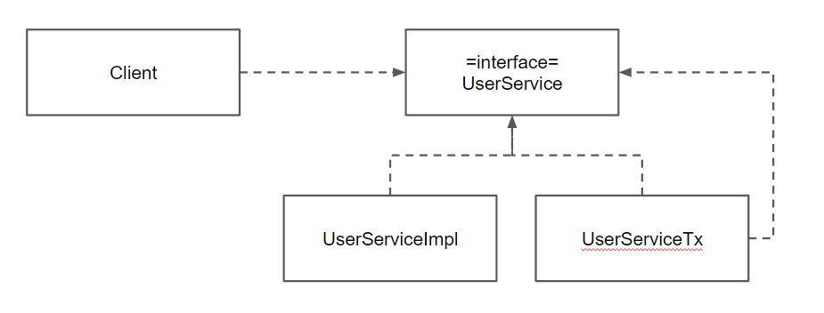
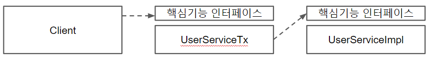
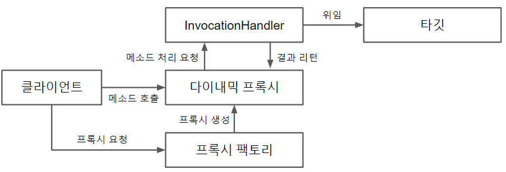
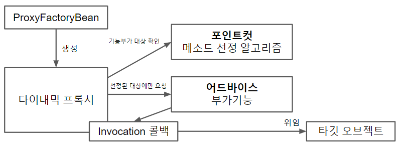
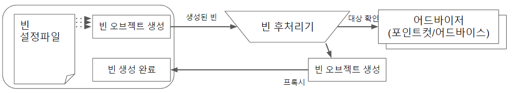
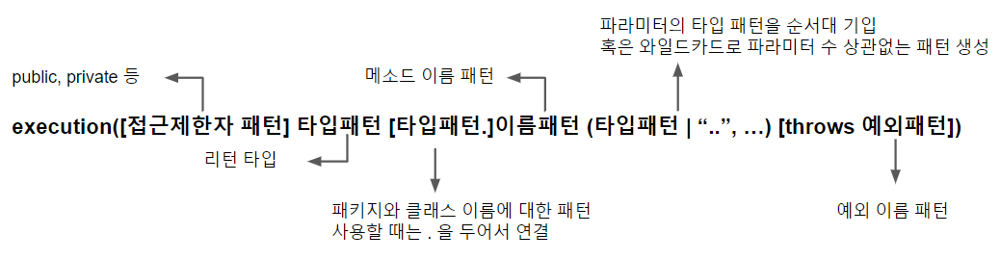

# AOP


"토비의 스프링 3.1" 6장 AOP 단원을 읽고 정리한 글입니다.

이 글에서는 AOP가 무엇이며, 어떤 과정과 원리를 통해서 현재의 모습까지 발전하였는지에 초점을 맞추어서 정리하였습니다. (현재 AOP의 사용 방법에 대한 글이 아닙니다.)

책에서 추가적으로 다루는 팩토리 빈, @Transactional의 내용들은 별도의 글로 분리하였으며, 중간 과정들에 대한 테스트 코드 작성법과 현재는 자주 사용되지 않는 XML 빈 설정 방법은 생략하였습니다. 


## 개요

AOP란 Aspect Oriented Programming의 줄임말로, **Aspect**라는 독특한 모듈을 **독립적으로 구분해 내어 프로그램을 설계하고 개발하는 방법**을 말한다. 여기서, Aspect란 프로그램의 핵심기능을 담고 있지는 않지만, 중요 구성 요소로서 부가기능을 담당하는 모듈을 의미한다. 

원래 부가기능이란 타깃이 존재해야만 의미 있는 종속적인 코드이다. 하지만 이를 부가기능을 정의하는 어드바이스와 적용 대상을 정의하는 포인트컷을 조합하여 Aspect라는 별도의 모듈로 분리해 냄으로 객체지향적 개발을 보조할 수 있게 했다.

이러한 AOP가 어떤 과정을 통해서 발전되었는지 차례대로 정리하고자 한다.


## DI 적용을 이용한 부가기능 분리


### 트랜잭션 경계설정과 비지니스 로직이 공존하는 메소드

저번 05.추상화 편에서 트랜잭션 추상화를 적용시킨 Service 코드를 다시 살펴보자

```java
public class UserService {
    private PlatformTransactionManager transactionManager;
    
    // 추후 PlatformTransactionManager은 bean으로 등록 후 @Autowired를 통해 주입 받음
    public void setTransactionManager(PlatformTransactionManager transactionManager){
    	this.transactionManager =transactionManager;
    }
    
    public void upgradeLevels(){
        TransactionStatus status = this.transactionManager.getTransaction(new DefaultTransactionDefinition());
        try{
            List<User> users = userDao.getAll();
            for(User user : users){
                upgradeLevel(user); 	
            }
	        this.transactionManger.commit(status);
        } catch(RuntimeException e) {
            this.transactionManager.rollback(status);
            throw e;
        }

    }
}
```

해당 코드를 보면, 트랜잭션 경계 설정을 담당하는 코드와 비지니스 로직을 담당하는 코드로 뚜렷하게 구분이 가능하다. 이 두가지 코드간에는 서로 주고 받는 정보가 없는 상호 독립적인 코드기에, 비지니스 수행 코드가 트랜잭션 시작과 종료 사이에 수행되어야 한다는 원칙만 지켜진다면 분리시킬 수 있다. 


### 부가기능만을 책임지는 구현 클래스 생성

위와 같은 코드는 동일 인터페이스를 구현하지만 트랜잭션 경계설정이라는 책임만을 담당하는 클래스와 비지니스 로직을 수행하는 클래스를 분리시킴으로 할 수 있다. 



[그림 6-3] 트랜잭션 경계설정을 위한 UserServiceTx의 도입


우선, 비지니스 로직 담당 클래스인 `UserServiceImpl`은 transaction 로직이 추가되기전 코드를 그대로 유지한다. 이로써, `UserServiceImpl`은 핵심 비지니스 기능에만 집중하는 코드가 된다.

```java
public class UserServiceImpl implements UserService {
    UserDao userDao;
    MailSender mailSender;
    
    public void upgradeLevels(){
        List<User> users = userDao.getAll();
        for(User user : users) {
            if(canUpgradeLevel(user)) {
                upgradeLevel(user);
            }
        }
    }
}
```

[리스트 6-4] 트랜잭션 코드를 제거한 UserSerivce 구현 클래스


부가기능인 트랜잭션 로직을 담당하는 `UserServiceTx` 클래스는 `UserServiceImpl`의 메소드를 부가기능 코드로 감싼다. 이로 인해, `UserServiceTx`은 오로지 트랜잭션 설정에만 책임을 가질 수 있다.

```java
publci class UserServiceTx implements UserService {
    UserService userService;
    PlatformTransactionManager transactionManager;
    
    public void setTransactionManager(PlatformTransactionManager transactionManager){
        this.transactionManager = transactionManager;
    }
    
    // UserSerivce를 구현한 다른 오브젝트는 DI 받는다
    public void setUserService(UserService userService) {
        this.userService = userService;
    }
    
    // ...
    
    // 비지니스 로직을 수행하는 구현클래스의 메소드를 부가기능 코드로 감쌈
    public void upgradeLevels(){
        TransactionStatus status = this.transactionManger.getTransaction(new DefaultTransactionDefinition());
        try {
            userService.upgradeLevels(); // 비지니스 로직은 DI 받은 오브젝트에 위임
            this.transactionManger.commit(status);
        }catch (RuntimeException e){
            this.transactionManger.rollback(status);
            throw e;
        }
    }
}
```

[리스트 6-5] 위임 기능을 가진 UserServiceTx 클래스


이후 Client가 `UserService` 인터페이스를 통해 사용자 관리 로직을 실행할 때, 트랜잭션 담당 오브젝트가 호출되어 선 트랜잭션 작업 후 실제 비지니스 오브젝트를 통해 로직을 수행하는 구조로 로직을 수행한다.



[그림 6-9] 핵심기능 인터페이스 적용


### DI 적용을 이용한 부가기능 분리 구조의 특징 및 단점

해당 구조는 크게 2가지 특징을 가지고 있다.

첫번째로, **비지니스 로직을 담당하는 클래스는 부가기능을 담당하는 클래스로부터 독립적**이지만, **부가기능을 담당하는 클래스는 비지니스 로직을 담당하는 클래스에 종속적**이다. 비지니스 로직을 담당하는 `UserServiceImple` 코드 작성 시에는 트랜잭션과 같은 기술적 내용은 신경 쓰지않고 핵심 기능에만 집중할 수 있게 되었다. 심지어 핵심 기능 클래스는 부가 기능 클래스의 존재 자체를 모른다. 이에 반해, 부가기능 담당 클래스는 부가기능 외의 모든 기능은 핵심 기능을 가진 클래스에게 위임하기 때문에 핵심 기능을 가진 클래스를 주입받아야만 한다.

두번째로, **클라이언트는 인터페이스를 통해서만 핵심기능을 사용**한다. Client는 인터페이스에만 의존하면, 실제 구현 클래스는 DI를 통해 주입받는다. 이에, Client는 핵심 기능이 핵심 기능 담당 클래스를 통해 직접적으로 실현되는지, 아니면 중간에 몇 개의 부가 기능을 수행하는 클래스들을 통해 실현되는지 상관하지 않는다. 

이로 인해서 부가기능 클래스들이 몇 단계 추가되어도,  핵심 기능 클래스와 Client는 소스를 수정할 필요가 없다.


이렇게 보면, 이 코드는 단일 책임 원칙을 아주 잘 지키는 객체 지향적인 코드로 보이지만, 아주 치명적인 단점이 있다. 바로 **번거롭다**는 점이다.

먼저, 동일한 부가기능 코드를 메소드 단위로 작성해야 한다. 인터페이스의 모든 메소드를 구현해 위임하도록 코드를 만들어야 하며, 부가기능 수행하는 코드가 메소드들마다 반복적으로 등장하게 된다.

또한, 부가기능 클래스는 핵심기능 클래스에 종속적이기 때문에, 핵심 기능을 담당하는 클래스만큼 부가기능 담당 클래스들을 생성해야 한다. 추가하고 싶은 부가기능이 늘어난다면, 하나의 핵심 클래스를 구현할 때 원래보다 몇 배의 작업이 들게 된다.


 ## 다이내믹 프록시를 통한 부가기능 분리

위와 같은 한계를 극복하기 위해, 우선 다이내믹 프록시를 통해 부가기능을 분리하는 방식을 적용할 수 있다. 다이내믹 프록시에 대한 이해를 돕기 위해 먼저 프록시와 리플렉션에 대한 개념을 먼저 살펴보겠다.


### 프록시 패턴

**프록시**란 **클라이언트가 사용하려는 실제 대상인 것처럼 위장해서 요청을 받는 대리자, 대리인**을 의미한다. 이와 반대되는 개념으로 **타깃**이란 **프록시를 통해 최종적으로 요청을 위임받아 처리하는 실제 오브젝트**를 의미한다. 이때 프록시와 타깃은 서로 같은 인터페이스를 구현한다.

프록시는 사용 목적에 따라 구분할 수 있다. 타깃에 부가적인 기능을 부여하는 경우 데코레이터 패턴으로 부르며, 클라이언트가 타깃에 접근하는 방법을 제어하는 경우 프록시 패턴으로 구분짓는다. 하지만 이 글에서는 편의상 프록시를 데코레이터 패턴을 의미하는 것으로 사용하겠다.


### 리플렉션

리플렉션은 **자바의 코드 자체를 추상화해서 접근할 수 있도록** 해주는 java의 기능이다. 리플렉션은 Class 타입의 오브젝트를 통해 클래스 코드에 대한 메타 정보 가져오거나 오브젝트를 조작할 수 있도록 해준다.

예를 들어, 리플렉션 API 중 Method 인터페이스는 특정 클래스의 메소드 이름을 통해 메소드 정보를 가져온다. 그후, `invoke()` 메소드를 통해서 정보를 가져온 메소드를 호출할 수 있다.

```java
// 리플렉션 API 중 Method 인터페이스 이용

String name = "Spring";
Method lengthMethod = String.class.getMethod("length");
int length = lengthMethod.invoke(name); // int length = name.length(); 소스와 동일한 작업 수행
```

이때, Method 인터페이스의 `invoke()` 메소드는 대상 오브젝트와 파라미터 목록을 인자로 받아서 메소드 호출 후 결과를 Object 타입으로 반환한다. 

```java
public Object invoke(Object obj, Object... args)
```


### 다이내믹 프록시

다이내믹 프록시란, **프록시 팩토리에 의해 런타임 시 다이내믹하게 만들어지는 프록시**를 의미한다. 이때, 프록시 팩토리가 **리플렉션을 사용**하여 자동으로 인터페이스 구현 오브젝트를 생성하기 때문에, **인터페이스 내 메소드를 모두 구현해가면서 프록시를 정의하지 않아**도 된다. 이에 프록시로서 필요한 부가기능 제공 코드만 직접 작성하면 된다. 

다이내믹 프록시가 동작하는 방식은 다음과 같다.



[그림 6-13] 다이내믹 프록시의 동작방식

클라이언트는 프록시 팩토리에게 사용하고자 하는 인터페이스의 정보를 제공하면서 프록시를 요청한다. 그렇다면, 프록시 팩토리는 인터페이스 정보와 부가기능 수행 코드가 작성된 InvocationHanlder를 가지고 프록시를 생성하여 클라이언트 전달한다. 


예를 들어, `Hello`라는 인터페이스의 메소드가 반환하는 문자열을 대문자로 바꾸는 프록시는 다음과 같이 작성할 수 있다.

```java
public class UppercaseHandler implements InvocationHandler {
    Object target;
    
    public UppercaseHandler(Obejct target){
        this.target= target;
    }
    
    public Object invoke(Obejct proxy, Method method, Obejct[] args) throws Throwable {
        Object ret = method.invoke(target, args);
        if(ret instanceof String){
            return ((String)ret).toUpperCase();
        } else {
            return ret;
        }
    }
}
```

[리스트 6-25] 확장된 UppercaseHandler

`InvocationHandler` 구현 클래스는 부가기능 수행 및 타깃 위임을 수행한다. 

다이내믹 프록시가 클라이언트로부터 받는 모든 요청은  `invoke()`메소드로 전달된다.  리플렉션 API의 Method를 통해 위임을 수행하기 때문에, 인터페이스의 모든 메소드들을 구현할 필요 없이 `invoke` **메소드 하나로 타깃 인터페이스 내 모든 메소드들에 적용 가능**하다.

또한, 타깃 오브젝트는 생성자를 통해 미리 전달 받아두고, 이를 이용해 타깃 오브젝트의 메소드를 호출한다. 하지만 **타깃을 Object로 받기 때문에 특정 클래스에 종속적이지 않는다.** 


```java
Hello proxiedHello = (Hello) Proxy.newProxyInstance( // 프록시 생성 후 Hello 타입으로 캐스팅
		getClass().getClassLoader(),// 동적으로 생성되는 다이내믹 프록시 클래스의 로딩에 사용할 클래스 로더
		new Class[]{Hello.class},	// 구현할 인터페이스
		new UppercaseHandler(new HelloTarget()) // 부가기능과 위임 코드를 담은 InvocationHandler
);
```

[리스트 6-24] 프록시 생성

다이내믹 프록시 생성은 Proxy 클래스의 `newProxyInstance()` 스태틱 팩토리 메소드를 이용한다. 자세한 사용 방법은 다음과 같다.

첫 번째 파라미터는 클래스 로더를 제공한다. 다이내믹 프록시가 정의되는 클래스 로더를 지정하는 것이다.

두 번째 파라미터는 다이내믹 프록시가 구현해야 할 인터페이스다. 한 번에 하나 이상의 인터페이스를 구현할 수도 있다. 따라서 인터페이스의 배열을 사용한다.

마지막 파라미터로는 부가기능과 위임 관련 코드를 담고 있는 `InvocationHanlder` 구현 오브젝트를 제공한다.


:bulb: 이렇게 작성한 다이내믹 프록시는 DI 적용을 위해 bean으로 등록되어야 하지만, 일반적인 bean 방법으로는 등록이 불가능하다. 팩토리 빈을 통해 빈으로 등록이 필요하며, 해당 방법은 ""에 별도로 정리하였다.


### 다이내믹 프록시 방식의 장점과 한계

다이내믹 프록시 방식은 앞선 인터페이스 구현 클래스 분리를 통한 방식의 한계점들을 해결해준다. 

부가기능 코드는 더 이상 특정 클래스에 종속적이지 않는다. 부가기능을 담당하는 클래스를 타깃과 독립적으로 작성이 가능해졌다.

또한, 부가기능은 `invoke`라는 하나의 메소드로 모든 메소드들에 적용 가능해 졌다. 일일이 인터페이스를 구현하지 않아도 되며, 더 이상 부가기능 코드가 중복되어 등장하지 않는다.


하지만, 다이내믹 프록시 방식에도 여전히 2 가지 한계점들이 남아있다.

첫 번째로, 한 번에 여러 개의 클래스에 공통적인 부가기능을 제공하는 일은 불가능하다. 프록시를 통해 타깃에 부가기능을 제공하는 것은 메소드 단위로 일어나는 일이다. 부가기능을 한번에 여러 메소드에 적용시키는 것은 가능하였지만, 여러 개의 클래스에 적용하기 위해서는 비슷한 프록시 팩토리 빈의 설정 작업이 중복되어야 한다.

두 번째로, `InvocationHanlder` 구현 오브젝트가 프록시 팩토리 빈 개수만큼 만들어진다. `InvocationHanlder`는 내부에 타깃 오브젝트를 프로퍼티로 갖고 있다. 동일한 부가기능을 제공하여도, 타깃 오브젝트가 달라지면 새로운 오브젝트를 만들어야 한다.


## ProxyFactoryBean을 활용한 부가기능 분리

다이내믹 프록시방식의 한계를 극복하기 위해, AOP는 `ProxyFactoryBean`을 활용하는 방식으로 발전되어졌다.


### ProxyFactoryBean

`ProxyFactoryBean`은 프록시를 생생해서 빈 오브젝트로 등록하게 해주는 팩토리 빈이다. 이전과 다르게, `ProxyFactoryBean`은 **순수하게 프록시를 생성하는 작업만을 담당**하고, 프록시를 통해 제공해줄 부가기능은 별도의 빈에 둘 수 있다.


`ProxyFactoryBean`을 구현하는 샘플 코드는 다음과 같다.

```java
@Test
public void pointcutAdvisor(){
    public void proxyFactoryBean() {
        ProxyFactoryBean pfBean = new ProxyFactoryBean();
        pfBean.setTarget(new HelloTarget()); // 타겟 설정
        
        NameMatchMethodPointcut pointcut = new NameMatchMethodPointcut();
        pointcut.setMappedName("sayH*");
        
        pfBean.addAdvisor(new DefaultPointcutAdvisor(pointcut, new UppercaseAdvice())); // 어드바이저 등록
    }

    
    static class UppercaseAdvice implements MethodInterceptor {
        public Object invoke(MethodInvocation invocation) throws Throwable {
            String ret = (String) invocation.proceed();
            return ret.toUpperCase();
        }
    }
}
```


코드를 보면, `ProxyFactoryBean`은 타깃을 설정하고, Advice와 Poincut으로 이루어진 Advisor를 등록하는 것을 볼 수 있다. 

우선, `Advice`은 타깃 오브젝트에 적용하는 부가기능을 담은 오브젝트이다.  `Advice`는 `MethodInterceptor` 인터페이스를 구현해서 만든다. `InvocationHandler`와의 차이점으로는 `MethodInterceptor`의 `invoke()` 메소드는 `ProxyFactoryBean`으로부터 타깃 오브젝트에 대한 정보까지 들어있는 `MethodInvocation`을 제공받는다. 이를 통해서, 내부 프로퍼티로 타깃 오브젝트를 보유하지 않아도 되며,  target에 독립적이게 부가기능에만 집중 할 수 있다.

| MethodInterceptor                        | InvocationHanlder                        |
| ---------------------------------------- | ---------------------------------------- |
| 타깃 오브젝트의 정보까지 함께 제공 받음  | 타깃 오브젝트의 정보 제공 안 받음        |
| 독립적인 구현                            | target에 종속적인 Handler 구현           |
| 타깃이 다른 여러 프록시와 함께 사용 가능 | 타깃이 다른 여러 프록시와 함께 사용 불가 |

`Poincut`은 **메소드 선정 알고리즘을 담은 오브젝트**이다. 다이내믹 프록시에서 부가기능을 메소드별로 선정하고자 했다면, 부가기능 코드가 들어있는 `InvocationHandler`의 `invoke()` 메소드 내에서 조건절을 통해 선정했어야 할 것이다. 하지만, `ProxyFactoryBean`에서는 부가기능과 메소드 선정 알고리즘을 분리시켜, `MethodInvocation`은 타깃에 독립적이게 순수 부가기능만을 가지도록 하였다.

`ProxyFactoryBean`은 이렇게 Advice와 Poincut이 조합된 Advisor을 `addAdvisor` 메소드를 통해 여러 개 등록할 수 있다. 이를 통해서, 하나의 `ProxyFactoryBean`으로 여러 개의 부가기능 제공하는 프록시 생성한다.


이렇게 설정된 `ProxyFactoryBean`은 다음과 같이 동작한다.




1. 프록시는 클라이언트로부터 요청을 받으면 프인트컷에게 부가기능을 부여할 메소드인지를 확인해들라고 요청한다. 
2. 부가기능을 적용할 대상 메소드인지 확인받으면, `MethodInterceptor` 타입의 어드바이스를 호출한다. 
3. 부가기능을 수행하는 중간에 타깃 메소드의 호출이 필요하면,  콜백 오브젝인 `MethodInvocation`의 `proceed()` 메소드를 호출한다.


:bulb: 템플릿/콜백 구조의 프록시

위의 구조를 보면, 전형적인 템플릿/콜백 구조임을 알 수 있다. 재사용 가능한 기능이 담기는 어디바이스가 템플릿이고, 바뀌는 부분으로 외부에서 주입되는 `MethodInvocation` 오브젝트가 콜백이다. 매번 바뀌는 실제 타깃 오브젝트의 레퍼런스를 콜백에서 보유하도록 한 것이다.


#### ProxyFactoryBean의 한계

`ProxyFactoryBean`은 타깃의 수 만큼 반복적인 설정 작업 필요하다.

`ProxyFactoryBean`을 통해 여러 메소드에 부가기능을 일괄적으로 혹은 선별적으로 적용가능하게 되었다. 하지만 위 코드의 `setTarget()`에서 볼 수 있듯이, `ProxyFactoryBean`은 단일 타깃을 대상으로 생성할 수 있다. 타깃의 수 만큼 `ProxyFactoryBean` 설정이 필요하여, 아직 번거로운 반복 작업이 수반된다.


### 빈 후처리기

빈 후처리기는 스프링 빈 오브젝트로 만들어지고 난 후에, 빈 오브젝트를 다시 가공할 수 있게 해준다. 스프링은 빈 후처기리가 빈으로 등록되어져 있으면, 빈 오브젝트가 생성될 때마다 빈 후처리리기에 보내서 후처리 작업을 요청한다.

빈 후처리기를 통해서는 아래와 같은 작업들이 가능하다.

- 빈 오브젝트의 프로퍼티 강제 수정
- 초기화
- 빈 오브젝트의 바꿔치기
- **빈 오브젝트의 일부를 프록시로 포장하여 프록시를 빈으로 대신 등록하기**


빈 후처리기는 `BeanPostProcessor` 인터페이스를 구현해서 생성할 수 있으며, 여기서는 `DefaultAdvisorAutoProxyCreator`를 살펴보겠다.`DefaultAdvisorAutoProxyCreator`는 아래와 같이 동작한다.



1. 빈으로 등록된 모든 어드바이저 내의 포인트컷 이용하여, 전달받은 빈이 프록시 적용 대상인지 확인
2. 프록시 적용 대상이면 ,그때는 내장된 프록시 생성기에 현재 빈에 대한 프록시 생성 요청 및 어드바이저 연결
3. 컨테이너는 최종적으로 **빈 후처리기가 반환한 프록시를 빈으로 등록**

이 방식을 통해서, 대상 타깃을 일일이 설정하여 등록할 필요가 없다.


### AspectJ 포인트컷 표현식

AspectJ 포인트컷 표현식은 클래스와 메소드 선정 알고리즘을 한 번에 지정한다. 

기존의 `ProxyFactoryBean` 코드를 살펴보면, 타깃을 직접 지정하기 때문에 메소드에 대한 포인트 컷만 지정하였으면 되었다. 이처럼 기존의 포인트 컷은 클래스 필터와 메소드 매처 메소드라는 두개의 분리 메소드를 통해서 대상을 구분하였다.

하지만 이제는 빈 후처리기를 통해서 모든 빈들을 포인트컷으로 선정 대상을 걸러내게 된다. 이에 클래스 필터 선정이 필수적이게 된 만큼, 클래스 선정도 메소드 선정과 한 번에 할 수 있다면 편리할 것이다.


AspectJ 포인트컷 표현식의 문법은 다음과 같다. (:bulb: `[]` 는 옵션항목으로 생략 가능을 , `|` 는 OR 조건을 의미한다.)



- 접근제한자 패턴
  - 생략 시, 이 항목에 대해서 조건을 부여 안함
- 타입 패턴
  - 필수 항목
  - 하나의 타입 지정 또는 `*`로 모든 타입 선택이 가능하다
- 패키지 및 클래스 이름 패턴
  - 생략 시, 모든 타입 다 허용
  - 패키지,클래스, 인터페이스 이름에 `*` 사용 O
  - `..`로 한 번에 여러 개의 패티지 선택
  - :bulb: **타입을 명시하는 자리 이므로, 해당 클래스의 이름 뿐만 아니라, 슈퍼 클래스 및 인터페이스 이름으로도 적용 가능**
- 메소드 이름 패턴
  -  `*`로 모든 메소드 선택 가능
- 파라미터 패턴
  - 파라미터의 타입을 `,`로 구분하면서 순서대로 기입
  - 파라미터 없는 메소드는 `()`로 작성
  - `..`로 모두 다 허용하는 패턴 작성 가능


## @Aspect annotation

스프링의 프록시 방식 AOP를 적용하기 위해서는 최소 4 가지 빈을 등록해야 한다. 자동 프록시 생성기, 어드바이스, 포인트컷, 어드바이저가 그 대상이다. 이 빈들은 여타 빈들과는 다르게, 비지니스 로직을 담고 있지도 않으며, DI를 통해 다른 빈에 의존성 주입되는 대상들도 아니다. 이 빈들은 스프링 컨테이너에 의해 자동으로 인색돼서 프록시 생성이라는 특별한 작업을 위해 사용된다.

스프링에서는 AOP를 위해 기계적으로 적용하는 빈들을 간편한 방법으로 등록할 수 있다. XML을 이용한 방법에서는 `<aop>` 스키마를 별도로 제공하며, `@` annotation을 활용한 방법으로는 `@Aspect` 로 등록할 수 있다. 이 글에서는 현재 많이 사용되는 annotation 방식의 sample 코드로만 동작법은 살펴 보겠다.


```java
@Component
@Aspect
public class SampleAspect {
    
    @Pointcut("execution(* com.example.mvc.order..*(..))")
    private void allOrder(){} 
    
    @Before("allOrder()")
    public void doBefore(JoinPoint joinPoint) {
        log.info("[before] {}", joinPoint.getSignature());
    }
    
}

```

### `@Aspect`

- 해당 클래스가 Aspect임을 명시하고, 내부의 Advisor들을 빌드 및 조회한다.
- 주의할 점으론, `@Aspect`만으론 컴포넌트 스캔이 되지 않으므로, 반드시 별도로 스프링 빈으로 등록해줘야 한다. (여기서는 `@Component` 사용)

### `@Pointcut`

- 포인트컷 표현식을 별도로 분리해서 지정할 수 있게 한다.
- 별도 분리하지 않고, Advice의 속성값에 명시할 수도 있다.

### Advice

Advice임을 명시하고, Aspect가 언제 핵심 코드에 적용할지 정의한다.

Advice 타입으로는 다음과 같이 존재한다.

| Type              | Description                                                  |
| ----------------- | ------------------------------------------------------------ |
| `@Before`         | 조인 포인트 실행 이전에 실행(실제 target 메서드 수행 전에 실행) |
| `@AfterReturning` | 조인 포인트가 정상 완료 후 실행(실제 target 메서드 수행 완료 후 실행) |
| `@AfterThrowing`  | 메서드가 예외를 던지는 경우 실행                             |
| `@After`          | 조인 포인트의 정상, 예외 동작과 무관하계 실행                |
| `@Around`         | 앞의 4가지 애노테이션을 모두 포함하는 애노테이션<br />메서드 호출 전후 작업 명시 가능 |

또한, 속성값으로 **Pointcut을 지정** 할 수 있다.


토비의 스프링 3.1에서는 `@Aspect` 이전까지의  AOP의 발전 과정에 대해서 저술하고 있어, 우선 기본적인 내용으로만 대체하였다. 오늘날의 AOP 사용법도 내용이 방대함으로, 이는 다음 기회에 따로 정리해보고자 한다. 대신, 정리가 잘 되어 있는 글이 있어 링크를 남겨둔다.

 https://velog.io/@backtony/Spring-AOP-%EC%B4%9D%EC%A0%95%EB%A6%AC 


## [참고] 바이트코드 조작을 통한 AOP 

AOP을 적용하는 방식으로는 여태까지 살펴본 프록시 방식의 AOP외에도 바이트코드 조작을 통한 AOP 방식이 있다. 이는 직접 타깃 오브젝트를 뜯어고쳐서 부가기능을 직접 넣어주는 방법으로, JVM에 로딩되는 시점을 가로채서 바이트 코드 조작한다.

바이트코드 조작을 통한 AOP의 장점으로는 1. 스프링과 같은 DI 컨테이너 도움 필요 없으며, 2. 프록시 방식보다 훨씬 강력하고 유연한 AOP를 제공한다. 프록시 AOP는 부가기능 적용 대상이 클라이언트가 호출하는 메소드로 제한되며, **타깃 내에서 메소드 호출 시에는 적용이 안 된다**는 특징을 가지고 있다. 이에 반해, 바이트코드 조작 AOP는 오브젝트 생성, 필드값 조작, 스태틱 초기화 등 다양한 작업 가능하기에, 타깃 코드 내에 부가기능이 추가되는 효과를 가질 수 있다.

반면 단점으로, 번거로움 작업이 수반된다. 바이트코드 조작을 위해선 JVM 실행 옵션 변경, 별도 바이트코드 컴파일러 설정 등이 필요하다. 대부분의 부가기능은 프록시 AOP로 충분하기에, 바이트코드 조작을 통한 AOP를 사용할 일은 많지 않다.


:bulb: 프록시 방식 AOP의 경우, 타깃 내에서 메소드 호출 시 부가기능이 적용되지 않는 이유

프록시 방식의 AOP는 부가기능이 직접 타깃에 추가되는 것이 아닌, 타깃을 부가기능으로 감싼 프록시를 타깃 대신 클라이언트에 주입하는 방식이다. 타깃 내에서 메소드를 호출한다면, 부가기능이 추가되지 않은 메소드가 호출되기에 동작하지 않는다.


## 참고자료

토비의 스프링 1 서적과 함께 아래의 내용을 참고하여 작성하였습니다.

-  backtony.log, "Sping -  AOP 총정리", https://velog.io/@backtony/Spring-AOP-%EC%B4%9D%EC%A0%95%EB%A6%AC 
