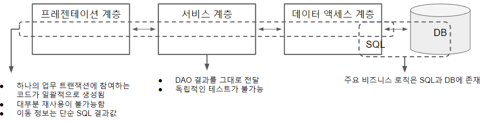
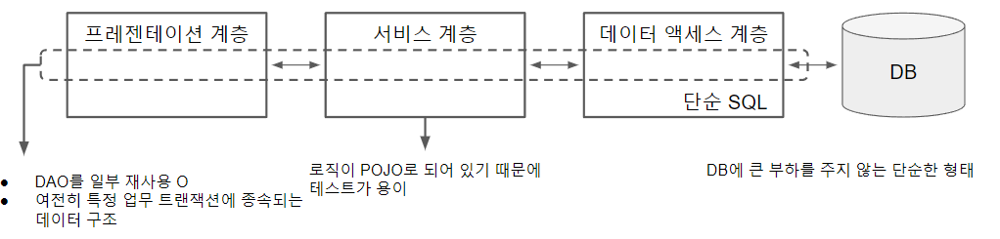
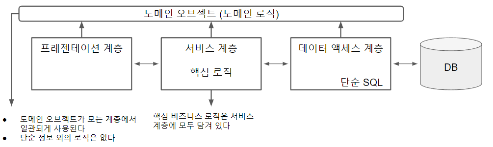
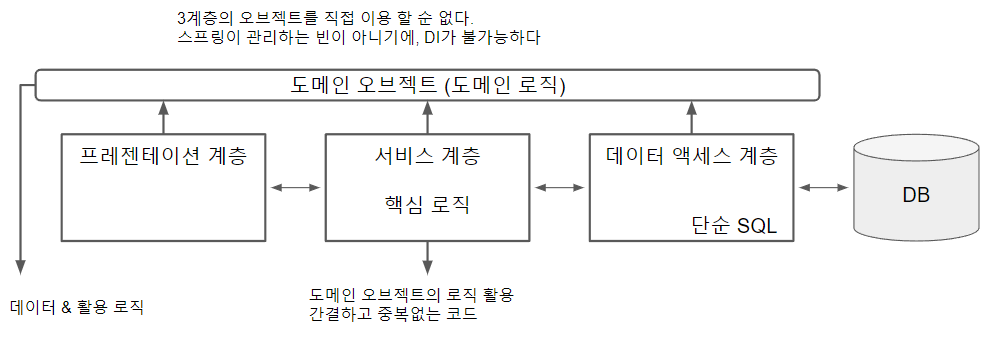

# [토비의 스프링] 9장.스프링 프로젝트 시작하기


"토비의 스프링 3.1" 9장 스프링 프로젝트 시작하기 단원을 읽고 정리한 글입니다.

(7장과 8장은 앞 장들에서 소개된 내용과 중복되는 내용이 많아 생략하였습니다. )

이 글에서는 스프링을 활용하여 어플리케이션을 어떻게 설계해야하는 지에 초점을 맞추어서 정리하였습니다. 


## 계층형 아키텍쳐 설계


### 개요

**계층형 아키텍쳐**란, 아키텍쳐 차원에서 **책임과 성격이 다른 것을 크게 그룹으로 만들어 분리**하는 것을 의미한다. 웹 기반 엔터프라이즈 애플리케이션은 일반적으로 3계층 (3-tier / 3-layer) 애플리케이션으로 설계된다. 

3계층 아키텍쳐 : 데이터 엑세스 계층 (DB) + 서비스 계층 (비지니스 로직) + 프레젠테이션 계층 (UI)


### 계층형 아키텍처 설계의 원칙

계층형 아키텍처 설계할때 다음 3가지 원칙을 유의하면서 설계해야 한다.

첫번째, **각 계층은 자신의 계층의 책임에만 충실**한다. 객체의 단일 책임 원칙은 계층 설계에도 적용된다. 계층 또한 높은 응집도, 낮은 결합도의 구조로 설계되어야 한다.


두번째, **계층의 경계를 넘어갈 때는 반드시 특정 계층에 종속되지 않는 오브젝트 형태로 변환**한다.

이는 첫번째 원칙과도 밀접하며, 계층간의 결합도를 낮추고 각 계층의 책임과 역할을 명확하게 하는 작업이기도 하다.

잘못된 예시로, 데이터 엑세스 계층에서 다음과 같은 메소드를 통해 DB 결과를 서비스 계층으로 반환한다고 하자

```java
public ResultSet findUserByName(String name) throws SQLException;
```

여기에는 두가지 문제가 존재하게 된다. 우선, **데이터 엑섹스 계층의 기술과 그 역할을 다른 계층에 그대로 노출**한다. 서비스 계층의 코드는 `ResultSet` 이라는 데이터 엑세스 계층에서 만들어지는 오브젝트를 직접 다루게 된다. 서비스 계층이 자신의 역할인 비지니스 로직 처리와 별도로, 데이터 엑세스 작업과 리스소 처리를 맡게된다. 

또한, **JDBC 기술에 종속적인 체크 예외**를 던지고 있다. 이렇다면, 서비스 계층에서 예외 해석 및 처리 코드가 필요해진다.

이 두가지는 문제는 여러 데이터 엑세스 기술을 사용하거나, 데이터 엑세스 기술을 바꿔야할 때 더욱 심화된다. 서비스 계층에서 비지니스 로직 외에 데이테 엑세스 기술별 처리 로직이 계속 추가되어야 하며, 자신의 역할과 상관 없는 데이터 엑세스 계층의 변화로 인해서 소스 수정이 필요해지게 된다.


따라서 해당 코드는 다음과 같이 수정되어야 한다.

```java
public List<User> findUserByName(String name) throws DataAccessException;
```

데이터 엑세스 계층은 특정 계층에 종속되지 않는 단순한 오브젝트 형태로 서비스 계층에 전달하고, `DataAccessException`와 같은 런타임 예외로 변환하여 예외를 던진다. 특정 구현 방식에 종속되지 않는 추상적인 형태로 계층간 이동이 이루어진다.


세번째, **계층 사이의 호출은 인터페이스를 통해 진행**한다.

인터페이스 사용한다는 것은 **각 계층 경계를 넘어서 들어오는 요청을 명확히 정의**하는 것을 의미한다. 단지 interface 키워드를 사용하는 것이 아니라, 매우 신중하게 계층 내부의 예상되는 변화에도 쉽게 바뀌지 않도록 주의해서 설계하는 것이 중요하다.


### 주의점

3 계층으로 계층을 나누는 것은 논리적이고 개념적인 구분이다. 꼭 오브젝트 단위로 만들어지는 것이 아님????, 경우에 따라, 두 개의 계층 통합하는 것도 가능하다는 것을 명심하자


## 애플리케이션 아키텍쳐

애플리케이션 아키텍쳐를 설계할 때, 엔터프라이즈 애플리케이션에 존재하는 정보를 단순히 데이터로 다루는 경우와 오브젝트로 다루는 경우로 구분할 수 있다. 전자를 **데이터 중심 아키텍처**, 후자를 **오브젝트 중심 아키텍처**라 부른다.


### [ 데이터 중심 아키텍처 ]

데이터 중심 아키텍처란, 애플리케이션에 존재하는 정보를 단순히 값이나 값을 담기 위한 목적의 오브젝트 형태로 취급하는 구조이다. DB에서 돌려주는 내용을 그대로 맵이나 단순 결과 저장용 오브젝트에 넣어서 전달한다. 

데이터 중심 아키텍처은 크게 2가지로 분류할 수 있다.


#### DB/SQL 중심의 로직 구현 방식

첫번째로, DB/SQL 중심의 로직 구현 방식이 있다.



[그림 9-17] DB 중심의 아키텍처


해당 방식은 주요 비지니스 로직이 SQL문에 담겨 있는 방식이다. 여기서, 서비스 계층은 DB 결과를 단순히 프레젠테이션 계층에 전달하는 역할만을 수행하게 된다. 프레젠테이션 계층 또한, 이동 정보가 단순 SQL 결과값이며, SQL문에 종속적인 코드를 작성해야 해서 대부분 재사용이 어려운 소스로 짜여진다.

이 방식에는 3가지 문제점이 있다.

**1. SQL에 변화가 있을 시, 로직들이 같이 변경된다.**

데이터가 일종의 접착제 역할로 강한 결합을 생성한다. 데이터 전달이 `List`, `Map`과 같은 타입으로 진행하기에 SQL이 변경되어 필드의 수, 개수, 이름이 변경될 경우 서비스 계층과 프레젠테이션 계층의 코드들도 같이 변경이 필요하다.

**2. 재사용성이 떨어진다.**

계층 간 종속적인 관계로 객체지향의 장점 활용하지 못하며, 업무 트랜잭션에 따라 필드 하나가 달라져도 거의 비슷한 DAO 메소드를 새로 생성해야 한다.

**3. 제한된 DB에 의존**

해당 방식은 복잡한 SQL로 로직을 처리하는데, 복잡한 SQL을 처리하기 위해 **제한된 자원인 DB에 큰 부담을 주는 것은 바람직하지 못하다**. 이와 반대로, 어플리케이션 **서버는 확장이 용이하기 때문에 로직을 서버로 가져오는 것이, 비용, 안정성, 코드 검증 측면에서 유리**하다.


#### 거대한 서비스 계층 방식

두번째는, 거대한 서비스 계층 방식이다.



[그림 9-18] 거대 서비스 계층 방식의 아키텍처


거대한 서비스 계층 방식에서는 비지니스 로직이 서비스 계층으로 이동해왔다. SQL문은 단순 조회 및 작업만을 수행하기에 DB에 큰 부하를 주지 않는다. 하지만 여전히 모든 계층의 코드들이 SQL 결과에 의존하고 있기 때문에, 계층간 높은 결합도과 낮은 재사용성 문제는 그대로 존재한다.


### [ 오브젝트 중심 아키텍처 ]

오브젝트 중심 아키텍처는 도메인 모델을 반영하는 오브젝트 구조를 만들고, 그것을 각 계층 사이에서 정보를 전송하는 데 사용하는 아키텍처이다. 객체지향 분석과 모델링의 결과로 나오는 도메인 모델을 오브젝트 모델로 활용하는데, 이로 전 계층에서 일관된 구조를 유지할 수 있다. 또한, 레퍼런스 변수를 이용해서 타 오브젝트와의 관계를 표현할 수 있다.

```java
public class Category {
    int categoryid;
    String description;
    Set<Product> products;
    
    // ...
}

public class Product {
    int productid;
    String name;
    Category category;
    
    // ...
}
```

[리스트 9-9] 도메인 오브젝트


오브젝트 중심 아키텍처는 다음과 같은 4가지 장점을 가진다.

**1. 계층간 낮은 결합도를 가진다.**

서비스 계층과 프레젠테이션 계층은 더 이상 SQL 결과값에 종속적이 않게 된다. 필요한 객체 오브젝트만 반환된다면, 어떠한 DB, DAO, SQL문을 통해 반환되었는지는 신경 쓰지 않아도 된다. 

**2. 직관적인 메소드를 가질 수 있다**

예를 들어, `calcTotalOfProductPrice()`메소드가  `Category` 객체 내에 있다면, `Category` 하위의 `Product`들의 가격 총합을 구하고 있는지를 직관적으로 전달할 수 있다.

**3. 재사용 가능한 코드**

계층 간 전달에 사용되는 오브젝들은 독립적인 오브젝트이기에, 계층 내 어디서든 사용할 수 있다. 객체 내에서 정의한 메소드들은 계층별로 재정의 할 필요없이, 모든 계층에서 공통적으로 사용 가능하다.

**4. 레퍼런스를 통한, 오브젝트 구조 파악이 용이하다**

객체 내에서 레퍼런스를 표현하는 것이, Map 혹은 List 간에 레퍼런스 관계를 맺는 것보다 훨씬 더 활용도가 좋을 것이다.


물론, 오브젝트 중심 아키텍처에도 **단점**이 존재한다. 

**1. 성능 문제**

기능별로 최적화된 SQL을 매번 만들어 사용하는 것보단 성능 면에서 떨어질 수가 있다.

**2. 메모리 낭비**

만약 특정 비지니스 로직에서 필요한 정보가 몇 개의 필드뿐이라면, DAO에서 도메인 오브젝트의 모든 필드 정보를 채워서 전달하는 것은 메모리 낭비를 유발한다. 특히, 참조하는 객체까지 모든 정보를 채워서 가져오는 경우 메모리 낭비 뿐만 아니라 조회 성능 또한 떨어진다. 하지만, 이러한 문제는 JPA와 같은 ORM 기술을 활용해 Lazy Loading(지연 로딩) 방식으로 해결할 수 있다.


오브젝트 중심 아키텍트도 두가지 방식으로 구분지을 수 있다.

#### 빈약한 도메인 오브젝트 방식

첫번째로, 빈약한 도메인 오브젝트 방식이 있다.



빈약한 도메인 오브젝트 방식은 도메인 오브젝트가 정보만 들고 있고, 정보를 활용하는 아무런 기능도 갖고 있지 않는 방식이다. 대신, 핵심 비지니스 로직은 서비스 계층에 모두 존재한다.

예를 들어, `Category` 하위의 `Product`들의 가격 총합이 필요한 서비스 계층의 클래스들에서 `calcTotalOfProductPrice(Category category)` 메소드를 정의하는 것이다.

해당 방식은 로직의 재사용성이 떨어지고 중복이 발생하기 쉽지만, 비지니스 로직이 복잡하지 않다면 만들기 쉽고 3 계층의 구조의 특징을 잘 살려서 개발 할 수 있다는 장점이 있다.


#### 풍성한 도메인 오브젝트 방식 (영리한 도메인 오브젝트 방식)

두번째는 풍성한 도메인 오브젝트 방식이다.



풍성한 도메인 오브젝트 방식은 도메인 오브젝트가 정보 뿐만 아니라, 해당 객체를 활용하는 핵심 비지니스 기능까지 들고 있는 방식이다.

예를 들어, `calcTotalOfProductPrice()` 메소드가 `Catagory` 클래스 내에 정의되어 있는 것이다.

해당 방식은 도메인 오브젝트의 객체지향적인 특징을 잘 살린 방식으로 데이터와 그것을 사용하는 기능이 한곳에 모여있어 높은 응집도를 가진다. 


## 마치며

여태까지의 장에서 소개된 Spring의 가치와 객체 지향의 특징을 활용해서 어떻게 어플리케이션 설계를 할 수 있는지 단번에 이해할 수 있었던 장이었다. 특히 객체지향적이지 못한 아키텍처들에 관한 내용을 읽을 때에 내가 작성했던 코드들이 머리속을 스쳐지나가며 후회와 반성하는 시간을 가졌다. 더 나은 개발자가 되기 위한 고민을 할 수 있었던 장이었다.

