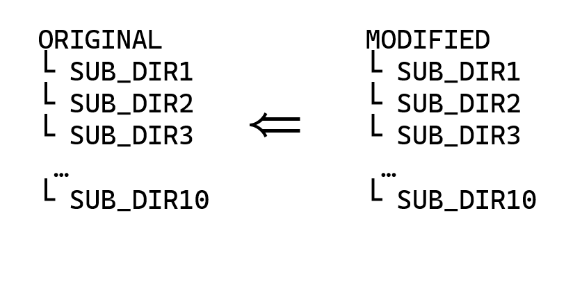

# 파일들을 확장자 수정 후 특정 폴더로 이동시키기


여러 서브 폴더에 나누어져 있는 대량의 파일을 가지고 있을 때, 그 중 일부 파일들에 대해서 수정본을 받았다. 


수작업으로 파일들을 본래의 폴더로 옮기면서 덮어씌우기에는 다음과 같은 문제가 있었다.

1. 서브 폴더의 개수가 많다.

수자업으로 파일들을 옭기기 위해서 서브 폴더들의 수만큼 작업이 이루어져야 해서 번거움이 있었다. 

2..확장자가 달라졌다.

원본 파일은 확장자가 빈 파일이지만, 수정본은 **.json** 이라는 확장자가 붙어서 왔다.


이에, 터미널 커맨드를 사용하여  전체 수정본 파일들을 확장자 수정 후 원본 폴더에서 자신이 속한 폴더로 이동시키고자 한다. 

예를 들어, 아래의 구조처럼 ORIGINAL 폴더와 구조가 같은 MODIFED 폴더를 받았을 때, MODIFIED 내의 모든 파일들을 ORIGINAL의 자신이 속한 폴더들로 옮기고자 한다. 



## 수행 코드

```bash
for dir in ./*
do for file in ${dir}/*
	do cp ${file} ../ORIGINAL/${file:2:${#file}-7}
done
done

```

해당 코드는 **MODIFIED** 폴더 내에서 수행되었으며, 3가지 부분으로 나눌 수 있었다.


### 1. 2중 for 문으로 전체 파일 탐색

LInux 터미널에서의 for문은 다음과 같은 기본 형식을 가진다.

```bash
for 변수 in 값들
do
    명령
done
```

값들에는 **1 2 3 4 5** 와 같은 숫자의 나열로 iterate할 대상을 지정할 수 도 있으며, 여기서는 **./**를 통해서 현재 폴더 내에 있는 모든 폴더 및 파일을 대상으로 잡았다.

또한, 변수로 지정한 값에 대해서는 ${변수}를 통해서 for문 안에서 사용이 가능하다.


### 2. **cp** 커맨드로 복사 후 이동

**cp** 커맨드는 copy에서 나온 명령어로 파일들 복사하는 명령어 이다. 기본 형식은 다음과 같다.

**cp [옵션] 원본 대상**

여기서는 for문을 통해서 접근한 **file**이 원본 파일이며, **../ORIGINAL/${file:2:${#file}-7}** 해당 부분을 대상으로 지정하여, 복사할 파일을 어떤 폴더의 어떤 이름으로 저장할지 지정하였다.


### 3.문자열 slice로 확장자명 제거

터미널에서는 **${변수:시작인데스:길이}** 를 통해서 문자열을 자를 수 있으며,

**${#변수}**를 통해서 문자열의 길이를 알 수 있다.


위의 for문을 통해 얻은 file 변수를 

```bash
echo ${file}
```

를 통해서 출력을 하면 **./SUB폴더명/파일이름.json** 라는 형태로 출력이 되었다.

 앞의 **./** 부분과 뒤의 **.json** 부분을 없애기 위해서, **${file:2:${#file}-7}**와 같이 시작 인덱스를 2, 자른 후 문자열의 길이를 원래 길이 -7로 설정하였다.


## 별첨


### cp 주요 옵션

- **-r** , **-R** : 디렉토리를 재귀적으로 복사
- **-i**: 복사할 때 덮어쓸지 물어봄
- **-v**: 복사할 때 복사 과정을 자세히 출력
- **-f**: 복사할 때 덮어쓰기를 강제로 수행


