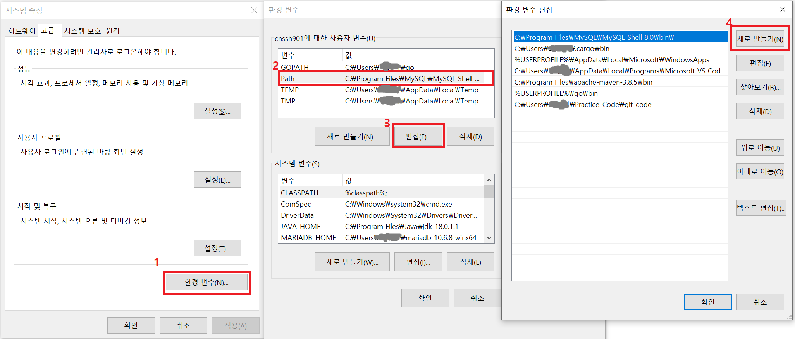
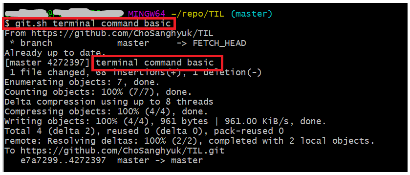

# [Terminal] git push 시, 필요 명령어 실행 파일 만들기(window)


## 개요

git의 TIL이나 개인용 레포지토리에 수정한 내용을 올릴 때, 반복적으로 다음과 같은 명령어들을 사용한다.

```sh
git pull origin master
git add .
git commit -m "{message}"
git push origin master
```

이 명령어들은 중간의 `{message}` 부분만을 제외하면 똑같은 코드들 기계적으로 입력해, 번거로울 때가 많다.

이에, 위 명령어들을 하나의 실행 파일로 묶어서, git에 수정 내용을 반영할 때 한 번의 코드로 올릴 수 있도록 세팅하고자 한다.


## 방법

### 1. 실행 파일 만들기

우선, 원하는 위치에 실행 파일을 만들어 준다. 나는 `git.sh`라는 파일로 생성하겠다.

```bash
vi git.sh
```


파일 편집기로 들어왔으면, I를 입력해 Insert 모드를 실행시킨다. 그 다음 아래의 내용을 입력하였다.

```sh
#!/bin/bash

commit_message="$@"

git pull origin master
git add .
git commit -m "$commit_message"
git push origin master
```

해당 파일을 구간을 나누어서 살펴보면 다음과 같다.


우선, `#!/bin/bash`은 스크립트가 실행될 때 사용할 인터프리터를 지정하는 특별한 주석으로, 실행할 때 Bash를 사용하도록 하는 지시한다.


그 다음 `commit_message="$@"`로 파일에 전달되는 모든 인자들을 하나의 변수로 합쳐준다.

- `$@` : 파일에 전달되는 모든 인자가 포함된 문자열이며, 각각의 인자는 공백으로 구분된다.

  

마지막으로, 반복적으로 사용하는 git 명령어들을 입력하고, 커밋 메시지의 경우 전달된 인자들로 만든 변수 값을 사용한다.

```sh
git pull origin master
git add .
git commit -m "$commit_message"
git push origin master
```


이후, `esc`, `:wq`로 파일을 저장하고 편집기에서 나온다.


### 2. 권한 설정

이렇게 파일을 생성하였으면, 파일에 실행 권한을 부여한다. `vi`로 생성한 파일은 기본적으로 실행 권한이 없기 때문이다.

```bash
chmod +x git.sh
```


### 3. 환경 변수 세팅

마지막으로 생성한 파일은 어느 경로에서든지 실행할 수 있도록, 환경 변수에 등록한다.

환경 변수 편집에 들어가 새로 만들기를 한 이후, 생성한 실행 파일이 있는 폴더의 경로를 입력한 후 저장한다.




## 테스트

이후, 로컬 레포지토리에서 파일을 수정한 이후, 생성한 실행 파일을 통해 한번에 git push가 되는지 확인한다.



생성한 파일을 통해 git 반영이 제대로 완료되고, 파일에 넣은 인자들이 합쳐져 커밋 메시지가 되었음을 확인할 수 있다.


### 참고 자료

- DEEPLIFY, [Linux/리눅스] Shell 실행 파일 만드는 방법 및 예제, https://deeplify.dev/server/bash/create-execute-file-in-linux
- codechacha, Bash Shell - Command Line으로 전달된 인자 받기, https://codechacha.com/ko/shell-script-arguments/
- hostinger, How to Concatenate Strings in Bash: A Guide for Connecting String Variables, https://www.hostinger.com/tutorials/bash-concatenate-strings
