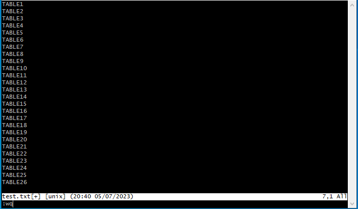

# [Terminal] 대상 목록들의 grep 결과를 편집하여 파일로 저장하기 

# (feat while,grep,sed,cut,>>)


## [문제 상황]

26개의 테이블들이 30개의 java 프로젝트 중 어떤 프로젝트들에서 등장하는지 각 테이블 별로 목록 추출이 필요하다.

대상 30개의 java 프로젝트들은 모두 eclipse의 workspace 내에 존재함으로, 각각의 테이블에 대해서 eclipse의 find 기능을 사용해서 어떤 프로젝트에 등장하는지 찾을 수는 있지만, 수작업으로 26개의 테이블에 대해 find 기능을 사용하고, 결과를 취합하느니 terminal 코드로 자동화시키고자 한다.


예를 들어, TABLE1, TABLE2, ... TABLE26 이라는 테이블 목록이 존재하고, my-java-project-01, my-java-project-02, .... my-java-project-30 이라는 프로젝트들이 존재할 때,

```
TABLE1 : my-java-project-01
TABLE1 : my-java-project-02
TABLE1 : my-java-project-03
TABLE2 : my-java-project-07
...
TABLE26 : my-java-project-09
TABLE26 : my-java-project-11
```

와 같이 목록을 추출할 것이다.


## [코드]

```bash
vi target_tables.txt
```

```bash
while IFS= read -r table;
do echo $table;
grep -r $table my-java-project-* | sed "s/^/$table: /" | cut -f 1 -d '/' 1>> "search_result.txt";
done < "target_tables.txt"

```


### 1. `vi target_tables.txt`

while문을 사용하기 위한 사전 작업으로, `target_tables.txt` 파일에 테이블 목록들을 저장해둘 것이다.

`target_tables.txt` 파일을 윈도우에서 열어 테이블 목록을 작성한 후 저장하는 경우에는 encoding 문제인지 추후 while 문에서 값을 제대로 못 읽어오는 경우가 발생했다. 

`vi` 를 통해 파일을 연 후 테이블 목록을 작성해 준 후 `wq` 로 저장 후 파일을 닫아준다.




### 2. `while IFS=read -r table; ... ; done < "target_tables.txt"`

while


일반적인 프로그래밍 언어와 마찬가지로 = 을 사용하여 변수ㅜ에 값을 설정한다.

변수의 이름은 대소문자가 구분된다.

= 앞/뒤에는 공백이 없어야 한다.

변수 값에 공백이 있는 경우 변수 값의 시작과 끝에 "을 사용한다.


https://jesc1249.tistory.com/291


sed 명령어에 변수 사용하기

sed "s/abc/$txt/g" 와 같이 큰따옴표 안에 변수를 사용함

`''` 사용 시 $txt라는 문자열로 인식

https://iamflower.tistory.com/401


`>>` **기존 파일 끝에 내용 추가**

https://jihyeong-ji99hy99.tistory.com/176

