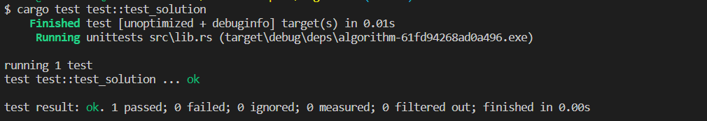

# [Rust] [프로그래머스] 하노이의 탑


※ 프로그래머스는 Rust 언어를 지원하지 않아, 해당 코드는 정답을 돌려본 것이 아닌 Java로 푼 문제로 Rust로 바꿔 풀어본 코드입니다.


## 문제요약

### 문제 설명

하노이 탑(Tower of Hanoi)은 퍼즐의 일종입니다. 세 개의 기둥과 이 기동에 꽂을 수 있는 크기가 다양한 원판들이 있고, 퍼즐을 시작하기 전에는 한 기둥에 원판들이 작은 것이 위에 있도록 순서대로 쌓여 있습니다. 게임의 목적은 다음 두 가지 조건을 만족시키면서, 한 기둥에 꽂힌 원판들을 그 순서 그대로 다른 기둥으로 옮겨서 다시 쌓는 것입니다.

1. 한 번에 하나의 원판만 옮길 수 있습니다.
2. 큰 원판이 작은 원판 위에 있어서는 안됩니다.

하노이 탑의 세 개의 기둥을 왼쪽 부터 1번, 2번, 3번이라고 하겠습니다. 1번에는 n개의 원판이 있고 이 n개의 원판을 3번 원판으로 최소 횟수로 옮기려고 합니다.

1번 기둥에 있는 원판의 개수 n이 매개변수로 주어질 때, n개의 원판을 3번 원판으로 최소로 옮기는 방법을 return하는 solution를 완성해주세요.

### 제한사항

- n은 15이하의 자연수 입니다.

------

### 입출력 예

| n    | result                  |
| ---- | ----------------------- |
| 2    | [ [1,2], [1,3], [2,3] ] |


문제 링크 : https://school.programmers.co.kr/learn/courses/30/lessons/12946


## 풀이


### 풀이법

n이 2,3,4 일 때에 대해서 손으로 직접 결과를 도출해본 결과, 다음과 같은 결론들을 얻을 수 있었다.


1.. 1 ~ n까지의 원판들이 1에서 3으로 최소 횟수로 이동하기 위해서는 마지막 원반 n의 이전 원판들 1 ~ n-1이 2에 이동해 있어야 한다.

예를 들어, 1~n-1까지의 원판들이 3으로 옮겨져 있다면, 가장 큰 n을 3으로 옮기기 위해서는 3에 있는 1 ~ n-1까지를 다시 다른 위치로 옮기는 작업이 수반되어 한다. 그렇기에 최종 목적지인 3이 아닌 2로 1 ~ n-1을 옮겨 두어야 한다.

이후 n을 3으로 옮긴 다음 1~n-1를 다시 3으로 옮겨서, 1~n까지를 3으로 보낼 수 있다.


2.. 1 ~ n-1의 원판이 이동하는데에 n이 주는 제약은 없다. 

n은 1 ~ n-1까지의 원판들보다 크기 때문에 1 ~ n-1이 이동하는데 n은 신경쓸 필요가 전혀 없어진다. 즉, 1 ~ n-1의 원판들을 옮길때에는 n이 없다고 가정하여도 무방하다.


이 두가지 결과들 사용하면, 다음과 같은 재귀식들이 도출된다.

1. 1 ~ n까지의 원판들이 1에서 3으로 최소 횟수로 이동하기 위해서는 마지막 원반 n의 이전 원판들 1 ~ n-1이 2에 이동해 있어야 한다.

2. 1 ~ n-1까지의 원판들이 1에서 2로 최소 횟수로 이동하기 위해서는 마지막 원반 n-1의 이전 원판들 1 ~ n-2가 3에 이동해 있어야 한다.

3. 1 ~ n-2까지의 원판들이 1에서 3로 최소 횟수로 이동하기 위해서는 마지막 원반 n-1의 이전 원판들 1 ~ n-3가 2에 이동해 있어야 한다.

   ....


즉, 현재 1 ~ i 만큼을 목적지로 보내기 위해서는 1 ~ i-1은 i의 목적지가 아닌 곳으로 이동하면 된다. 이후 i를 옮기고 1 ~ i-1이 i를 따라가는 로직을 넣어주면 된다.


### 코드

```rust

pub fn solution(n : u64) -> Vec<[u32;2]> {

  let mut rtn: Vec<[u32;2]>= Vec::new();
  recur(&mut rtn, n,1,2,3);
  rtn
}

// s : 출발지, o : 출발 및 목적지가 아닌 곳, d : 목적지
pub fn recur( rtn: &mut Vec<[u32;2]>, n:u64, s:u32, o:u32, d:u32, ) {

  if n == 1 {
    rtn.push([s,d]);
  } else {
    recur(rtn, n-1, s,d,o); // n-1까지를 n의 목적지가 아닌 곳으로 이동시킨다.
    rtn.push([s,d]);		// n을 목지지로 이동시킨다.
    recur(rtn,n-1, o, s, d);// n-1이 n따라 목적지로 이동한다.
  }

}

#[cfg(test)]
mod test {
    use super::*;
    
    #[test]
    fn test_solution() {
        assert_eq!(solution(2),vec![ [1,2], [1,3], [2,3] ]);
    }
}
```


## 학습한 내용

메소드와 변수에 있어서 새로운 것을 사용할 일은 없었다. 다만, Rust의 단위 테스트를 적용하여 정답 유무를 확인하였다.


1.. 테스트 메소드 작성

- Unit Test는 작성한 submodule 파일 하단에 작성한다.
- #[cfg(test)] attriute로 시작하는 메서드를 생성한 다음, **use::super::***을 통해서 모듈 전체를 가지고 온다. 
- 해당 모듈에 대한 각각의 테스트 메소드 에는 #[test] attribute를 작성하여, 테스트를 분리시킨다.
- Rust의 경우, 하나의 테스트가 Fail 시, 이후 테스트들에 대해서는 수행하지 않는다.

2.. assert macro

- 테스트의 결과를 검증하는 매크로이다.
- `assert_eq!( a, b)`
  - a와 b가 일치하면 성공, 다를 시 실패이다.
  - 이때 a와 b의 비교는 PartialEq Trait의 구현을 통해서 이루어진다.
- `assert_ne!(a,b)`
  - a와 b가 다르면 성공, 같을 시 실패이다.
- `assert!( boolean expression );`
  - a > b 와 같이 true, false를 return하는 expression이 들어간다.
  - true시 성공, false 시 실패이다.


### 결과




