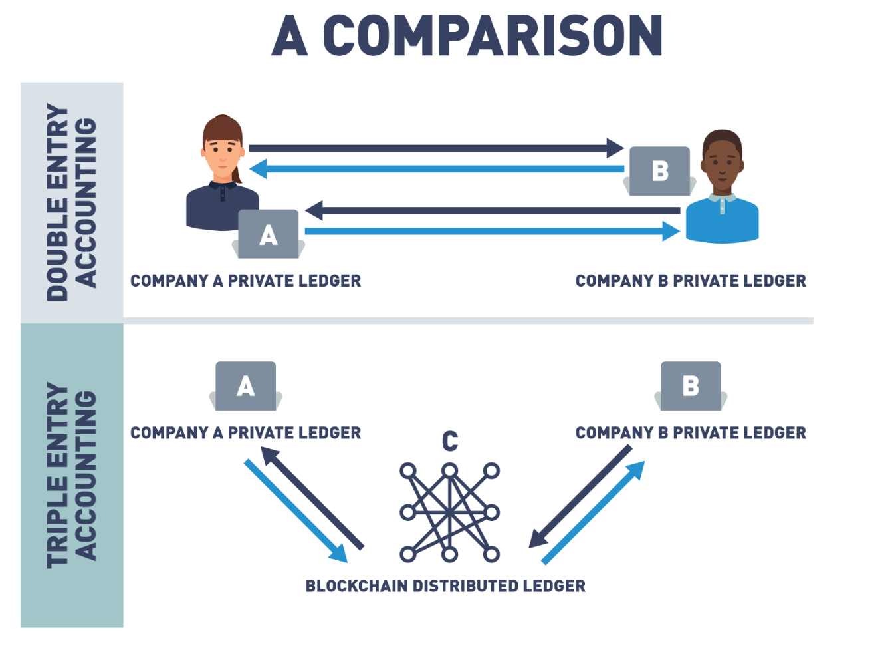
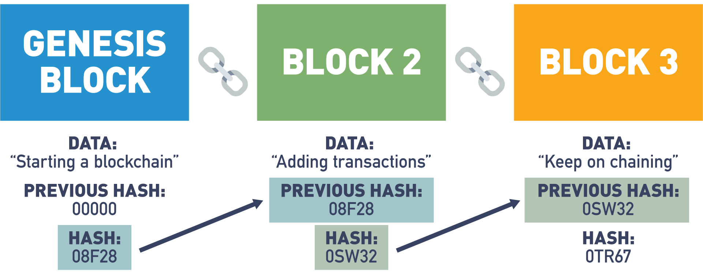

# 블록체인의 구성 (블록 & 체인)

블록체인에 대해 가장 단순하게 정의를 내려보면, "데이터 블록들을 체인과 같이 강하게 연결한 것"이라고 답할 수 있을 것이다. 이처럼 블록체인은 실제 데이터들이 저장되는 블록 부분과 블록들을 연결하는 체인 부분으로 나누어 살필 수 있다. 오늘은 이 두 파트를 나누어 동작 원리를 살펴보고자 한다.

## 블록

### 블록이란 무엇인가.

블록체인에서 블록을 다른 말로 표현하면, 장부라 할 수 있다. 

이것이 우리가 블록체인을 다른 말로 "분산 원장 기술"이라고 표현하는 이유이다. 원장이란 근원이되는 장부라는 의미로, 자산의 이동에 대해 기록이 되어져 있다. 여기서 중요한 것은 장부들은 **자산의 최종 결과 값을 기록해 둔 것이 아닌, 최종 자산 결과에 영향을 주었던 모든 거래들에 대한 기록**이라는 것이다.

그렇다면, 블록체인의 장부는 기존의 장부 시스템과 어떤 점이 다를까?

### Triple Entry Accounting

블록체인이 제공하는 장부 기록 방식은 Triple-entry accounting(삼식부기)라 부른다. Triple-entry accounting은 기존의 Double-entry accounting 시스템에서 제 3의 장부를 둬 거래에서 발생되는 가치의 변화를 기록하는 방식이다. 회계 방식별 특징은 다음과 같다.

**Single Entry Ledger**

- 첫번째 문서화된 회계 관리 시스템

- 차변(Debit), 대변(Credit) 구분 없이 한 개의 컬럼에서 수입과 지출 내용만 관리

**Double Entry Ledger**

- 차변(Debit), 대변(Credit)을 구분지어 내역을 관리

- 거래 당사간들은 각자의 장부에 거래 내역을 기록

**Triple Entry Ledger**

- 차변(Debit), 대변(Credit)을 구분지어 내역을 관리
- 제 3의 분산화된 장부 시스템(블록체인)에서 거래 내역을 기록

Double Entry Ledger에서는 거래 기록들이 각자의 장부에 기록되었기 때문에, 의도적 혹은 비의도적인 오기입과 같은 문제의 발생 소지가 존재했다. 하지만 Triple Entry Accounting에서는 거래 내역이 자동적으로 제 3의 장부에 기록됨으로써, 지속적이고 정확한 회계 기록을 남길 수 있다. 

[Double vs. Triple-Entry Accounting Comparison](https://learning.edx.org/course/course-v1:LinuxFoundationX+LFS170x+1T2023/block-v1:LinuxFoundationX+LFS170x+1T2023+type@sequential+block@47866c822c894049af4a2213c7a9d469/block-v1:LinuxFoundationX+LFS170x+1T2023+type@vertical+block@834ecd6eaa744a108a798b69a3f6e282)

이러한 제 3의 장부는 분산화되고 암호화로 보호되기에, 위조나 삭제, 그리고 정보의 공개를 사실상 불가능하게 만든다. 

우선, 분산화되었다는 것은 장부를 특정 개인/단체가 소유하는 것이 아닌, 시스템 참여자 전체가 같은 내용의 장부를 소지하고 있음을 의미한다. 장부가 유효한 장부임을 인증받기 위해서는 시스템 참여자 과반의 지지를 받아야 한다. 만약 특정 세력이 장부를 조작하기 위해서는 시스템 참여자 과반 이상을 해킹해야 하기에, 시스템의 참여자 수가 많아질 수록 해킹의 가능성을 점점 0으로 수렴시킨다.

또한, 장부의 내용은 암호화되어 기록되기에, 장부를 모두가 가지고 있다고 하더라도 거래 당사자를 제외하곤 내용을 알 수 없다. 또한, 블록체인에서는 거래의 유효성 검증 방식으로 ZKP(Zero-Knowledge Proof) 방식을 사용하여 보안성을 높이고 있다. 

블록의 보안을 유지하는 방법에 대해서 더 자세히 알아보겠다.

### 블록체인의 암호화 기술 : 공개키, 개인키 기반의 암호화

블록체인에서는 참여자들 모두가 각자의 공개키/개인키를 가지고 있다. 참여자들은 공개키(public key), 개인키(private key) 방식을 통해 내용을 암호화시킨다.

여기서, **공개키는 모두에게 노출되어 있는 나만의 암호화 키 값**이다. 쉽게 말해 나의 자물쇠는 모두가 가져다가 쓸 수 있다. **개인키는 나만 알고 있는 나만의 복호화 키 값**이다. 공개된 자물쇠를 풀 수 있는 열쇠는 나만 들고 있는 것이다. 

예를 들어, A가 B에게 비밀 내용을 암호화해서 보낸다 하자. 이때, A는 비밀 내용을 B의 공개키로 암호화 시킨다. (B의 자물쇠로 내용을 봉한다.) 그 다음 B에게 전달하면, B는 자신의 개인키로 내용을 복호화 시켜서 (열쇠로 자물쇠를 열어서), 비밀 내용을 확인할 수 있다. 만약 중간에 내용이 탈취되거나 공개되어도, B를 제외한 사람들은 복호화 키(열쇠)가 없기 때문에 내용을 확인할 수 가 없다. 

:bulb: 블록체인 지갑

추가로, 블록체인 지갑의 개념이 이 공개키, 개인키에서부터 온다. 블록체인 지갑에는 실제 지갑과 다르게 직접적인 암호화폐가 들어있지 않다. 다만, 참여자들은 자신의 공개키를 기반으로 시스템 내에서의 주소를 가지는데, 블록체인 지갑은 이 주소로 온 거래 내역들을 개인키로 확인한 결과값을 보여준다. 다시 말해, 블록체인 지갑을 잃어버렸다는 것은 내가 들고 있는 블록체인 화폐를 직접적으로 잃어버린 것이 아닌, 개인키를 잃어버려 나에게 온 거래 내역에 대한 증빙을 할 수 없게된 상태를 말한다.

### 블록체인의 검증 방식 : ZKP(Zero-Knowledge Proof)

ZKP란, 하나의 명제가 참임을 외부에 증명할 때 추가적인 정보의 공개 없이 증명하는 방식을 뜻한다.

예를 들어, 내가 "나는 우리집 현관문 비밀번호를 알고 있다"라는 명제를 외부에 참임을 증명한다고 하자. 이때, 내가 다른 사람이 보는 앞에서 우리집 안으로 들어가기만 한다면, 나의 현관문 비밀번호를 외부에 공개하지 않고서 명제를 증명할 수 있다. 

블록체인에서는 거래 유효성을 검증할 때 이러한 ZKP 방식을 사용한다. 블록체인 거래가 있을 때, 블록체인은 송신자가 누구인지, 총 얼만큼의 블록체인 화폐를 가지고 있는지 요구하지 않는다. 다만, 해당 블록체인의 거래를 진행할 만큼의 블록체인을 들고 있는지만을 확인한다. 이러한 방식으로 블록체인은 불필요한 정보의 노출을 막을 수 있다.

정리하자면, 블록이란 시스템 참여자 모두가 공통으로 소유하고 기록하는 장부로써, 블록들에는 전체 거래 이력들이 저장되어 있다. 블록의 데이터는 참여자 모두가 확인하고 검증할 수 있으므로 위변조를 할 수 없으며, 암호화와 ZKP 방식으로 블록의 보안을 유지한다.

## 체인

이번에는 블록들을 어떻게 체인과도 같이 강하게 연결하는 방법을 살펴보겠다.

### 해시 알고리즘을 통한 연결

블록체인은 해시(hash) 알고리즘을 사용해서 블록들을 연결한다.

해시란, 특정 input을 넣었을 때 일련의 변환 과정을 걸쳐서 값을 변환하는 알고리즘으로, 다음과 같은 특징을 가진다

1. 고정된 길이의 값을 반환한다. 인풋의 크기와 상관없이, 고정된 길이를 반환하기에 데이터를 압축시킬 수 있다.
2. 단방향 변환이다. 같은 인풋을 넣었을 때는 계속 같은 결과가 나오지만, 결과값을 통해서 인풋을 유추할 수 없다.
3. 인풋이 조금만 변해도, 전혀 다른 결과값이 나온다. 이로 인해, 인풋이 조금만 변해 결과값을 통해 쉽게 다른 인풋값임을 확인할 수 있다.
4. 같은 결과값을 내는 인풋을 찾기 어렵다. 해시 충돌이란, 서로 다른 입력에 대해 동일한 해시값을 출력하는 것을 의미하는데, 해시 충돌이 나는 입력값을 찾기 어려워야 한다.

블록체인은 다음과 같이 하나의 블록을 해시값으로 변환하고, 해당 해시값을 다음 블록에 입력함으로써 블록들을 연결시킨다. 다시 말해, 하나의 블록은 이전 블록의 해시값과 신규 거래 내역들을 가지고 있으며, 이러한 전체 정보가 해시값으로 변환되어서 다음 블록에 전달되는 구조이다. 

[Hash Functions in Blockchain](https://courses.edx.org/assets/courseware/v1/d40a197c613f2ece59080075ee780f9f/asset-v1:LinuxFoundationX+LFS170x+1T2023+type@asset+block/LFS170x_Ch2_CourseGraphics-10.png)

### 블록체인의 투명성과 불변성

이 구조에서는 오직 블록의 추가만이 가능하며, 블록들의 수정/삭제가 사실상 불가능하다. 이로 인해서, 블록체인은 투명성(Transparency)과 불변성(Immutability)을 가진다.

우선, 블록체인은 전체 내역들이 체인 구조로 관리되기 때문에, 언제든지 **전체 내역들을 투명성있게 확인**할 수 있다. 현재의 DB 구조는 CRUD의 결과값인 최종 데이터만을 가지고 있기에, 현재의 데이터가 어떻게 생성되었고, 정확한 데이터인지 확인할 수 없다. 하지만 블록체인에서는 오직 블록의 추가만 가능하고 이전 블록들에 대한 변경이 불가능하기에, 정보의 투명성을 보장한다.

또한, 각 부분은 다른 모든 부분과 연결되어 일관된 전체를 형성하어, 공격자가 수정하기 어렵게 만들어져 있다. 따라서, **블록들은 불변성있게 유지**된다. 

예를 들어, 어떤 사람이 첫번째 블록의 내용을 수정한다고 해보자. 그렇다면 해시의 특성상, 아무리 조금의 수정이 있었다 하더라도 첫번째 블록의 해시값은 원본과 크게 달라질 것이다. 그렇다면 2번째 블록에 저장된 첫번째 블록의 원래 해시값과 값이 달라졌기에, 연결이 끊어지게 된다. 

만약, 첫번째 블록의 변경분을 유효하게 체인에 반영시키기 위해서는 두번째 블록에 저장된 첫번째 블록의 해시값 정보도 수정해야 한다. 하지만 이 경우 또 다시 두번째 블록의 해시값이 변경되기에 또 다시 세번째 블록과의 연결이 끊어진다. 즉, 하나의 블록을 수정하기 위해서는 이후의 모든 블록들을 수정해야 하며, 이를 전체 참여자의 과반 이상에 반영시켜야만 유효한 체인으로 인정받을 수 있다. 

블록들의 수정/삭제한다는 것은 새롭게 추가되는 블록들이 추가되는 연산을 따라잡으면서 과반 이상의 참여자의 장부들을 해킹해야 한다는 것이기에, 규모가 큰 블록체인에서는 불가능한 일로 간주된다.

## 참고자료

- edX, Blockchain: Understanding Its Uses and Implications chapter2.Blockchain Mechanics, https://learning.edx.org/course/course-v1:LinuxFoundationX+LFS170x+1T2023/block-v1:LinuxFoundationX+LFS170x+1T2023+type@sequential+block@1088154e18e0450f9bb3a418121008c1/block-v1:LinuxFoundationX+LFS170x+1T2023+type@vertical+block@e54720e1b1a9435f8928805a3b137f59

- 노마드 코더, https://www.youtube.com/watch?v=4uBWSPw-Vd8&list=PL7jH19IHhOLOJfXeVqjtiawzNQLxOgTdq&index=6