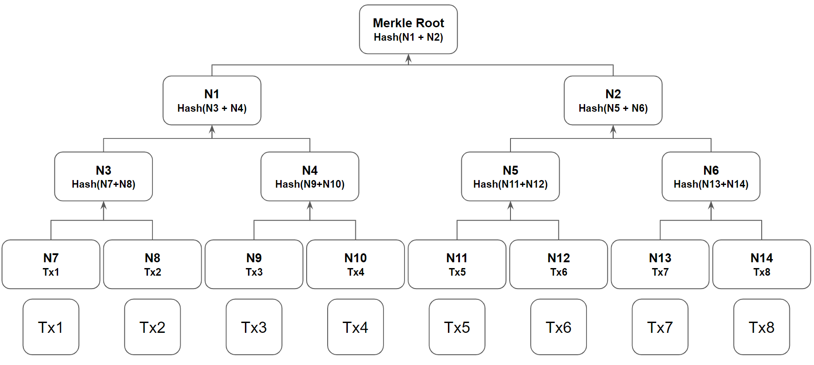

# [블록체인] Merkle Tree 구조

저번 포스트에서 블록에 대해 설명할 때, 블록에는 거래내역(transaction)들이 저장된다고 하였다. 하지만, 대부분의 블록체인에서는 블록에 거래내역을 직접적으로 저장하지 않는다. 다만, Merkle Tree 구조에서 나온 **Merkle Root 값만을 저장**하고 있다. 블록체인에서는 이 구조를 통해, 블록들에는 압축된 정보를 저장함과 동시에 거래내역들에 빠른 검증과 추적을 할 수 있도록 한다. 

## Merkle Tree 개요

Merkle Tree(머클 트리)는 이진 트리구조로, 잎 노드(Leaf node)는 실제 데이터를 가지고, 각각의 내부 노드(Internal node)는 자신의 자식 노드들의 데이터를 해시 전환한 값을 가지는 자료 구조이다. 

예를 들어, 다음과 같이 Tx1 ~ Tx8까지 8개의 트랜잭션 데이터가 있다고 하자. 

그렇다면, 잎 노드(N7 ~ N14)는 각각 실제 트랜잭션 정보를 가지고 있다. H7와 N8의 부모 노드인 N3는 N7와 N8의 값을 합친 값을 Hash 전환한 값을 가지게 된다. 이러한 자식 노드들에 대한 Hash 전환은 Merkle Root라고 부르는 루트 노드까지 이어진다.

## Merkle Tree 강점

이러한 Merkle Tree는 크게 3가지의 강점을 가지고 있다.

### 1. 빠른 탐색

우선, 이진 트리 구조로 접근하고자 하는 트랜잭션을 빠르게 탐색할 수 있다. 이진 트리 구조에서 잎 노드 탐색에 필요한 시간 복잡도는 log2(N)으로, 트랜잭션의 양이 기하급수적으로 늘어도 특정 트랜잭션을 찾는 경로는 단순하다. Merkle 트리를 위에서 아래로 횡단하는 경우, 다음과 같은 공식을 사용하여 자식 노드의 인덱스를 찾을 수 있기 때문이다.

- 왼쪽 자식 인덱스     = 부모 인덱스 x 2 + 1 
- 오른쪽 자식 인덱스 = 부모 인덱스 x 2 + 2

위의 그림에서 예시를 들어보면, Tx7 트랜잭션을 찾으려고 할 때, Root에서부터 해싱이 되는 과정이 3번이었으므로, 세 번의 경로만 찾아가는 연산을 하면 Tx7을 빠르게 찾을 수 있다. 

### 2. 빠른 검증

또한, Merkle Tree는 이진 트리 구조와 Hash 알고리즘의 특성을 이용해서, 특정 트랜잭션에 대한 검증을 빠르고 효율적으로 수행할 수 있다.

예를 들어, 내가 Tx5 트랜잭션이 변조되지 않은 올바른 데이터인지 검증하기 위해서는 Tx5, Tx6, N6, N1 이렇게 4개의 데이터만 제공받으면 된다. 이렇게 4개의 데이터만 제공받으면, 나는 해시 변환을 통해 Merkle Root를 도출할 수 있으며, 나의 블록에 저장된 Merkle Root와 비교해서 Tx5가 올바른 데이터인지 검증할 수 있다.

하나의 트랜잭션을 검증하기 위해 전체 트랜잭션을 제공받아 처음부터 Merkle Tree를 도출해 낼 필요가 없기 때문에, 네트워크 대역을 최소화하고 연산량을 줄일 수 있다. 

### 효율적인 데이터 저장

블록에는 Merkle Root의 값만 저장하고, 트랜잭션에 대한 정보는 필요한 경우에만 제공받음으로써 효율적으로 데이터를 저장할 수 있게 된다. 

블록체인의 용량은 시간이 지날수록 지속적으로 늘어나기 때문에 모든 블록체인을 다운받는 풀노드(full node)는 성능이 좋은 컴퓨터만 수행할 수 있다. 하지만 Merkle Tree 구조에서는 블록 데이터의 일부만 다운받는 라이트 노드(light node)로도 쉽고 빠르게 트랜잭션의 유효성을 확인할 수 있기에, 모바일과 같은 가벼운 기기로도 참여가 가능하다.

## 참고자료

- edX, Blockchain: Understanding Its Uses and Implications chapter2.Blockchain Mechanics, https://learning.edx.org/course/course-v1:LinuxFoundationX+LFS170x+1T2023/block-v1:LinuxFoundationX+LFS170x+1T2023+type@sequential+block@1088154e18e0450f9bb3a418121008c1/block-v1:LinuxFoundationX+LFS170x+1T2023+type@vertical+block@e54720e1b1a9435f8928805a3b137f59

- security,머클 트리(Merkle Tree)와 구조와 용도,https://www.lesstif.com/security/merkle-tree-125305097.html
- banksalad,쉽게 설명하는 블록체인 : 머클트리(Merkle Trees)란, https://www.banksalad.com/contents/%EC%89%BD%EA%B2%8C-%EC%84%A4%EB%AA%85%ED%95%98%EB%8A%94-%EB%B8%94%EB%A1%9D%EC%B2%B4%EC%9D%B8-%EB%A8%B8%ED%81%B4%ED%8A%B8%EB%A6%AC-Merkle-Trees-%EB%9E%80-ilULl