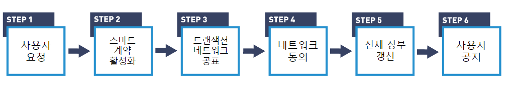
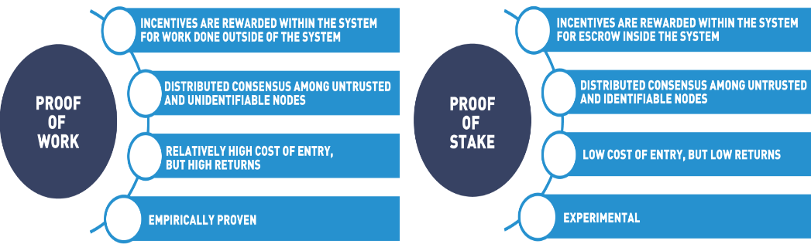

# [블록체인] 합의 알고리즘 (feat. Pos, PoS, PoA)

오늘은 블록체인을 구성하는 중요한 요인들 중 하나인 합의 알고리즘에 대해서 정리해보고자 한다. 먼저 블록체인 트랜잭션이 어떤 순서로 진행되는지 확인한 다음, 합의 알고리즘의 개념과 대표적인 종류들에 대해서 알아보고자 한다.

## 블록체인 트랜잭션

우선 블록체인의 종류와 상관없이, 일반적으로 다음과 같은 순서로 트랜잭션이 진행된다.

출처 : [[Blockchain Transactions](https://courses.edx.org/assets/courseware/v1/e0bd310e9f8bf0643b384efdd1919bb7/asset-v1:LinuxFoundationX+LFS170x+1T2023+type@asset+block/Chapter_3_Graphics-14.png)]

1. **사용자 요청**
   - 사용자가 블록체인에 저장되어야 할 작업을 수행한다.
2. **스마트 계약 활성화**
   - 작업은 스마트 계약 혹은 체인 내 코드를 활성화시켜, 블록체인 내부에서 코드가 실행된다. 
   - 트랜잭션이란 코드의 실행결과로, 장부에 기입하고자 하는 내용이다.
3. **트랜잭션 네트워크 공표**
   - 특정 블록체인에서 실행 중인 프로토콜을 사용하는 블록체인 운영자들은 해당 트랜잭션을 블록체인 네트워크 전체에 퍼트린다.
4. **네트워크 동의**
   - 블록 생성자들은 트랜잭션들을 모아서, 새로운 블록을 생성한다.
   - 새로 생성된 블록을 추가할 것에 대해 **네트워크 내 합의**가 이루어진다.
5. **전체 장부 갱신**
   - 블록 운영자들은 새로 생성된 블록을 네트워크에 퍼트려 전체 노드들에 반영한다.
6. **사용자 공지**
   - 사용자들은 블록체인 생성에서부터의 이벤트를 공지받는다.

트랜잭션 과정에서 볼 수 있듯이, 블록체인에 새로운 블록(장부)가 추가되기 위해서는 누군가는 트랜잭션을 수집하여, 블록으로 생성해야 한다. 또한, 해당 블록이 블록체인 내에서 발생한 정상적인 트랜잭션들만 모은 올바른 장부인지 정확한 검증이 있어야 전체 블록에 신뢰를 가질 수 있을 것이다. 

블록체인에서는 이러한 과정을 사전에 정의된 합의 알고리즘을 통해 수행한다.

## 합의 알고리즘

합의 알고리즘이란,  블록체인 네트워크에서 참여자들 간에 동의를 이끌어내는 규칙의 집합이다. 이를 통해 어떻게 블록 생성자를 선출하고, 블록을 검증하며, 얼마의 보상을 제공할지에 대한 규약이 정의된다. 분산된 노드 간에 합의를 형성하여 트랜잭션의 유효성을 검증하고 블록을 추가함으로써 전체 네트워크에서 일관된 상태를 유지한다.

### 대표 합의 알고리즘

#### PoW(Proof of Work)

PoW은 탈중앙화된 합의 매커니즘으로 네트워크 구성원들에게 수학 문제를 풀도록하여 블록을 검증한다. 이때 문제는 풀기는 어렵지만, 정답을 검증하는 것은 알기 쉽게 설계된다. PoW 알고리즘은 다음과 같은 순서로 블록을 생성한다.

1. 블록 생성자가 되고 싶은 사람은 누구나 블록 생성자가 될 수 있으며, 이들을 채굴자(miner)라고 부른다.
2. 하나의 블록이 가득찰 정도로 트랜잭션이 쌓인다면, 채굴자들은 블록을 생성하기 위해 주어진 문제를 푼다.
3. 정답을 알아낸 채굴자는 네트워크 전체에 자신의 값을 공유하고, 네트워크의 절반 이상에서 해당 값이 정답으로 인정된다면 정답으로 인정된다.
4. 최초로 정답을 찾은 채굴자는 블록을 생성하여 네트워크에 공유하고, 정해진 incentive를 얻게 된다.

여기서 나오는 문제는 주로 다음과 같이 해시 문제를 풀도록 되어있다.

예를 들어, 한 블록을 가득채울만큼 트랜잭션이 쌓였다면, 채굴자(miner)들은 블록을 추가하기 위해서는 다음과 같은 문제를 풀어야 한다.

​	*트랜잭션들과 같이 해싱을 했을 때, 해싱 결과가 연속하는 0 3개로 시작하는 값이 되게끔하는 임의의 수(nonce)를 구하시오*

정답을 구하기 위해서는 임의의 값들을 여러 번 반복해서 직접 넣어보는 수 밖에 없기 때문에, 값을 구하는데에는 상당한 시간과 자원이 필요하다. 하지만 누군가 정답을 찾아서 네트워크에 공유했을 때에는, 다른 네트워크 구성원들은 해당 값을 자신이 가지고 있는 트랜잭션들과 해싱을 했을 때 연속된 0 3개가 나오는지만 확인하면 되기에, 정답을 쉽게 검증할 수 있다.

:memo: 참고 : [[PoW 영상 설명](https://learning.edx.org/course/course-v1:LinuxFoundationX+LFS170x+1T2023/block-v1:LinuxFoundationX+LFS170x+1T2023+type@sequential+block@b2327e4750bc4beda267bf03132fbe6c/block-v1:LinuxFoundationX+LFS170x+1T2023+type@vertical+block@90fdfcf7c8e946bdbcaf131b9772ccae)]

이 방법을 통한다면, 블록 생성자가 **임의로 트랜잭션 결과를 조작해서 저장하는 것을 막을 수 있다**. 문제 풀이에는 자신이 기록하고자 하는 트랜잭션의 이력들과 같이 사용되기에, 임의로 조작한 트랜잭션을 가지고 찾은 정답은 다른 노드들에선 정답으로 인정받지 못 하기 때문이다. 

물론, 조작의 가능성이 완전이 없는 것은 아니다. 1. 본래의 트랜잭션과 조작된 트랜잭션 둘 다에서 공통되게 정답으로 인정받는 정답을 찾거나 2. 네트워크 노드의 절반 이상을 장악한다면 조작된 트랜잭션을 블록으로 생성하는 것이 가능하다. 하지만 전자는 여러 채굴자들이 경쟁하는 상황에서 남들보다 훨씬 복작한 연산을 남들보다 빨리 찾는 것은 현실적으로 매우 어려우며, 후자는 한 세력에게 절반 이상이 장악된 블록체인은 사회적으로 가치가 없어지기에 시도할 이유가 없어진다. 

이처럼 PoW는 블록의 조작에 자원 소모가 지나치게 많아지도록하는 방식을 통해서, 블록을 검증한다.

이러한 방식의 PoW는 크게 다음 3가지 단점을 가지고 있다.

첫번째로, 느리다. PoW 방식은 채굴자들 간 공정한 경쟁과 보안성을 유지하기 위해 일정 수준 이상 난이도의 문제를 해결하도록 한다. 만약 문제가 너무 쉽다면, 네트워크 전파상 가까운 쪽에게 유리하며 블록 조작의 위험도 커질 것이다. 이로 인해, Visa 결제 시스템은 시간당 70,000건의 트랜잭션을 처리하는 것에 비해, PoW는 시간당 10~20 정도의 트랜잭션 밖에 처리하지 못 한다.

두번째로, 비친환경적이다. 말했듯이, PoW는 자원 소모가 지나치게 많아지도록하는 방식을 통해서 시스템을 유지한다. 채굴자들은 같은 문제를 해결하기 위해서 같은 작업을 몇번이고 반복적으로 수행해야 한다. 이 과정에서 많은 양의 그래픽 카드와 전기가 낭비된다. 최근 친환경이 경제에 있어서도 큰 화두인 만큼, PoW의 방식은 비지속적이지 못 하다는 한계가 있다.

마지막으로, 중앙화를 부추긴다. 최근 몇년사이 하드웨어(ex 그래픽카드)의 성능과 가격이 크게 향상 되었다. 이는, 일반 사람들이 채굴자가 되는 것에 높은 진입장벽을 생성한다. 이제는 채굴자가 되기 위해서는 높은 자본금이 있어야 가능하며, 전기료가 싼 지역일 수록 이점을 가지게 된다. 원래는 탈중앙화 방식으로 나왔지만, 이제는 역설적이게도 권한이 몇몇 집단 혹은 지역에 집중되고 있다. 

#### PoS(Proof of Stake)

PoS은 탈중앙화된 합의 매커니즘으로 구성원들은 검증자가 되기 위해 자신의 암호화폐를 배팅하고, 배팅에 따른 확률로 랜덤하게 선출된 검증자가 검증을 수행한다. 검증을 옳게 수행했을 시에는 보상을 주고, 잘못된 검증과 같은 악의적 행위를 했을 시 배팅한 화폐의 일부를 몰수당한다. 이처럼 PoS는 보상과 몰수라는 방식으로 생성자가 올바르게 블록을 검증할 유인을 주며, 생성자를 랜덤하게 선출함으로 악의적인 행위자가 공격을 조율하기를 더 어렵게 만든다.

PoS는 Pow의 대안으로 나온 합의 알고리즘으로 어느 정도 PoW의 한계를 극복한 모습을 보여준다. PoS는 "채굴"이라는 문제 풀이를 하지 않음으로, 블록 생성에 있어서 반복적이고, 자원 소모적인 작업을 하지 않는다. 이로 인해, PoS는 Pow보다 더 빠르고, 훨씬 전기를 적게 소모하는 친환경적 방식으로 블록을 검증 및 생성한다. 

하지만 여전히 중앙화의 문제를 가지고 있다. PoS에서 생성자가 되기 위해서는 자신이 가지고 있는 암호화폐를 배팅해야 하며, 배팅할 금액이 커질 수록 생성자가 될 더 높은 확률을 가지게 된다. 자신이 가지고 있는 자본금에 따라서 생성자가 될 확률이 정해지기에, 초기에 높은 점유율을 가진 개인 혹은 집단에게 권한이 계속 집중될 수 있다.

또한, 블록의 조작이나 분기(fork)의 유지와 같은 악의적 행위에 PoW보다 높은 유인을 가진다. Pos에서는 블록을 생성하는 것 자체에는 비용이 들지 않기 때문에, 블록 생성자는 악의적 행위가 자신의 배팅금보다 더 큰 이득을 준다고 판단한다면 악의적 행동을 할 합리적 유인이 존재한다. 

따라서, PoS를 잘 유지하기 위해서는 생성자 선정에 있어 배팅금 이외에 선정 주기, 랜덤 선정 알고리즘과 같은 요인들을 추가하여 중앙화를 막고, 생성자의 작업 결과를 빠르고 정확하게 검증할 수 있어야 한다.

:bulb: [Proof of Work Characteristics](https://courses.edx.org/assets/courseware/v1/6167f3f746ce90cf86145e91ffec4603/asset-v1:LinuxFoundationX+LFS170x+1T2023+type@asset+block/Chapter_3_Graphics-19.png) vs [Proof of Stake Characteristics](https://courses.edx.org/assets/courseware/v1/c128e73e2701b49b316ea3dab421dd67/asset-v1:LinuxFoundationX+LFS170x+1T2023+type@asset+block/Chapter_3_Graphics-17.png)

#### PoA (Proof of Authority)

PoA는 중앙화된 합의 매커니즘으로 권한이 있는 특정 몇몇 네트워크 노드이 검증자가 되어 블록을 검증하고 생성한다. 검증자는 인정받은 정체성 혹은 네트워크에 대한 일정 수준의 신뢰를 가진 개인 또는 조직이다. 따라서, PoA는 permissioned(private) 네트워크에서 참여자들이 서로를 알고 있고, 참여자들간 신뢰의 레벨이 존재할 때 사용된다. 

최근 대표되는 PoA 알고리즘에는 *IBFT 2.0*, *Clique*, *Aura* 등이 있다. PoA 알고리즘별 특징은 다음 기회에 더 자세하게 다뤄보겠다.

## 참고 자료

- edX, Blockchain: Understanding Its Uses and Implications chapter2.Blockchain Mechanics & chapter3.Blockchain Functions, https://learning.edx.org/course/course-v1:LinuxFoundationX+LFS170x+1T2023/block-v1:LinuxFoundationX+LFS170x+1T2023+type@sequential+block@1088154e18e0450f9bb3a418121008c1/block-v1:LinuxFoundationX+LFS170x+1T2023+type@vertical+block@e54720e1b1a9435f8928805a3b137f59

- Hyperledger Founcation, ANNOUNCING HYPERLEDGER BESU ,https://www.hyperledger.org/blog/2019/08/29/announcing-hyperledger-besu
