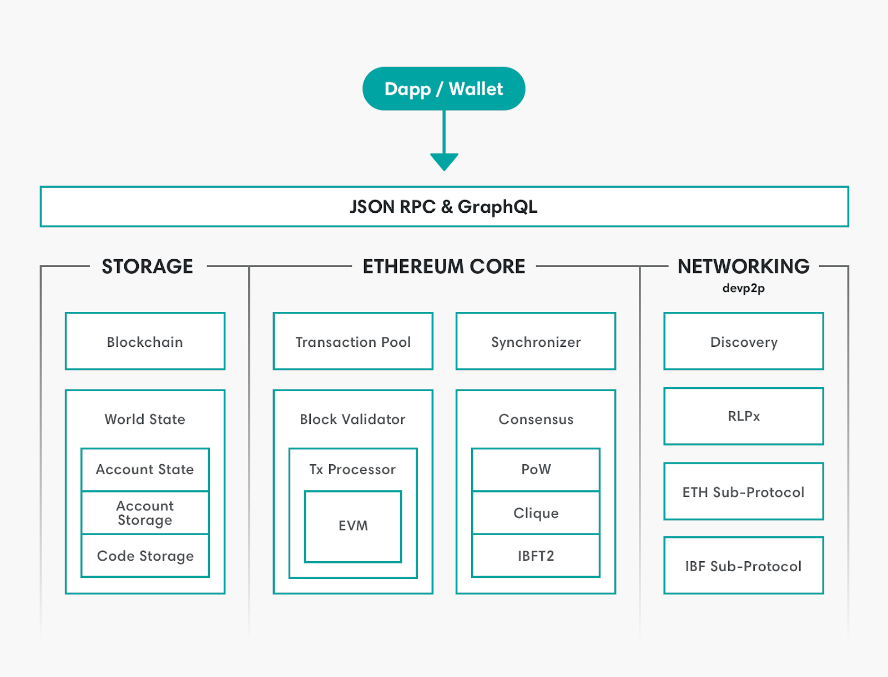

# Hyperledger Besu

Hyperledger Foundation의 ANNOUNCING HYPERLEDGER BESU 글을 읽고 정리한 내용입니다.

## Hyperledger Besu 개요

### Hyperledger Besu 소개

Hyperledger Besu는 java 기반 **Ethereun client**로, 기업이 자신의 어플리케이션에 permissioned network와 public network를 구축하고자 하는 관심사를 반영하여 만들어졌다. Hyperledger Besu는 모듈로써 설계되었으며, 합의 알고리즘과 다른 중요 blockchain 특징들 간에 관심사의 분리로 구성요소를 쉽게 발전/실행가능하게 한다.

:bulb: **Ethereun client**란, Ethereum 프로토콜을 실행하는 소프트웨어로 하기 요소들을 포함한다.

- Ethereum 블록체인 내의 트랜잭션을 처리하는 실행 환경
- 트랜잭션 실행과 관련된 데이터를 유지하는 보관소
- 상태를 동기화하기 위한 네트워크 상의 다른 Ethereum 노드들과 교류하는 P2P 네트워크
- application 개발자가 블록체인과 교류하기 위한 API

### Hyperledger Besu 지원 기능

Hyperledger Besu는 Ethereum 네트워크 내 노드들을 실행하고, 관리하고, 모니터링하기 위한 command line interface와 HTTP/WebSockect 기반 APIs를 지원한다. Besu client의 API는 전형적인 Ethereum 기능들을 지원하는데, 여기엔 스마트 컨트랙, dapp의 개발/전개/운영 등이 있다. *Truffle*, *Remix*, *web3j*과 같은 툴들이 이러한 기능들을 가능하게 한다. Besu는 표준 JSON-RPC API를 구현하여 생태계 도구들과의 통합을 간단하게 만든다. 

추가적으로, Besu는 비공개(private)/허가(permissioned) 컨소시엄 네트워크 생성을 지원한다. 

**:bulb:비지원 기능**

Besu는 보안상의 이유로 클라이언트 내 키 관리 지원하지 않는다. 대신 *EthSigner*이나 다른 Ethereum-호환 지갑을 사용해 관리가 가능하다. 

## Hyperledger Besu 특징

Hyperledger Besu가 가지는 주요 특징들은 다음과 같다.

- **The Ethereum Virtual Machine(EVM)**
  - Ethereum 블록체인 내 트랜잭션을 통한 스마트 컨트랙의 이용과 실행을 하게 해주는 가상머신인 EVM을 지원한다.

- **Consensus Algorithms**

  - 트랜잭션 검증, 블록 검증, 블록 생성을 포함하는 다양한 합의 알고리즘을 구현한다. 지원하는 합의 알고리즘에는 *IBFT 2.0*, *Clique*와 같은 PoA(Proof of Authority)와 PoW(Proof of Work) 합의 알고리즘들이 있다.

  - :memo: [[블록체인] 합의 알고리즘 (feat. Pos, PoS, PoA))](https://dev-ote.tistory.com/36)

- **Storage**

  - 로컬에 체인 데이터를 저장하기 위해 *RocksDB*라는 key-value DB를 사용한다. 데이터들은 다음과 같은 몇 개의 카테고리로 분류된다.

  1. Blockchain

     - block header : 데이터의 체인을 형성하며, 블록체인의 상태를 암호화적으로 검증하는 데 사용

     - block body : 트랜잭션을 정렬하여 각각의 블록에 기록

     - transaction receipts : 트랜잭션 로그와 같이 트랜잭션 실행의 메타 데이터를 포함

  2. World State

     - World State란 주소(addresses)에서 계좌(account)로의 매핑으로, 모든 block header들은 stateRoot 해시를 통해 world state를 참조하고 있다. 

     :bulb: Ethereum accounts는 다음 2가지 type으로 분류 가능함

     1. Externally Owned Accounts (EOAs) : 거래 송신, 스마트 컨트랙, ether 잔고 보관을 수행하는 계좌

     2. Contract Accounts : 추가적으로 실행 가능한 코드와 보관소를 가지는 계좌

- **P2P networking**

  - Hyperledger Besu는 UDP 기반의 프로토콜로 네트워크 상의 사용자들을 찾으며, ***RLPx***라고 불리는 TCP 기반의 프로토콜로 다양한 서브-프로토콜들을 통해 사용자들간의 소통을 지원한다. 

  - :heavy_check_mark: 서브 프로토콜

    - ETH Sub-protocol : 네트워크 상 블록체인 상태를 동기화 시키고, 새로운 트랜잭션을 전파

    - IBF Sub-protocol : 합의 결정을 촉진시키는 *IBFT2* 합의 프로토콜

- **User-facing APIs**
  - mainnet Ethereum, EEA JSON-RPC APIs, WebSocket protocols, GraphQL API 제공한다.

- **Monitoring**

  - 노드와 네트워크 성능에 대한 모니터링을 제공한다.

  - 노드 성능은 *Prometheus* 또는 *debug_metrics* JSON-RPC API 방법을 사용하며, 네트워크 성능은 *Block Explorer* 및 *EthStats Network Monitor*와 같은 *Alethio* 도구를 사용하여 모니터링을 수행한다.

- **Privacy**
  - 당사자간 트랜잭션을 비공개로(private하게) 유지 가능하다. 당사자 외의 그룹들은 트랜잭션 내용, 송신, 참여 그룹들의 정보에 접근할 수 없다. Private Transcation Manager을 이용하여, 이러한 Privacy를 구현한다. 

- **Permissioning**
  - 허가된 네트워크는 오직 특정된 노드들과 계정들만 참여하게끔 한다.

이러한 특징들이 정리된 Hyperledger Besu의 전반적인 아키텍처는 다음 그림과 같다.

[[the architecture for Hyperledger Besu](https://www.hyperledger.org/hubfs/Imported_Blog_Media/mxQGM4M12WqO4bC3bh_NcGLkPgQx_6jNdv3NLo-UElZd3rdvCxokjxsPrk-vxo4k-kvPM8JmXwfpDPfa3TtKbEQnx8a_jTVRP3UWkCxBOwUyAqIzUWuMSCMnlrcLSSqqZ6KAzihJ.png)]

## 참고 자료

- Hyperledger Foundation, ANNOUNCING HYPERLEDGER BESU, https://www.hyperledger.org/blog/2019/08/29/announcing-hyperledger-besu

