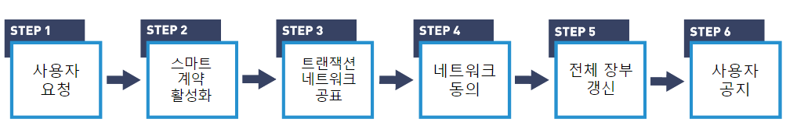

# [블록체인] 합의 알고리즘 (Consensus Algorithm)

오늘은 블록체인을 구성하는 중요한 요인들 중 하나인 합의 알고리즘에 대해서 정리해보고자 한다. 먼저 블록체인 트랜잭션이 어떤 순서로 진행되는 지 확인한 다음, 합의 알고리즘의 개념과 대표적인 종류들에 대해서 알아보고자 한다.

## 블록체인 트랜잭션

우선 블록체인의 종류와 상관없이, 일반적으로 다음과 같은 순서로 트랜잭션이 진행된다.

출처 : [[Blockchain Transactions](https://courses.edx.org/assets/courseware/v1/e0bd310e9f8bf0643b384efdd1919bb7/asset-v1:LinuxFoundationX+LFS170x+1T2023+type@asset+block/Chapter_3_Graphics-14.png)]

1. **사용자 요청**
   - 사용자가 블록체인에 저장되어야 할 작업을 수행한다.
2. **스마트 계약 활성화**
   - 작업은 스마트 계약 혹은 체인내 코드를 활성화시켜, 블록체인 내부에서 코드가 실행된다. 
   - 트랜잭션이란 코드의 실행결과로, 장부에 기입하고자 하는 내용이다.
3. **트랜잭션 네트워크 공표**
   - 특정 블록체인에서 실행 중인 프로토콜을 사용하는 블록체인 운영자들은 해당 트랜잭션을 블록체인 네트워크 전체에 퍼트린다.
4. **네트워크 동의**
   - 블록 생성자들은 트랜잭션들을 모아서, 새로운 블록을 생성한다.
   - 새로 생성된 블록을 추가할 것에 대해 **네트워크 내 합의**가 이루어진다.
5. **전체 장부 갱신**
   - 블록 운영자들은 새로 생성된 블록을 네트워크에 퍼트려 전체 노드들에 반영한다.
6. **사용자 공지**
   - 사용자들은 블록체인 생성에서부터의 이벤트를 공지받는다.

트랜잭션 과정에서 볼 수 있듯이, 블록체인에 새로운 블록(장부)가 추가되기 위해서는 누군가는 트랜잭션을 수집하여, 블록으로 생성해야 한다. 또한, 해당 블록이 블록체인 내에서 발생한 정상적인 트랜잭션들만 모은 올바른 장부인지 정확한 검증이 있어야 전체 블록에 신뢰를 가질 수 있을 것이다. 

블록체인에서는 이러한 과정을 사전에 정의된 합의 알고리즘을 통해 수행한다.

## 합의 알고리즘

합의 알고리즘이란, 어떻게 블록 생성자를 선출하고, 어떻게 블록을 검증하고, 얼만큼 유인을 줄 것인지에 대해 네트워크 사용자들이 동의한 규약이다. 분산된 노드 간에 동의를 형성하여 트랜잭션의 유효성을 검증하고 블록을 추가하는 방식을 통해 전체 네트워크에서 일관된 상태를 유지한다.

### 대표 합의 알고리즘

#### PoW(Proof of Work)

PoW은 탈중앙화된 합의 매커니즘으로 네트워크 구성원들에게 수학 문제를 풀도록하여 블록을 검증한다. 이때 문제는 풀기는 어렵지만, 정답을 검증하는 것은 알기 쉽게 설계된다. PoW 알고리즘은 다음과 같은 순서로 블록을 생성한다.

1. 네트워크 참여자 중 블록 생성자가 되고 싶은 사람은 누구나 블록 생성자가 될 수 있으며, 이들을 채굴자(miner)라고 부른다.
2. 하나의 블록이 가득찰 정도로 트랜잭션이 쌓인다면, 채굴자들은 블록을 생성하기 위해 주어진 문제를 푼다.
3. 정답을 알아낸 채굴자는 네트워크 전체에 자신의 값을 공유하고, 네트워크의 절반 이상에서 해당 값이 정답으로 인정된다면 정답으로 인정된다.
4. 최초로 정답을 찾은 채굴자는 블록을 생성하여 네트워크에 공유하고, 정해진 incentive를 얻게 된다.

여기서 나오는 문제는 주로 다음과 같이 해시 문제를 풀도록 되어있다.

예를 들어, 한 블록을 가득채울만큼 트랜잭션이 쌓였다면, 채굴자(miner)들은 블록을 추가하기 위해서는 다음과 같은 문제를 풀어야 한다.

`예시 문제 : 트랜잭션들과 같이 해싱을 했을 때, 해싱 결과가 연속하는 0 3개로 시작하는 값이 되게끔하는 임의의 수(nonce)를 구하시오"`

정답을 구하기 위해서는 임의의 값들을 여러 번 반복해서 직접 넣어보는 수 밖에 없기 때문에, 값을 구하는데에는 상당한 시간과 자원이 필요하다. 하지만 누군가 정답을 찾아서 네트워크에 공유했을 때에는, 다른 네트워크 구성원들은 해당 값을 자신이 가지고 있는 트랜잭션들과 해싱을 했을 때 연속된 0 3개가 나오는지만 확인하면 되기에, 정답을 쉽게 검증할 수 있다.

:memo: 참고 : [[PoW 영상 설명](https://learning.edx.org/course/course-v1:LinuxFoundationX+LFS170x+1T2023/block-v1:LinuxFoundationX+LFS170x+1T2023+type@sequential+block@b2327e4750bc4beda267bf03132fbe6c/block-v1:LinuxFoundationX+LFS170x+1T2023+type@vertical+block@90fdfcf7c8e946bdbcaf131b9772ccae)]

이 방법을 통한다면, 블록 생성자가 **임의로 트랜잭션 결과를 조작해서 저장하는 것을 막을 수 있다**. 문제 풀이에는 자신이 기록하고자 하는 트랜잭션의 이력들과 같이 사용되기에, 임의로 조작한 트랜잭션을 가지고 찾은 정답은 다른 노드들에선 정답으로 인정받지 못 하기 때문이다. 

물론, 조작의 가능성이 완전이 없는 것은 아니다. 1. 본래의 트랜잭션과 조작된 트랜잭션 둘 다에서 공통되게 정답으로 인정받는 정답을 찾거나 2. 네트워크 노드의 절반 이상을 장악한다면 조작된 트랜잭션을 블록으로 생성하는 것이 가능하다. 하지만 전자는 여러 채굴자들이 경쟁하는 상황에서 남들보다 훨씬 복작한 연산을 남들보다 빨리 찾는 것은 현실적으로 매우 어려우며, 후자는 한 세력에게 절반 이상이 장악된 블록체인은 사회적으로 가치가 없어지기에 시도할 이유가 없어진다. 

이처럼 PoW는 블록의 조작에 자원 소모가 지나치게 많아지도록하는 방식을 통해서, 블록을 검증한다.

이러한 방식의 PoW는 크게 다음 3가지 단점을 가지고 있다.

우선, 느리다. PoW 방식은 채굴자들 간 공정한 경쟁과 보안성을 유지하기 위해 일정 수준 이상 난이도의 문제를 해결하도록 한다. (만약 문제가 너무 쉽다면, )

Proof of Work 단점

- 느리다 (processing capability)
  - Proof of Work is capable of processing anywhere between 10 and 20 transactions per second worldwide.
  - Visa's payment processing network which can scale up to over 70,000 transactions per second.

- 전기를 많이 쓴다

- 중앙화
  - 전기가 싼 지역이나, 좋은 기기를 가진 그룹에게 집중
  - folks are competing with very various specialized pieces of equipment, specialized hardware, specialized mining rigs, in order to mine most efficiently. And this can be done most efficiently in large data centers where electricity is cheap.

#### PoS

#### PoA

Yes, both BFT (Byzantine Fault Tolerance) and IBFT (Improved Byzantine Fault Tolerance) are related to consensus algorithms, particularly in the context of distributed systems and blockchain networks.

Consensus algorithms are essential components of distributed systems that ensure all nodes or participants in the network agree on the state of the system. Byzantine Fault Tolerance refers to the system's ability to reach consensus even in the presence of malicious or faulty nodes.

1. **BFT (Byzantine Fault Tolerance):**

   - BFT is a category of consensus algorithms designed to tolerate Byzantine faults, which include arbitrary or malicious behavior by a subset of nodes in the network.
   - Examples of BFT algorithms include Practical Byzantine Fault Tolerance (PBFT), HoneyBadgerBFT, and Tendermint.

2. **IBFT (Improved Byzantine Fault Tolerance):**

   - IBFT is a specific instance or enhancement of BFT, introducing optimizations and improvements to the classic BFT algorithms.
   - IBFT is often used in the context of blockchain networks to achieve consensus among nodes, ensuring the agreement on the order and validity of transactions.

   

**BFT (Byzantine Fault Tolerance) and IBFT (Improved Byzantine Fault Tolerance):**

- **Relation to PoW/PoS:** BFT and IBFT are consensus algorithms specifically designed to address Byzantine faults, where nodes in a network may act maliciously or fail arbitrarily. They provide formal guarantees of consensus even in the presence of such faults.
- **Use Cases:** BFT and IBFT are often employed in permissioned blockchain networks where the participants are known and trusted. Examples include Practical Byzantine Fault Tolerance (PBFT), HoneyBadgerBFT, and some variations of Tendermint.
- **Security:** BFT and IBFT provide strong security guarantees against Byzantine faults but may have different trade-offs in terms of scalability and efficiency compared to PoW or PoS.

BFT, Pow : 다음 글

