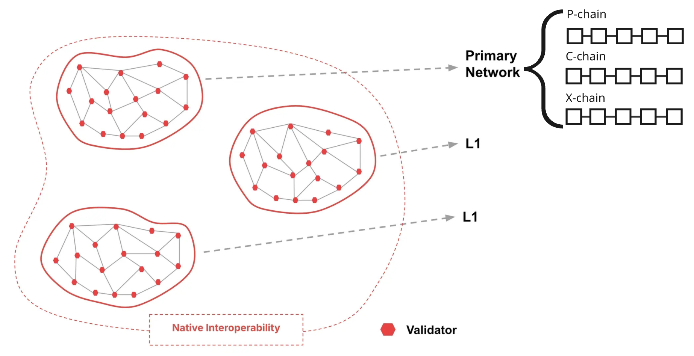
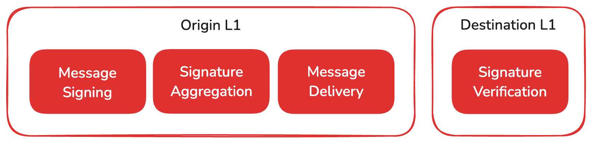
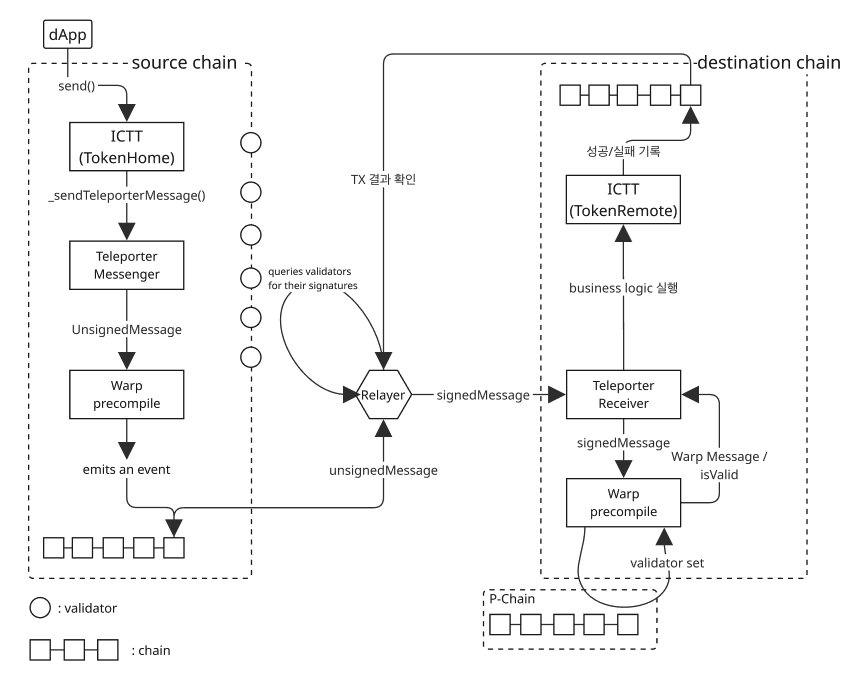

# Avalanche 개요 및 상호운용성


Avalanche의 기본적인 개념과 멀티 체인 환경에서의 상호 운용성에 대해 알아보고자 한다.


##Avalanche 네트워크 구조



Avalanche는 크게 **Primary Network**와 여러 개의 **L1 체인(Subnet)**으로 구성되어 있다. Primary Network는 Avalanche의 기본 뼈대이며, 세 개의 체인(P-Chain, C-Chain, X-Chain)으로 이루어져 있다.

### Primary Network

#### P-Chain: 플랫폼 체인

P-Chain은 Avalanche에서 가장 핵심적인 체인이다. 이 체인에는 **모든 밸리데이터(검증자)**가 등록되고 관리된다. Avalanche 메인넷과 각 서브넷에서 활동하는 밸리데이터들은 반드시 P-Chain에 등록되어 있어야 한다. 쉽게 말하면, **전화번호부** 같은 역할을 한다. 새로운 밸리데이터 등록, 새로운 L1 네트워크 생성, 스테이킹 같은 작업도 모두 이곳에서 처리된다.

#### C-Chain: 컨트랙트 체인

C-Chain은 EVM(Ethereum Virtual Machine) 기반으로 만들어진 체인이다. Avalanche에서 **스마트 컨트랙트를 배포하고 실행하는 역할**을 담당한다. 이더리움 개발자에게 익숙한 환경을 제공하기 때문에 dApp 개발에 자주 활용된다.

#### X-Chain: 교환 체인

X-Chain은 Avalanche 고유 토큰의 **생성과 전송**을 담당하는 체인이다. 예를 들어 AVAX와 같은 토큰을 효율적으로 전송할 수 있도록 설계되어 있다.


### Subnet 기반 L1 체인

Avalanche는 Primary Network 외에도 사용자가 직접 만들 수 있는 **별도의 L1 체인(Subnet)**을 지원한다. 이 체인들은 **VM 종류나 합의 알고리즘에 제한 없이** 자유롭게 설계할 수 있다. 예를 들어, EVM이나 SVM 같은 VM을 선택할 수 있으며, PoA(Proof of Authority) 또는 PoS(Proof of Stake) 방식 중 하나를 사용할 수 있다.

다만 이러한 L1 체인을 검증하는 밸리데이터들도 **P-Chain과 반드시 동기화되어 있어야** 한다. 그래야 Avalanche 전체 네트워크의 일관성과 보안성이 유지된다.


## 상호운용성


Avalanche는 Primary Network와 다양한 L1 체인(서브넷) 간의 메시징을 **네이티브 상호운용성(Native Interoperability)**으로 지원하여 체인 간 데이터 및 자산 이동을 원활하게 구현한다. 이 과정은 중앙 집중식 메시지 허브 없이, 각 L1 체인들이 직접 메시지를 주고받는 구조로 되어 있어 병목 현상이 없고 기록도 남지 않는다.


### 주요 개념

| 용어                                       | 설명                                                         | 구분     | 범주 |
| :----------------------------------------- | :----------------------------------------------------------- | :------- | :--- |
| Avalanche Warp Messaging (AWM)             | L1 간 메시지를 서명 및 검증하는 저수준(low-level) 네이티브 메시징 프로토콜 | protocol | 범용 |
| Avalanche Interchain Messaging (ICM)       | AWM을 기반으로 하여, 개발자가 사용할 수 있는 상위 레벨의 메시징 프로토콜 | protocol | 범용 |
| Warp Precompile                            | EVM에서 AWM을 사용하기 위해 precompile된 smart contract (`0x0200..05`) | contract | EVM  |
| Relayer                                    | off-chain에서 Warp message를 읽어 목적지 L1에 전달           | 노드     | 범용 |
| Teleporter                                 | ICM contracts를 위한 cross-L1 messaging 인터페이스 제공      | contract | EVM  |
| ICM Contracts                              | ICM 을 기반으로 구축된 EVM 호환 smart contract들의 집합      | contract | EVM  |
| Avalanche Interchain Token Transfer (ICTT) | ICM을 활용해 L1 간 토큰을 전송하는 smart contract들의 집합   | contract | EVM  |


### ICM Process



1.. **원본 L1에서 메시지 생성 및 서명**

 **원본 L1 체인**에서 메시지를 생성하고, 그 안에는 바이트 배열 형식의 `payload`가 포함된다. 이 메시지는 해당 L1의 밸리데이터들이 BLS 키쌍을 이용해 **개별적으로 서명**하게 된다.

2.. **서명 집계 (Aggregation)**

BLS 방식으로 **다수의 서명을 하나의 멀티서명으로 집계**한다. 

:bulb: BLS(Boneh–Lynn–Shacham) 서명 

  : 여러 서명을 하나의 짧은 멀티서명으로 집계할 수 있어, 다중 서명의 검증을 효율적으로 수행할 수 있는 암호화 서명 방식

3.. **메시지 전달**

서명이 완료된 메시지는 **중앙 프로토콜 없이 대상 L1 체인으로 직접 전달**된다. 이 구조는 네트워크의 병목을 유발하지 않으며, 별도의 전달 기록도 저장되지 않는다.

4.. **대상 L1에서 메시지 검증**

마지막으로 **대상 L1 체인**에서는 받은 메시지에 대해 서명 검증을 수행한다. BLS 공개키를 기반으로 서명을 검증하며, 각 체인은 자신만의 기준에 따라 **요구하는 validator의 지분(stake) 비율**을 설정할 수 있다. 예를 들어, C-Chain에서는 전체 스테이크의 90% 이상이 서명에 참여했는지를 확인한 뒤 메시지를 처리한다.


### :bulb: ICM Message 구조

```
+---------------+----------+--------------------------+
|      codecID  :  uint16  |                 2 bytes  |
+---------------+----------+--------------------------+
|     networkID :  uint32  |                 4 bytes  |
+---------------+----------+--------------------------+
| sourceChainId : [32]byte |                32 bytes  |
+---------------+----------+--------------------------+
|       payload :   []byte |       4 + size(payload)  |
+---------------+----------+--------------------------+
                           |  42 + size(payload) bytes|
                           +--------------------------+
```

- **codecID**: payload 직렬화에 사용되는 코덱 버전으로, `0x0000`으로 고정됨

- **networkID**: Avalanche 네트워크(Mainnet/Testnet 등)의 고유 ID로, BLS 서명의 재사용 공격을 방지함

- **sourceChainID**: P-체인에서 해당 블록체인을 생성한 트랜잭션의 해시로, 각 블록체인을 고유하게 식별하며 해당 체인만 자신의 ID로 서명 가능

- **payload**: 메시지 내용을 담은 임의의 바이트 배열이며, VM이 자체적으로 정의한 메시지 형식을 포함함


### Cross-chain Messaging Flow

다음은 EVM 환경의 L1 체인에서 ICTT 컨트랙트를 사용하여 다른 체인으로 토큰을 전송할 때의 흐름도이다.

Home 컨트랙트에서 remote 컨트랙트로 전송할 때를 가정하며, 이때는 토큰의 전송을 Home contract에서 토큰을 lock하고 remote 컨트랙트에서 mint하는 방식으로 구현된다.

#### 주요 용어

| 용어              | 설명                                                         |
| ----------------- | ------------------------------------------------------------ |
| Home contract     | ICTT 컨트랙트는 하나의 home 컨트랙트를 가지며, 외부로 전송하고자 하는 하나의 자산을 관리 |
| Remote contract   | ICTT 컨트랙트는 하나 이상의 remote 컨트랙트들을 가지며, home과 다른 L1에서 존재 |
| source chain      | 토큰의 전송이 시작되는 L1 chain                              |
| destination chain | 토큰의 전송을 받는 L1 chain                                  |

#### 프로세스



1. dApp에서 ICTT Home 컨트랙트에 토큰의 전송을 요청한다
2. ICTT Home에서는 전송하고자하는 토큰의 양 만큼 lock 시킨 후, Remote 컨트랙트에서의 mint 요청을 Message로 담아 Teleporter 컨트랙트에 전달한다.
3. 해당 Message는 Warp 컨트랙트가 event로 담아 블록에 저장한다
4. Relayer는 블록에서 event를 조회하며, validator들에게 서명을 요청한다
5. 서명들은 수집한 후에는 BLS 서명으로 하나의 멀티서명으로 집계한 다음 목적지 L1에게 전달한다.
6. 목적지 체인에서는 서명된 메시지에 대해 검증한 다음 메시지를 Remote 컨트랙트에 전달한다.
7. Remote 컨트랙트는 정해진 수량만큼 mint한다.
8. 수행 결과는 목적지 L1의 블록체인에 기록되며, Relayer는 성공, 실패 여부를 확인한다.
9. 만약 실패했을 경우, Source L1에 실패 여부를 전달하여 사전에 세팅한 실패 처리 로직을 실행하게 한다.[^1]

[^1]: 주의. 대상 체인에서 메시지 실행이 실패하더라도 메시지는 대상 체인에 **전달된 것으로 간주된다**. 

