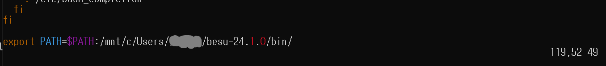

# Hyperledger Besu 설치하기 (Window WSL)


저번 포스트에서 알아본 Hyperledger Besu를 실제로 설치해서 사용해보고자 한다.

환경은 **Window의 WSL**를 통한 Linux이다.


## 사전 세팅


### Ubuntu 설치

Window가 Linux용 Windows 하위 시스템(WSL)을 지원하게 되면서 윈도우 상에서 우분투를 설치하고 사용할 수 있다. 

Windows 설정에서  WSL을 활성화한 후, 마이크로소프트 스토어(Microsoft Store)에서 Ubuntu를 다운로드 한다.

:link: Windows에서 WSL(Linux 개발 환경) 구축하기, https://tech.cloud.nongshim.co.kr/2023/11/14/windows%EC%97%90%EC%84%9C-wsllinux-%EA%B0%9C%EB%B0%9C-%ED%99%98%EA%B2%BD-%EA%B5%AC%EC%B6%95%ED%95%98%EA%B8%B0/


### java 설치

ubuntu에 버전 17이상의 java가 설치되어 있어야 한다. 

Linux에 java가 설치되어 있지 않다면, 다음 명령으로 java를 설치할 수 있다.

```sh
sudo apt install openjdk-17-jdk-headless
```

:link: How to install OpenJDK 17 on Ubuntu, https://keepgrowing.in/java/how-to-install-openjdk-17-on-ubuntu/


설치가 되었다면, `java --version`과 같은 명령어로 설치 여부를 확인한다.


## Hypeberledger Besu 설치


### Hypeberledger Besu 설치

아래의 Hyperledger Besu의 배포 버전을 관리하는 깃헙에서 Besu zip 파일을 다운 받는다. 이때는 window에서 다운을 받고 폴더 위치는 아무 곳이나 상관 없다.

:link:https://github.com/hyperledger/besu/releases


그 다음, 다운 받은 폴더에서 zip 파일의 압축을 해제한다.


### Hypeberledger Besu 설치 확인

ubuntu에서 해당 파일로 이동한 뒤 설치 여부를 확인해 본다. ubuntu 환경에서 아래 명령어들을 실행한다.

```sh
cd /mnt/c/Users/???/besu-24.1.0
./bin/besu --help
```

(`???`에는 besu를 설치한 경로가 들어가며, `besu-24.1.0` 폴더명은 실제 다운받은 besu 버전에 따라서 달라질 수 있다)


실행 결과가 다음과 같이 나온다면 정상적으로 설치된 것이다.


### :bulb: besu 명령어 시스템 환경 변수로 등록하기

설치는 완료되었지만, 현재 환경에서는 besu를 실행할 때마다 besu의 경로로 이동하거나, 풀 경로를 함께 입력해야하는 번거로움이 있다. 이에, besu의 경로를 시스템 환경 변수로 등록하여, 어느 위치에서든지 besu 명령어만으로 실행할 수 있도록 설정한다.


1. `.bashrc` 파일을 open한다.

```sh
vim ~/.bashrc
```

2. i로 수정모드 시작
3. 파일에 아래와 구문을 추가하여, 경로를 환경변수로 등록 

```sh
export PATH=$PATH:/mnt/c/Users/???/besu-24.1.0/bin
```



4. `esc` 후 `:wq`로 수정 사항 저장

5. `source ~/.bashrc` 명령어로 수정사항 적용


등록 후에는, 어떤 위치에서든지 `besu` 명령어로 실행이 가능하다


## 참고 자료

- edX,Hyperledger Besu Essentials: Creating a Private Blockchain Network,https://learning.edx.org/course/course-v1:LinuxFoundationX+LFS176x+3T2023/home

- Hypberledger Besu,Install Besu ,https://besu.hyperledger.org/private-networks/get-started/install
