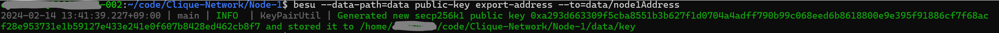
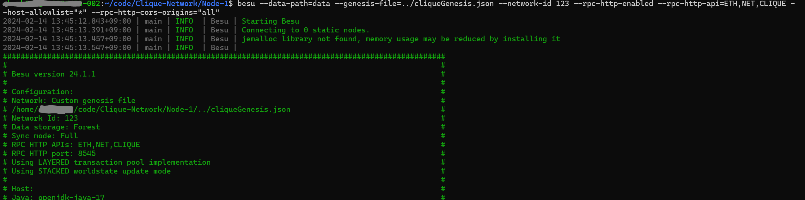
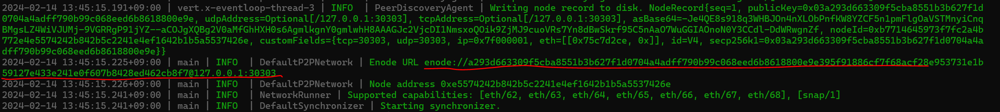
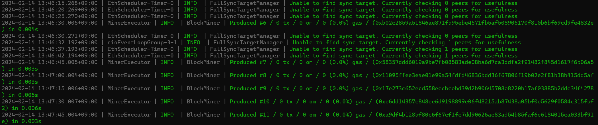
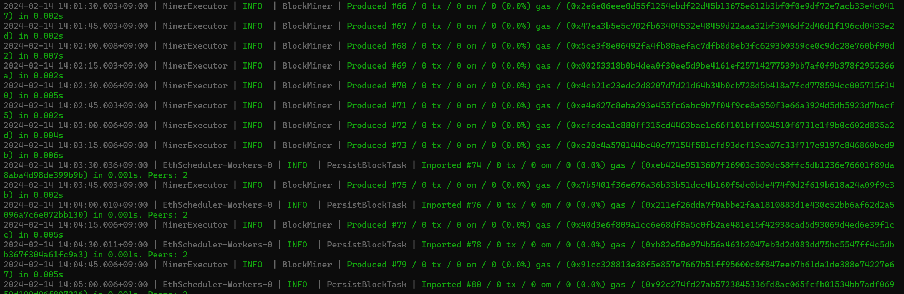

# Hyperledge Besu로 Private Network 생성하기 (feat Clique)


Hyperledger Besu로 Cliqeu PoA network를 생성하고자 한다.

3개 노드로 네트워크를 구성할 것이며, 초기에는 하나의 signer(블록 생성자)로 시작하였다가 중간에 signer를 추가/삭제 해보고자 한다.


## Clique Network 생성하기


### 1. 노드별 폴더 생성하기

총 3개의 노드를 운영하기 위해, 각각의 노드 정보를 저장할 폴더를 생성해둘 것이다. 다음과 같은 구조로 폴더를 생성할 것이다.

```
Clique-Network/
├── Node-1
│   ├── data
├── Node-2
│   ├── data
└── Node-3
    ├── data
```


저번에 설치한 Ubuntu Terminal 내에서 폴더를 생성하고자 하는 임의의 위치로 간 다음 아래 명령어를 통해 폴더들을 구조에 맞게 생성한다.

```sh
mkdir -p code/Clique-Network
cd code/Clique-Network
mkdir Node-1 Node-2 Node-3

for dir in ./*
do cd ${dir}; mkdir data; cd ..;
done
```


### 2. Node-1의 주소 얻기

Clique Network에서 초기 signer 역할을 수행할 Node-1의 주소 정보가 필요하다. Node-1 폴더에서 다음 명령어를 수행한다.

```sh
besu --data-path=data public-key export-address --to=data/node1Address
```

`--data-path` 옵션은 노드의 데이터 저장 경로를 명시한다. 

`public-key export-address --to` 커맨드는 node의 계정 주소 (account address)를 지정한 경로에 저장한다.




수행하면 위와 같이 문구가 나오는데, log로 표시되는 것은 public key에 관한 정보이며, 현재 필요한 Node-1의 계정 주소는 경로로 지정한 `data/node1Address` 파일에 들어가서 정보를 저장해둔다.


:bulb: **public key vs address**

- **공개 키**: 공개 키는 개인 키에서 유도된 암호화 키로, 공개적으로 알려져 서명을 확인하는 데 사용된다. 

- **주소** :  주소는 공개 키에서 유도된 문자열로, 블록체인 네트워크에서 거래 수신자를 식별하는 데 사용된다. (공개 키를 재생성하는 데 사용할 수는 없다)

즉, 주소는 대응되는 해당 공개 키로 거래를 보낼 수 있지만 공개 키 자체는 아니다.


### 3. Genesis File 생성하기

블록체인 네트워크의 규칙을 정의하기 위해, root 폴더 (`Clique-Network`)에 `cliqueGenesis.json` 파일을 생성한다.

`cliqueGenesis.json` 파일은 샘플로 다음과 같이 정의하였다.

```json
{
"config":{
    "chainId":1981,
    "constantinoplefixblock": 0,
    "clique":{
        "blockperiodseconds":15,
        "epochlength":30000
	}
},
"coinbase":"0x0000000000000000000000000000000000000000",
"difficulty":"0x1",
"extraData":"0x0000000000000000000000000000000000000000000000000000000000000000<Node1Address>0000000000000000000000000000000000000000000000000000000000000000000000000000000000000000000000000000000000000000000000000000000000",
"gasLimit":"0xa00000",
"mixHash":"0x0000000000000000000000000000000000000000000000000000000000000000",
"nonce":"0x0",
"timestamp":"0x5c51a607",
"alloc":
{
    "fe3b557e8fb62b89f4916b721be55ceb828dbd73":
    {
        "privateKey": "8f2a55949038a9610f50fb23b5883af3b4ecb3c3bb792cbcefbd1542c692be63",
        "comment":
        "private key and this comment are ignored. In a real chain, the private key should NOT be stored",
        "balance": "0xad78ebc5ac6200000"
    },
    "627306090abaB3A6e1400e9345bC60c78a8BEf57":
    {
        "privateKey": "c87509a1c067bbde78beb793e6fa76530b6382a4c0241e5e4a9ec0a0f44dc0d3",
        "comment":
        "private key and this comment are ignored. In a real chain, the private key should NOT be stored",
        "balance": "90000000000000000000000"
    },
    "f17f52151EbEF6C7334FAD080c5704D77216b732":
    {
        "privateKey": "ae6ae8e5ccbfb04590405997ee2d52d2b330726137b875053c36d94e974d162f",
        "comment":
        "private key and this comment are ignored. In a real chain, the private key should NOT be stored",
        "balance": "90000000000000000000000"
    }
}
}
```

`extraData` field 영역에서 `<Node1Address>`에는 방금 전 저장해둔 Node-1의 계정 주소를 입력한다. `extraData` field에는 초기 signer에 대한 정보가 들어간다. (:link: [extra data in Clique](https://besu.hyperledger.org/private-networks/how-to/configure/consensus/clique#extra-data))


:bulb:**주의**

이더리움 Mainnet이나 어떠한 공개 네트워크를 구성할 때에는 `alloc` 필드에 계정들을 사용하면 안 된다. 개인 키가 노출되어 계정이 안전하지 않는다.


### 4. Bootnode 실행하기

네트워크에서 Bootnode로 사용될 Node-1를 우선 실행시킨다. 부트 노드는 네트워크에서 네트워크에 참여하는 노드들을 찾는데 사용된다.

Node-1 폴더에서 아래의 명령어를 실행시킨다.

```sh
besu --data-path=data --genesis-file=../cliqueGenesis.json --network-id 123 --rpc-http-enabled --rpc-http-api=ETH,NET,CLIQUE --host-allowlist="*" --rpc-http-cors-origins="all"
```


명령어 실행 시, 아래와 같이 로그가 나오는데, 그 중 bootnode를 식별하는데 사용될 enode url 정보를 저장해둔다.






### 5. Node-2, Node-3 실행

이제는 일반 네트워크 참여 노드로 Node-2와 Node-3를 실행시킨다.

Node-2, Node-3 폴더로 이동한 다음 각각 아래의 명령어를 실행시킨다.

```sh
besu --data-path=data --genesis-file=../cliqueGenesis.json --bootnodes=<Node-1 Enode URL> --network-id 123 --p2p-port=30304 --rpc-http-enabled --rpc-http-api=ETH,NET,CLIQUE --host-allowlist="*" --rpc-http-cors-origins="all" --rpc-http-port=8546
```

노드 실행 명령어를 수행할 때에는 `<Node-1 Enode URL>` 부분에  Node-1 실행하고 나온 Enode URL(enode://로 시작)을 입력한다. 또한 Node-2 폴더와 Node-3 폴더 실행할 땐 `p2p-port `와 `rpc-http-port`에 서로 다른 값을 설정해서 수행한다. (예를 들어, Node-2의 rpc-http port를 8546으로 했으면,Node-3에서는 8547 사용 )


### 실행 결과 (Node-1 실행 terminal 로그)



네트워크 참여 노드들을 모두 실행시키면 위와 같이 동기화 타겟을 모두 찾고, block을 생성하게 된다.

우선, Node-1만 실행했을 때에는, 동기화 타겟이 미존재하여 0개의 peer가 존재한다. (*Unable to find sync target. Currently checking 0 peers for usefulness*)

Node-2를 실행했을 때에는 1개의 peer을 찾았으며, Node-2까지 실행한 후에는 더 이상 동기화 대상을 찾지 못 한다는 로그를 반환하지 않는다.

또한, signer인 Node-1은 지속적으로 block을 생성하게 된다. 트랜잭션이 미존재했더라도 (*0 tx*), Node-1은 빈 블록(empty block)을 지속적으로 생성한다. 빈 블록은 블록 헤더와 메타데이터만 포함하고 트랜잭션 데이터는 포함하지 않는데, 트랜잭션이 없더라도 지속적으로 블록을 생성함으로써, 네트워크의 안정성과 무결성을 유지하고 사용자들에게 네트워크의 예측 가능성을 준다.


:bulb: 빈 블록 스킵하기

트랜잭션이 없을 경우, 블록을 생성하지 않게 하기 위해서는 genesis 파일에서 설정할 수 있다.

```json
{
  "config": {
    "londonBlock": 0,
    "clique": {
      "blockperiodseconds": 10,
      "epochlength": 30000,
      "createemptyblocks": false
    }
  },
...
}
```


## Signer 


### Signer 개념

Clique 네트워크에서는 인정된 **signer**들에 의해서만 새로운 블록을 생성될 수 있다. 초기 signer 집단은 genesis block에서 설정된다. 이후, signer들은 투표를 통해서 새롭게 인정되거나, 탈락될 수 있다.


:bulb: **validator** vs **signer**

- **validator** : 좁은 의미로는 트랜잭션을 검증하고, 신규 블록을 생성하는 노드를 뜻하지만, 넓은 의미로 네트워크 참여 노드를 의미하기도 한다.
- **signer** : 구체적으로 자신의 개인 키를 통해서 제안된 블록을 서명하는 노드를 가르킨다. Clique 네트워크에서 각 블록은 validator 노드 중 하나에 의해 제안되어야 하며, 유효하고 블록체인에 추가되기 위해서는 충분한 수의 다른 validator 노드에 의해 서명되어야 한다.

실전에서는, 두 가지 용어는 상호교환적으로 사용된다. 현재 글에서는 블록을 생성하는 노드는 signer로 한정하여 명시한다.


### 네트워크에 Signer 추가하기

signer 추가는 다음과 같은 요청을 보냄으로써 가능하다

```sh
curl -X POST --data '{"jsonrpc":"2.0","method":"clique_propose","params":["0xd6a98d4f51e8072ef3c994fcd619e28c6072c7cf", true], "id":1}' <JSON-RPC-endpoint:port>
```

- `"jsonrpc": "2.0"`: 사용되는 JSON-RPC의 버전을 명시한다.
- `"method": "clique_propose"`: 실행시킬  JSON-RPC 메소드를 명시한다. `clique_propose`는 signer를 추가/삭제할 때 사용된다.
- `"params": ["0xd6a98d4f51e8072ef3c994fcd619e28c6072c7cf", true]` :  `clique_propose` 메소드에 전달될 파라미터를 설정한다. 
  - `0x6451a1b837a520e2bf7c868db7f88fccbedecee9` : signer로 추가하고자 하는 노드의 계정 주소를 작성한다. (Node-2 주소)
  - true : 해당 노드를 signer로 추가하고자 할 때는 true, 삭제하고자 한다면 false를 입력한다
- `"id": 1`: JSON-RPC 요청의 유일한 구분자를 명시한다. 요청과 응답을 매칭할 때 사용된다.
- `<JSON-RPC-endpoint:port>` : 요청을 보내고자 하는 url:port 정보를 입력한다 (ex. `localhost:8545`). 현재의 signer에게 요청을 보내므로 Node-1의 RPC Http 포트인 8545로 작성하였다. 


성공한 후에는 `clique_getSigners` 메소드로 네트워크의 signer들을 반환 받을 수 있다.

```sh
curl -X POST --data '{"jsonrpc":"2.0","method":"clique_getSigners","params":["latest"], "id":1}' <JSON-RPC-endpoint:port>
```


### 네트워크에 Signer 삭제하기

signer 삭제는 추가에 사용했던 `clique_propose` 메소드에 파라미터 값을 false로 보냄으로써 가능하다

```sh
curl -X POST --data '{"jsonrpc":"2.0","method":"clique_propose","params":["0xd6a98d4f51e8072ef3c994fcd619e28c6072c7cf", false], "id":2}' <JSON-RPC-endpoint:port>
```


pending 투표삭제

https://besu.hyperledger.org/private-networks/how-to/configure/consensus/clique

```
The clique_discard request in the JSON-RPC API for Besu's Clique consensus algorithm is used to discard a pending validator vote that has not yet been included in a block. This request allows a node to cancel its intention to vote for or against a specific action, such as adding or removing a validator, before the vote is finalized and included in the blockchain.

When a node broadcasts a clique_discard request, it indicates to the network that it no longer wishes to proceed with the previously proposed vote. This action can be useful in scenarios where a node mistakenly initiates a vote or changes its mind about the proposed action before the vote is sealed in a block.

The clique_discard request typically includes parameters to identify the specific vote that the node wishes to discard, such as the target address or action being voted on.

Overall, the clique_discard request provides flexibility and control to nodes participating in the Clique consensus algorithm, allowing them to manage their pending votes and adjust their participation in the consensus process as needed.
```


### :bulb: 주의점

요청을 보낼 때에는 다음 2가지 사항에 대해서 주의하면서 보내야, 원하는 응답을 얻을 수 있다.

첫번째로, **signer의 추가/삭제에 대한 투표는 signer들의 과반 (2/3 이상)의 찬성이 있을 때 가결된다.** 예를 들어, Node-1만 signer였을 때에 signer를 추가하기 위해서는 Node-1에만 요청을 보냈으면 되었다. 하지만 Node-1과 Node-2가 signer일 때, signer 추가하기 위해서는 signer들의 과반, 즉 Node-1과 Node-2에 모두 요청을 보내야 signer의 추가가 반영된다. (이는 signer의 삭제에도 똑같이 적용된다.)

두번째로, **요청을 보낼 때에는 `id` 값을 변경해서 보내야 한다**. `id` 필드는 요청의 유일한 구분자이기 때문에, 이전에 보낸 요청과 같은 id로 요청을 새로 보낸다면, 요청이 반영되지 않는다.


### Signer 추가 후 결과(Node-1 실행 terminal 로그)



Signer을 추가하기 전에는 유일한 signer였던 Node-1에서는 블록이 생성되고 있었다. (*MinerExecutor | INFO  | BlockMiner | Produced*)

하지만 Node-2를 signer로 추가한 74번 블록부터는 Node-2와 번걸아가면서 블록을 생성하게 된다.


## 참고자료

- edX,Hyperledger Besu Essentials: Creating a Private Blockchain Network,https://learning.edx.org/course/course-v1:LinuxFoundationX+LFS176x+3T2023/home

- Hypberledger Besu,Install Besu ,https://besu.hyperledger.org/private-networks/get-started/install

- https://geth.ethereum.org/docs/tools/clef/clique-signing
