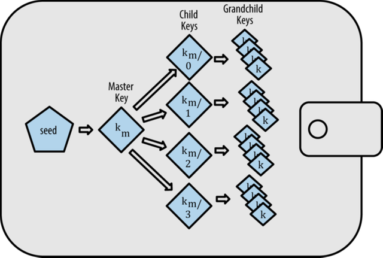

# [마스터링 이더리움] 5장. 지갑


본 포스트는 서적 *마스터링 이더리움*의 5장 *지갑* 파트를 정리한 포스트입니다. 


지갑이란, 넓은 의미로는 이더리움의 주요 사용자 인터페이스를 제공하는 소프트웨어 애플리케이션을 의미한다. 개발자의 시각으로 좁혀보면, 사용자의 키를 보관하고 관리하기 위해 사용되는 시스템을 의미하며, 모든 지갑은 키 관리 구성요소를 가지고 있다.

지갑에 대한 일반적인 오해는 지갑이 이더 혹은 토큰을 직접 보유한다는 것이다. 하지만 실제로 지갑은 단지 키만 보유하며, 이더와 토큰은 이더리움 블록체인에 기록된다. 이러한 맥락에서 이더리움 지갑은 개인키와 공개키 쌍을 포함하는 키체인과 같다.

이번 장에서는 개인키를 담는 공간이자 키를 관리하는 시스템으로서 지갑을 살펴볼 것이다.


## 지갑 기술 개요


지갑을 설계 할 때 중요한 고려사항 중 하나로는 편의성과 프라이버시 사이의 균형을 맞추는 것이다. 극단적인 편의성을 추구하면, 하나의 개인키와 주소를 가지고 이를 재사용해서 모든 것을 처리하는 방안이 있을 것이다. 하지만 이는 프라이버시에 대한 악몽이 생길 가능성이 있다. 이와 반대로, 극단적인 프라이버시를 추구하면, 모든 트랜잭션에 새로운 키를 사용하는 방안이 된다. 하지만 이는 키와 주소를 관리하기가 몹시 어려울 것이다. 


## 지갑 유형

지갑에는 두 가지 유형이 있다.


### 비결정적 지갑

첫 번째는 **비결정적 지갑**이다. 비결정적 지갑은 **각기 다른 무작위 수로부터 각각의 키를 무작위적으로 추출**하는 방식의 지갑이다. 이더리움 주소의 재사용을 피하는 것이 좋은 지침으로 간주되기에, 자금을 받을 때마다 새로운 주소(새로운 개인키가 필요)를 사용하는 것이 권장된다. 비결정적 지갑에서 이를 따르기 위해서는 정기적으로 키 목록을 증가시켜야 하는데, 이는 정기적인 백업이 필요하다는 의미와 상동한다. 

비결정적 지갑은 백업 전 데이터를 잃어버리면 해당 계정의 자금과 스마트 컨트랙트에 접근할 수 없게 된다. 특히, 비결정적 지갑은 때마다 새로운 지갑 파일을 생성하기에 다루기 매우 어렵다. 따라서, 간단한 테스트 외에는 비결정적 지갑은 사용 권장되지 않는다.


### 결정적 지갑

두번째는 **결정적 지갑**이다. 결정적 지갑은 **모든 키가 시드(seed)라고 하는 단일 마스터 키로부터 파생**되는 방식의 지갑이다. 모든 키는 서로 관련이 있고, 원래의 시드를 갖고 있다면 다시 키를 파생시킬 수 있다. 새로운 키가 필요한 경우에는 파생 키들을 사용하면 되며, 파생 키에 대해 백업이 안 되어 있더라도 시드만 백업해두었다면 다시 키를 찾을 수가 있기에 비결정적 지갑에 비해 다루기가 쉽다. 결정적 지갑에는 여러 개의 표준이 존재하며, 이에 대해서 자세히 알아보겠다.


## 결정적 지갑 표준


### BIP-32 : HD 지갑

우선 BIP는 Bitcoin Improvement Proposal의 약자로, BIP-32는 HD 지갑(Hierarchical Deterministic Wallet)에 대한 표준을 제공한다.


#### HD 지갑 개요

HD 지갑은  BIP-32 표준으로 정의된 결정적 지갑으로 트리 구조로 파생된 키들을 가지고 있다. HD는 다른 결정적 지갑에 비해 두가지 장점을 가진다. 첫 번째로 트리 구조를 가진다. 파생 키들을 분기별로 다른 용도 지정이 가능하여, 구조적인 의미를 표현할 수 있다. 두 번째로, 개인키에 접속하지 않고 사용자가 공개키 시퀀스 생성이 가능하다. HD 지갑은 보안상 안전하지 않는 서버, 보기 전용, 수신 전용의 용도로 사용 가능하다. 이때 이 지갑에는 자금을 움직이는 개인키가 들어있지 않게 할 수 있다(그 주소로 보낸 돈은 쓸 수 없을을 의미).



[그림 5-1 HD 지갑 : 단일 시드로부터 생성된 키 트리] ([출처 : steemit](https://steemit.com/busy/@etainclub/2d76k2-5))


#### 키의 확장

위의 그림처럼, 키는 확장(extended)될 수 있다. 적절한 수학적 연산을 사용하여 확장된 부모키는 자식키를 파생시킬 수 있게 되고, 키와 주소의 계층 구조를 만들 수 있게 된다. 

키를 확장하는 것은 키 자체를 가져와서 특수 **체인 코드**를 추가하는 것이다. 체인 코드는 자식키를 생성하기 위해 각 키와 혼합된 256비트 이진 문자열이다. 만약 키가 개인키이면, 접두어 **xprv**로 구분되는 **확장된 개인키**(extended private key)가 되며, 공개키일 경우 접두어 **xpub**로 구분되는 **확장된 공개키**(extended public key)가 된다. 


#### 강화 파생

HD 지갑의 장점으로 소개되었던 확장된 공개키(또는 xpub)에서의 공개키 분기는 잠재적 위험 또한 존재한다. xpub이 체인 코드를 포함하므로, 만약 하위 개인키가 유출될 경우 다른 모든 자식 개인키를 파생시키기 위한 체인 코드로 될 수 있다. 유출된 하나의 자식 개인키와 부모 체인 코드는 모든 자식의 개인키를 노출시킬 수 있으며, 부모의 개인키 또한 추론할 수 있게 한다. 

이에 대응하기 위해, HD 지갑은 **강화 파생 (hardended derivation)**를 사용한다. 이는 부모 공개키와 자식 체인 코드 간의 관계를 끊는 대체 가능 파생 함수로, 자식 체인 코드를 파생하기 위해 부모 공개키 대신에 **부모의 개인키를 사용**한다. 마스터 키의 유출을 방지하기 위해서는 항상 강화 파생으로 파생된 마스터 키의 1단계 자식 사용을 강력히 추천한다. 또한, 유출된 체인 코드의 위험에 노출되지 않고 편리하게 xpub을 이용해 공개키의 분기를 파생하기 위해서는 일반적인 부모가 아닌 강화된 부모로 공개키를 분기하는 것을 권고한다.


#### 인덱스

하나의 부모 키에서 여러 개의 자식 키를 파생하는데, 이를 관리하기 위해서 인덱스 번호를 사용한다. 각 인덱스 번호는 부모 키와 결합될 때 각각 다른 자식 키를 만들어낸다.

인덱스는 일반 파생용 인덱스와 강화 파생용 인덱스로 분리된다. `0 ~ 2^31-1`의 인덱스는 일반 파생용 인덱스로 사용되며, `2^31 ~ 2^32-1`의 인덱스는 강화 파생용 인덱스로 사용된다. 다만, 인덱스 번호를 좀 더 읽기 쉽도록 표시하기 위해, 강화 인덱스도 0부터 시작하는 것으로 표현한다. 이때, 일반 파생용 인덱스와 구분하기 위해 숫자 옆에 `'`을 붙여서 표기한다. (ex. 첫 번째 강화된 자식(0x80000000)은 `0'`, 두 번째 강회된 자식(0x80000001)은 `1'`으로 표기)

HD 지갑의 키는 경로 이름 규칙을 사용하여 식별, 트리의 각 레벨은 슬래시(/) 문자로 구분한다. 마스터 개인키에서 파생된 개인키는 m으로 시작하며, 마스터 공개키에서 파생된 공개키는 M으로 시작된다. 경로의 예시는 다음과 같다.

| HD 경로     | 키 설명                                                      |
| ----------- | ------------------------------------------------------------ |
| m/0         | 마스터 개인키(m)의 첫 번째(0) 자식 개인키                    |
| m/0/0       | 첫 번째 자식(m/0)의 첫 번째 자식 개인키                      |
| m/0'/0      | 첫 번째 강화된 자식(m/0')의 첫 번째 일반 자식                |
| m/1/0       | 두 번째 자식(m/1)의 첫 번째 자식 개인키                      |
| M/23/17/0/0 | 24번째 자식의 18번째 자식의 첫 번째 자식의 첫 번째 자식 공개키 |


### BIP-39 : 니모닉 코드

#### 니모닉 코드

니모닉 코드 단어는 결정적 지갑을 파생하기 위해 시드로 사용되는 난수를 인코딩하는 단어 시퀀스로, BIP-39에 의해서 표준화되었다. 실용적인 측면에서, 16진수 시퀀스로 시드를 기록할 때에는 오류가 발생한 확률이 매우 높다. 하지만 단어 목록은 중복성이 커서 다루기가 매우 쉽다는 장점이 있다. 

예를 들어, 시드를 생성하기 위한 니모닉 코드가 다음과 같다고 하자. 

```
attend love radar dust into wire lion miracle sad kit blood cabin rhythm inch ocean
```

이때, `miracle` 단어를 `miracel`이라고 잘못 기입하였더라도, 나중에 다시 시드를 추론해낼 때에는 금방 자신의 실수를 찾을 수 있을 것이다.

니모닉 단어 코드는 아주 조심스럽게 다루고 절대로 컴퓨터나 휴대전화의 전자파일로 저장하지 말고 종이에 적어서 안전한 곳에 보관할 것을 권고한다. 


#### 선택적 암호문

BIP-39 표준은 시드의 표준에 선택적 암호문을 사용할 수 있다. 암호문의 유무 및 암호문의 값을 어떻게 입력하냐에 따라서 각기 다른 시드를 생성한다. 이때, 본질적으로 잘못된 암호문은 없다. 모든 암호문은 유효하며, 각각 다른 시드를 만들어내고, 가능한 한 초기화되지 않은 많은 지갑을 형성한다.

선택적 암호문은 두 가지 중요 특징을 가진다. 첫 번째로, 니모닉 자체만으로는 의미가 없어져, 니모닉 도난으로부터 보호된다. 공격자의 협박 받았을 시에는, 그럴 듯한 가짜 암호문을 제공하여 진짜 지갑을 보호할 수 있다. 두 번째로, 암호문의 사용은 손실의 위험 또한 동반한다. 니모닉과 암호문 둘 중 하나만 분실해도 계정 및 자금을 잃어버리게 된다. 소유자가 암호문을 시드와 동일한 위치에 백업하는 것은 2차 팩터의 목적에 어긋나기에, 복구할 수 있는 가능성을 고려하여 신중한 계획이 필요하다.


### BIP-43 : 트리 구조 탐색

HD 지갑 트리 구조는 대단히 유연하며, 무한한 복잡성을 허용한다. 각 부모의 확장 키는 40억 개의 자식을 가질 수 있으며, 그 자식들은 각각 40억개의 자식들을 가질 수 있다. 즉, 무한한 세대가 될 수 있다.

BIP-43은 HD 지갑의 표준을 만들어 잠재적인 복잡성을 관리할 수 있는 방법을 제공한다. 강화된 첫 번째 자식 인덱스를 트리 구조의 목적을 나타내는 특수 식별자로 사용하도록 제안한다. 트리의 구조와 나머지 레벨의 네임스페이스를 식별하여, 지갑의 목적을 정의하는 인덱스 번호와 함께 트리 레벨 1 분기만 사용해야 한다. 예를 들어, `m/i'/..` 분기만을 사용하는 HD 지갑은 특정 목적을 나타내기 위한 것이고, 그 목적은 인덱스 번호 i로 식별된다.


### BIP-44 : 트리 구조 탐색의 확장된 사양 제공

BIP-44은 BIP-43보다 확장된 사양을 제공한다. 목적 번호를 44'로 설정하여, 복수화폐 복수계정 구조를 제안한다. 즉, BIP-44를 따르는 모든 HD 지갑 구조는 하나의 트리 분기(m/44'/*)만을 사용한다.

BIP-44는 다음과 같은 다섯 가지 트리 레벨로 구성된 구조를 지정한다.

```
m/ purpose' / coin_type' / account' / change / address_index
```

- `purpose'`
  - 목적 번호로, BIP-44에서는 항상 `44'`로 설정한다.
- `coin_type'`
  -  암호화폐의 동전의 유형을 의미한다. 암호화폐별로 지정된 번호가 있으며, 이더리움은`60'`, 비트코인은 `44'`이다. 
- `account'`
  - 회계 또는 조직 목적을 위한 별도의 논리적 하위 계좌로 세분화할 수 있다. 
- `change`
  - 비트코인을 위한 필드로, 특이점(quirk)을 의미한다. 해당 필드부터는 일반 파생을 사용한다. 
  - 입금 주소 작성용일 경우 0을, 잔액 주소 작성용일 때는 1을 작성한다.
  - 이더리움은 단지 입급 경로만 사용하여 0으로 고정한다. 
- address_index
  -  인덱스 값

예를 들어, `M/44'/60'/0'/0/2`는 주 메인 계정에서 이더리움 지급을 위한 세번째 입금 주소를 의미한다.

