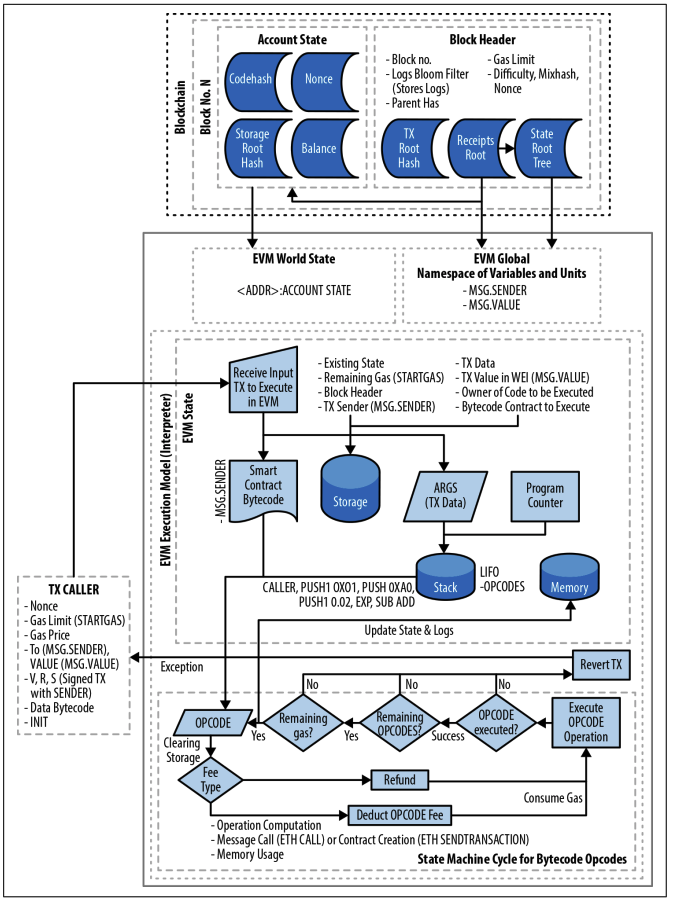

# [마스터링 이더리움] 13장. 이더리움 가상 머신

본 포스트는 서적 *마스터링 이더리움*의 13장 *이더리움 가상 머신* 파트를 정리한 포스트입니다. 해당 파트에서 소개되는 실습 내용은 제외하고,개념적인 내용만 정리하였습니다.

##  EVM

### 개요

EVM은 스마트 컨트랙트 배포 및 실행을 처리하는 이더리움의 일부이다. 이더리움에서의 대부분의 작업은 EVM에서 수행된다. 하나의 EOA에서 다른  EOA로의 간단한 값을 전송하는 트랜잭션은 EVM이 필요없지만, 그 외 모든 것은  EVM에 의한 상태 업데이트를 수반한다. 넓게 보면, EVM은 자체 영구 데이터 저장소가 있는 수백만 개의 실행 가능 객체를 가진 전 세계의 탈중앙화된 컴퓨터라 할 수 있다.

EVM은 유사 튜링 완전 상태 머신이다. 이에 대한 설명은 아래에서 자세히 하겠습니다.

### 동작 및 구성 요소

EVM은 메모리 내의 모든 값을 스택에 저장하는 스택 기반 아키텍처로, 256  비트의 단어 크기로 동작한다.

EVM은 다음과 같이 주소지정이 가능한 데이터 구성요소를 가진다.

- 불변 **프로그램 코드 ROM** : 바이트코드 저장
- 휘발성 **메모리** : 모든 위치가 명시적으로 0으로 초기화
- 영구 **스토리지**  : 0으로 초기화

### EVM 명령어(바이트코드 연산)

EVM은 일반적인 프로그래밍 언어가 갖는 대부분 작업의 바이트코드 연산을 제공한다

- 산술 및 비트 논리 연산
- 실행 컨텍스트 조회
- 스택, 메모리 및 스토리지 접근
- 흐름 제어 작업
- 로깅 호출 및 기타 연산자

이 외에도, 계정 정보 및 블록 정보에 접근할 수 있다.

### 기존 기술과의 비교

우선, EVM은 일반적인 VM에 비해, 훨씬 제한된 영역에서 작동한다. EVM은 계산 엔진일 뿐이며, JVM 사양과 유사한 계산 및 스토리지 추상화를 제공한다.

또한, 실행 순서가 외부에서 구성되기 때문에 스케줄링 기능이 없다. 클라이언트가 어떤 순서로 실행되어야 하는지를 결정한다. 이런 의미에서 단일 스레드라 할 수 있다.

마지막으로, 인터페이스할 실제 물리적인 장비가 없다. 이더리움 월드 컴퓨터는 완전히 가상 환경이다.

### EVM 아키텍처 및 실행 컨텍스트

[그림 13-1 EVM(Ethereum Virtual Machine) 아키텍처 및 실행 컨텍스트](https://user-images.githubusercontent.com/39115630/216258316-8d4741e6-8f50-4eef-b723-89af97e5d0f5.png)

