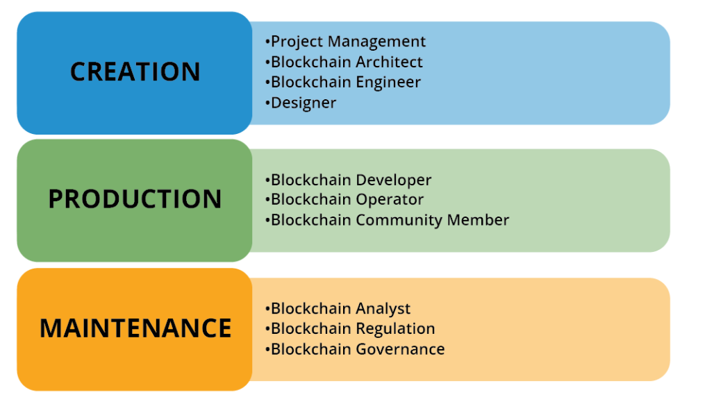

# 블록체인의 사용과 활용 - 블록체인 소개

해당 글은 Hyperledger foundation에서 제공하는 `Blockchain: Understanding Its Uses and Implications` 강좌의 **Chapter 1. Introduction to Blockchain**를 수강하고 정리, 작성한 내용입니다.

우선, 인터넷 역사와 설계를 간략히 다루고, 이를 기반으로 블록체인 기술이 현재의 인터넷 프로토콜을 활용하며 발전시키는 방법을 살펴봅니다. 또한 블록체인 프로젝트에서의 역할들과 블록체인 프로젝트가 적용 가능한 새로운 산업 영역에 대한 간단한 소개를 합니다.

## 블록체인과 인터넷의 발전

### 블록체인 개요

블록체인은 참여자간 거래를 직접 수행하도록 허용하는 P2P(Peer To Peer) 장부 시스템이다. 본질적으로 블록체인은 거래에 대한 정보를 새로운 탈중앙화된 방식으로 기록하는 시스템으로, 거래 기록을 수정하기 어렵거나 불가능하게 만든다. 거래 내역은 참여자들 간에 공유된 디지털 장부의 시트 또는 블록에 저장된다. 

P2P 네트워크에 신뢰를 세우기 위해서는 네트워크 내 거래에 대한 **합의**를 이끌어내는 것이 중요하다. 세워진 합의에 따라서, 거래들은 그룹화되고, 수정 불가능한 장부에 저장된다. 합의에 의해서, 신뢰가 시스템을 구성하는 가장 중요하고 본질적인 구성 요소가 되는 것이다. 중앙 모델에서는 중앙 기관이 장부 혹은 신뢰를 관리하였다면, 이러한 분산화된 모델에서는 참여자들이 신뢰에 합의하는 모델로 변화한다.

### 인터넷의 발전 과정

인터넷은 이 새로운 기술과 상호 작용하는 방법에 따라 다음과 같이 세 가지 구분되는 세그먼트로 나뉜다.

**1) Web 1.0 - 연결의 인터넷**

- 웹 기반 응용 프로그램의 개발, 이메일과 같은 온라인 서비스 촉진
- 중앙 권한에 의한 관리
- 읽기 전용. 정보가 사용자에게 단방향 전달

Web 1.0시대의 인터넷에서는 컨텐츠가 중앙 관리 및 단방향 전달된다는 특징을 가진다. 사용자는 컨텐츠에 대한 소비외에는 수정, 생성, 삭제와 같은 권한을 가지지 못한다. 예를 들어, email 서비스, 마트의 상품 소개 홈페이지 등이 있다.

**2) Web 2.0 - 정보의 인터넷**

- 사용자 생성 콘텐츠
- 중앙 권한에 의한 관리
- 읽기-쓰기, 개인이 정보와 상호 작용 가능
- 정보의 격리

Web 2.0시대의 인터넷에서는 사용자도 소비자임에 동시에 컨텐츠 생성자가 될 수 있다. 다만, 컨텐츠들은 중앙에서 관리되며 사용자는 중앙에서 열어준 권한만을 가진다. 또한, 데이터도 하나의 상품이 되어 수집되고, 격리되고, 팔리기 시작한다. 대표적인 예시로 유튜브가 있다. 사용자들은 유큐브 정책하에 자신의 컨텐츠를 생성하며, 생성된 데이터들은 중앙의 서버에서 관리되는 하나의 상품이 된다.

**3) Web 3.0 - 가치의 인터넷**

- 커뮤니티 상호 작용
- 정보는 개인이 보유하게 되며, 데이터의 격리를 깨뜨림
- 블록체인은 토큰 형태로 가치를 교환함

Web 3.0시대의 인터넷에서는 분산화된 환경에서 사용자들간 직접 거래가 이루어진다. Web 1.0과 Web 2.0에서는 정보를 연결시켜주고, 사용자가 컨텐츠를 제작할 수 있도록 하는 것에 초점이 맞추어 졌다면, Web 3.0에서는 **가치의 직접적인 교환**을 강조한다. 여기서 가치란, 교환 가능한 자산, 화폐, 아니면 유의미한 정보 등을 나타낸다.

이러한 Web 3.0는 AI, ML(machine learning), 5G, IoT, 가상현실 등 데이터를 교환하고 통신하게 하는 기술들로 가능해진다. 이때, 이러한 기술들이 Web 3.0 기조를 잘 받쳐줄 수 있도록 촉진하고, 상호 연계 가능하도록 해주는 대표적인 플랫폼이 블록체인이다.

## 블록체인 주요 특징

그렇다면 어떻게 블록체인은 Web 3.0 기조를 구현할 수 있는 것일까

우선, 블록체인의 블록은 노트북의 페이지와 유사하게 생각할 수 있다. 블록에는 데이터를 저장하며, 어떤 종류의 정보든 상관하지 않는다. 오늘날 대부분 기록되는 것은 금융 거래이지만, 투표 기록 및 결과, 토지 소유권 및 의료 기록과 같은 것도 기록할 수 있다. 

블록체인의 강점은 모든 페이지가 서로 연결되어 있다는 것이다. 따라서 어느 페이지에서라도 어떤 데이터를 변경하려고 하면 매우 명백하고 쉽게 감지할 수 있는 방식으로 링크가 깨지게 된다. 이로 인해서 데이터의 불변성과 보안을 제공한다.

이러한 블록체인의 주요 특징으로는 다음과 같은 요소들이 있다.

**분산원장**

- 원장이란 거래의 모음으로, 블록체인에서는 특정 개인이 원장을 소유하지 않는다. 
- 원장은 네트워크 참가자들 간에 분산되어 있으며 모두 같은 블록체인 프로토콜을 실행한다.
- 동일한 원장의 사본이 네트워크의 각 노드/컴퓨터에 존재하므로 분산화된다.

**Peer To Peer(P2P)**

- 네트워크의 모든 노드는 동일한 운영 규칙 또는 프로토콜을 따르지만 노드마다 다른 역할을 갖는다
  - 전체 노드 : 블록체인 프로토콜, 블록체인의 트랜잭션 기록, 블록체인의 유지에 도움이 되는 것을 포함하는 사본을 저장
  - 사용자 노드 : 원장과 상호 작용합니다.
- 블록체인 네트워크에서는 중앙 권한의 부재로, P2P 네트워크로 대체된다.

**투명성**

- 공유 또는 분산 원장에 발생한 모든 거래를 볼 수 있다.
- 각 노드가 합의된 원장의 사본을 공유하므로 거래에 대한 마찰이 없다.
- 이와 반대되게, 중앙 집중식 시스템은 투명하지 않으며 원장에 대한 정보는 한 권한에 의해 제어된다.

**합의**

- 네트워크 참가자들은 원장내에 어떤 것이 존재해야 하는지 합의를 이끌어낸다.
- 블록이 추가되려면 시스템의 모든 노드들이 블록 내 데이터가 정확하며 추가되어도 되는지에 대한 합의에 도달해야 한다.
- 거래가 유효한지 노드에게 알려주는 중앙 권한이 없기 때문에, 새로운 합의나 합의에 도달하는 새로운 방법이 필요하다.

**암호화**

- 블록체인의 정보가 신뢰할 수 있도록 보장한다.
- 암호화는 블록체인 내 데이터의 진위를 증명하는데 안전한 방법을 제공한다. 제3자에 의존하는 대신 진위를 증명하는 암호 알고리즘에 신뢰를 둔다.

**불변성**

- 암호학은 블록체인 기술의 또 다른 강력한 특징인 불변성에도 기여한다.
- 해싱이라는 암호 기술을 사용하여 연결된 정보를 형성하므로 공유된 원장의 어느 블록에서나 데이터를 변경하려고하면 매우 명백하고 쉽게 감지할 수 있는 방식으로 다른 사본과의 연결이 깨지게 된다.
- 이렇게 블록이 모두 연결되어 있기 때문에 블록체인은 모든 원장에 대한 신뢰성을 유지할 강한 힘을 가진다.

**프로그래밍 가능**

- 일부 블록체인은 시스템에 논리를 부여하는 스마트 계약이라는 추가 기능을 제공한다.
- 스마트 계약은 블록체인에서 실행되는 프로그램으로, 특정 규칙 세트를 강제하는 디지털 계약으로 작동한다.
- 해당 프로그램은 컴퓨터 코드에 의해 미리 정의되며 모든 네트워크 노드에서 복제되고 실행된다.
- 모든 네트워크 노드에 복제되어 있기 때문에 계약의 불변성을 가지며, 이로 인해 사람들은 당사자간 trustless(신뢰가 필요없는) 프로토콜을 생성할 수 있다.

## 블록체인 프로젝트에서의 역할

### 블록체인 프로젝트의 단계

출처 : [[Stages of a Blockchain Project]](https://learning.edx.org/course/course-v1:LinuxFoundationX+LFS170x+1T2023/block-v1:LinuxFoundationX+LFS170x+1T2023+type@sequential+block@31aac67795644f13bd993a27072e4902/block-v1:LinuxFoundationX+LFS170x+1T2023+type@vertical+block@3d9cb31dc8bd4e099a2e45ab74bead6b)

블록체인 프로젝트도 다른 개발 프로젝트와 유사하게 생성 => 제품화 => 유지보수의 단계를 따라 진행된다. 각 단계마다 필요한 롤과 수행할 역할이 구분된다.

### 블록체인 단계별 롤과 역할

- 생성(Creation) 단계에서의 롤
  - 프로젝트 관리자
    - 블록체인 솔루션의 필요 여부 결정을 담당
    - 프로젝트를 성공으로 이끄는 리더십이 요구됨
  - 블록체인 아키텍트
    - 사용 사례에 적합한 블록체인 시스템 선택
    - 블록체인의 종류, 비용 대응 분석, 보안 설계를 고려
  - 블록체인 엔지니어
    - 블록체인 솔루션의 인프라 구축, 분산 블록체인 네트워크 설계 및 개발
    - 오픈 소스 코드 작업 및 프로그래밍 언어, 알고리즘, 노드, 데이터 구조 및 암호화 결정, P2P 네트워크 설계
  - 디자이너
    - 시스템이 참여자와 상호 작용해야 하는 인터페이스 작성
- 제품화 (Production) 단계에서의 롤
  - 블록체인 개발자
    - 비즈니스 로직을 제공하는 스마트 계약의 설계 및 코딩
    - 유형별 구분
      - 코어 개발자: 솔루션이 개발되어지는 블록체인 프로토콜을 작업하는 사람
      - 소프트웨어 개발자: 특정 use cases(사용 사례)를 개발하는 사람
  - 블록체인 오퍼레이터
    - 블록체인 장부의 전체 사본을 유지하고 네트워크 전체에 거래를 전파하는 소프트웨어를 실행
  - 블록체인 커뮤니티 멤버
    - 시스템과 상호 작용하는 노드
    - 성공적인 블록체인 프로젝트에는 강력한 커뮤니티가 필수적이다.
- 유지 보수 단계에서의 롤
  - 블록체인 분석가
    - 블록체인 장부의 효과를 검토하고 개선이 필요한 영역을 식별하며 변경 전략을 개발
  - 블록체인 규제
    - 새롭게 떠오르는 블록체인 기술에 대한 통제 필요로 광범위하게 생성되는 분야
  - 블록체인 거버넌스
    - 거버넌스(관리체제)는 블록체인 장부 시스템이 기존 사회에 생존하고 적응하는 데에 필수적이다.
    - 이때, 기존 정부에서 제시한 기본적인 금융 지침을 따라야만 할 것이다.

## 블록체인 사용 사례

블록체인 프로젝트가 적용 가능한 영역들을 사업의 종류별로 구분지어 설명하면 다음과 같다. 

### Business to Consumer (B2C) 사업

- 소비자는 공급자의 투명성, 책임을 비롯하여 공급자에 대한 윤리적 검증, 노동에 대한 확인 등과 같은 혜택을 얻게 된다.
- 수직적 구조의 시장에서 블록체인의 투명성 기능으로 금융, 물류, 자선 기금, 농업 등 사업 분양에 적용 가능하다.
- ex) IBM Food Trust: 허가된 영구적이고 공유된 식품 공급망 레코드로 식품이 규정 준수를 충족하고 원산지를 추적할 수 있음

### Business to Business (B2B) 사업

- 단일 그룹이 진실을 통제하지 않고, 합의에 기반된 운영으로 불신의 여지를 없앨 수 있다. => 새로이 깨달린 투명성으로 정보 공유
- 블록체인은 중개인(은행, 브로커 등)을 제거하여, 더 빠르고, 신뢰성 있는 작업 방식과 더 저렴한 결제 시스템을 촉진한다.
- 블록체인은 자주 확인되어야하고 갱신해야하는 종이 사본들, 수작업으로 준비되는 하드웨어, 소프트웨어 설정, 네트워크 구성, 보안 등 기존의 복잡한 절차를 제거한다.
- 이러한 특징으로, 금융, 국제 무역 및 상업, 식품 공급망 등과 같은 산업 분야에 활용이 가능하다

### Gonvernment To Consumer(G2C) / Government To Gevernment(G2G) 사업

- 공공 부문 기관은 블록체인 기술을 활용하여 격리되고 비효율적인 중앙집중형 시스템에서 탈피할 수 있다.
- 블록체인 네트워크는 보안, 민첩성 및 비용 효율적인 구조를 제공

종합적으로, 투명성, 추적성, 불변성이 요구되는 산업들에 대해서 블록체인의 활용성이 뛰어나다는 것을 알 수 있다. 

## 출처

- edX, Blockchain: Understanding Its Uses and Implications, https://learning.edx.org/course/course-v1:LinuxFoundationX+LFS170x+1T2023/block-v1:LinuxFoundationX+LFS170x+1T2023+type@sequential+block@b5d8fe9812784047954a2e6fcf3eba66/block-v1:LinuxFoundationX+LFS170x+1T2023+type@vertical+block@cc7781bf178f4c6ea3f23943aea661c9

- LinkedIn, Web 3.0: Discovering the Internet of Value, https://www.linkedin.com/pulse/web-30-discovering-internet-value-dale-russell-ca-sa-

