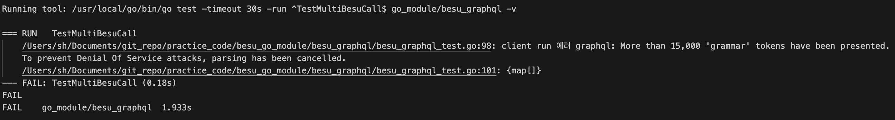
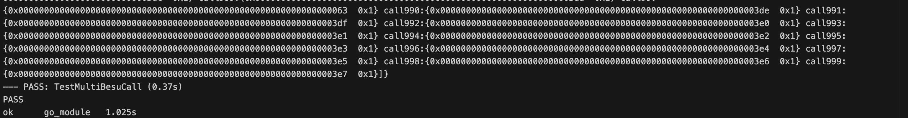
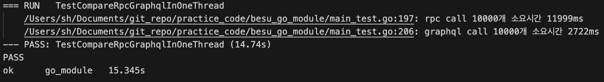
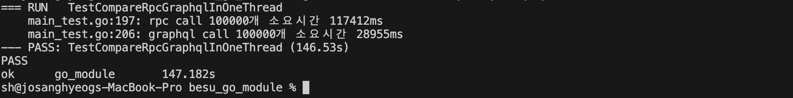
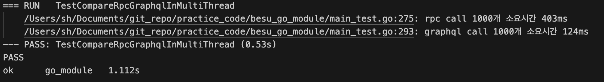
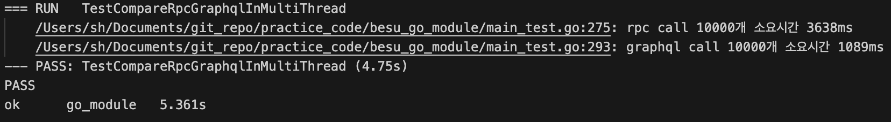
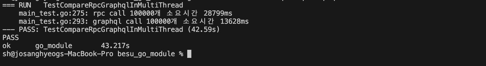

# [GraphQL] Hyperledger Besu GraphQL (2/2) - 다중 요청


이전 포스트에 이어서 Graphql을 통한 다중 요청을 보내는 법을 정리하고자 한다. Graphql 쿼리에 다중 요청을 담아서 보냈을 때, 개별적인 rpc call를 통한 방식에 비해서 어느 정도 효율성이 개선되는지 확인해 볼 것이다. 또한, Graphql를 사용함에 있어서 불편함은 없는지 살펴볼 것이다.


## Graphql 기대 효과

우선, Graphql을 사용하였을 때 효율성이 개선될 것이라 기대되는 이유로는 다음 3가지가 있다.

1.. 네트워크 부하 감소

여러 개의 요청을 개별적인 rpc call로 보낸다는 것은 매 요청마다 connection 연결, 요청 전송, 응답 대기, connection 해제의 작업을 반복해야 함을 의미한다. 하지만 하나의 graphql 쿼리에 여러 요청을 담아서 보낸다면, 한번의 사이클로 모든 요청을 처리할 수 있다. Graphql을 사용하면, 네트워크 통신에 필요한 작업을 최소화 시킬 수 있다.

2.. 서버의 작업 최적화

개별적인 rpc call은 서버에서도 매 요청을 개별적으로 처리함을 의미한다. 이 경우, 매 요청마다 반복적으로 수행되는 작업이 존재할 수 있다. 하지만, Graphql 요청으로 모든 요청을 한번에 담아 보낸다면, 서버 내부적으로 요청 처리를 최적화 시키는 로직을 기대해 볼 수 있다.

3.. 불필요한 데이터 fetch 방지

Graphql의 overfetching 방지는 여러 개의 요청을 담아 보내야할 때 더 효과적이다. 불필요한 데이터까지 받아오는 rpc call은 개별적인 요청의 횟수가 증가할 수록 부하가 증가하는 것에 비해, Graphql은 불필요한 데이터는 받아오지 않는다.


## 다중 Besu Graphql Querying (큰 쿼리 고려 이전)


### 다중 조회

다중 요청을 한번에 담아 보내는 쿼리도 단일 쿼리와 유사하게 작성한다. 차이점으로는 요청의 개수가 동적으로 정해질 수 있게끔, variable과 call을 동적으로 생성할 수 있도록 코드를 작성한다.

```go
type MultiCallsResp struct {
	Block map[string]CallResp `json:"block"`
}

var multiCallQuery = `
	query getCall($blockNumber: Long%s) {
		block(number: $blockNumber){
			%s
		}
	}
	fragment callFields on CallResult {
		data, 
		status
	}
`
var callForm = `
	call%d : call(data: $callData%d){
		...callFields
	}
`
var callVariableForm = "$callData%d: CallData!"


func BesuMultiCall(bn *big.Int, callDatas []Call) (MultiCallsResp, error) {

	var varBuilder strings.Builder
	var callBuilder strings.Builder

  	// 파라미터로 받은 callData의 수에 따라, 변수와 call 요청을 동적으로 생성
	for i := range len(callDatas) { 

		varBuilder.WriteString(", ")
		varBuilder.WriteString(fmt.Sprintf(callVariableForm, i))

		callBuilder.WriteString(fmt.Sprintf(callForm, i, i))

	}

  	// 동적으로 생성한 변수 영역과 와 call 요청들로 query 작성
	query := fmt.Sprintf(multiCallQuery, varBuilder.String(), callBuilder.String())

	req := graphql.NewRequest(query)

  	// 변수 입력
	req.Var("blockNumber", bn)

	for i, call := range callDatas {
		req.Var(fmt.Sprintf("callData%d", i), call)
	}

	var res MultiCallsResp

	err := client.Run(context.Background(), req, &res)
	if err != nil {
		return MultiCallsResp{}, fmt.Errorf("client run 에러 %w", err)
	}

	return res, nil
}


```


### 다중 변경

다중 변경 함수도 다중 조회 함수와 같은 방식으로 작성한다.

```go
var multiMutQuery = `
	mutation(%s) {
		%s
	}
`
var mutForm = "tx%d: sendRawTransaction(data: $mutData%d) "
var mutVariableForm = "$mutData%d: Bytes!"

func BesuMultiWrite(txs []string) (map[string]string, error) {

	var varBuilder strings.Builder
	var callBuilder strings.Builder

	for i := range len(txs) {
		varBuilder.WriteString(fmt.Sprintf(mutVariableForm, i))
		callBuilder.WriteString(fmt.Sprintf(mutForm, i, i))

		if i < len(txs)-1 {
			varBuilder.WriteString(", ")
			callBuilder.WriteString(", ")
		}
	}

	query := fmt.Sprintf(multiMutQuery, varBuilder.String(), callBuilder.String())

	fmt.Println(query)
	req := graphql.NewRequest(query)

	for i, tx := range txs {
		req.Var(fmt.Sprintf("mutData%d", i), tx)
	}

	var res map[string]string

	err := client.Run(context.Background(), req, &res)
	if err != nil {
		return nil, fmt.Errorf("client run 에러 %w", err)
	}

	return res, nil
}
```


### 테스트

#### 오류 테스트 케이스: 너무 큰 쿼리

아래의 코드로 1000개의 조회 요청을 하나의 쿼리로 담아 요청을 보내본 결과, 에러가 발생하였다.

```go
func TestMultiBesuCall(t *testing.T) {

	n := 1000

	abi, err := transaction.AgeInfoStrageMetaData.GetAbi()
	if err != nil {
		t.Error(err)
	}

	callDatas := make([]Call, n)

	for i := range n {
		data, err := abi.Pack("getAge", fmt.Sprintf("name%d", i))
		if err != nil {
			t.Error(err)
		}
		callDatas[i] = Call{
			To:   cntr_addr,
			Data: "0x" + hex.EncodeToString(data),
		}
	}

	rtn, err := BesuMultiCall(nil, callDatas)
	if err != nil {
		t.Error(err)
	}

	t.Log(rtn)
}
```




"More than 15,000 'grammar' tokens have been presented."라는 메시지와 함께 서비스 거부 공격을 방지하기 위하여 요청이 취소되었다는 에러가 반환됨을 알 수 있다. 여기서 토큰이란, 쿼리를 구성하는 가장 작은 단위들로, 키워드, 문장 부호와 같은 것들을 의미한다. Besu에서는 하나의 쿼리가 너무 많은 요청을 담지 못 하도록 크기를 제한하고 있음을 알 수 있다.

이와 유사하게, 요청의 사이즈를 조절하다 보면 "maximum query complexity exceeded 204 > 200" 와 같은 에러 메시지가 나올 때가 있다. Graphql 서버는 쿼리의 complexity score을 계산하여, 특정 복잡도를 넘어서는 쿼리는 에러를 반환하도록 설정하고 있다. Besu의 복잡도 제한은 200으로 해당 복잡도 밑으로 쿼리를 생성하여 요청을 보내야 한다.

:bulb: complexity limit은 besu source 코드의 GraphQLProvider.java 파일의 `MAX_COMPLEXITY`라는 변수로 값이 200으로 설정되어 있다. 이 값을 수정해서 build한다면 더 복잡한 쿼리로 요청을 보낼 수 있지만, Besu의 부하를 막기 위한 값이기에 신중하게 고려하여 값을 변경해야 할 것이다. (경로: ./ethereum/api/src/main/java/org/hyperledger/besu/ethereum/api/graphql/GraphQLProvider.java)


## 다중 Besu Graphql Querying (큰 쿼리 방지)

하나의 쿼리에 너무 많은 요청을 담으면 오류가 생기기에, 지정한 Limit에 맞게 요청을 나누어서 쿼리를 보내는 메소드로 수정한다.


### 다중 조회

```go
func BesuMultiCall(bn *big.Int, callDatas []Call) (MultiCallsResp, error) {

	var res MultiCallsResp
	var s int = 0
	var e int = min(len(callDatas), BesuLimit)

loop:
	var varBuilder strings.Builder
	var callBuilder strings.Builder

	for i := s; i < e; i++ {	// 지정한 Limit를 넘지 않도록 쿼리에 담는 요청의 개수를 조절

		varBuilder.WriteString(", ")
		varBuilder.WriteString(fmt.Sprintf(callVariableForm, i))

		callBuilder.WriteString(fmt.Sprintf(callForm, i, i))

	}

	query := fmt.Sprintf(multiCallQuery, varBuilder.String(), callBuilder.String())

	req := graphql.NewRequest(query)

	req.Var("blockNumber", bn)

	for i := s; i < e; i++ {
		req.Var(fmt.Sprintf("callData%d", i), callDatas[i])
	}

	err := client.Run(context.Background(), req, &res)
	if err != nil {
		return MultiCallsResp{}, fmt.Errorf("client run 에러 %w", err)
	}

	if e < len(callDatas) {
		s += BesuLimit
		e = min(len(callDatas), e+BesuLimit)
		goto loop
	}

	return res, nil
}
```


### 다중 변경

```go
func BesuMultiWrite(txs []string) (map[string]string, error) {

	var res map[string]string
	var s int = 0
	var e int = min(len(txs), BesuLimit)

loop:
	var varBuilder strings.Builder
	var callBuilder strings.Builder

	for i := s; i < e; i++ {
		varBuilder.WriteString(fmt.Sprintf(mutVariableForm, i))
		callBuilder.WriteString(fmt.Sprintf(mutForm, i, i))

		if i < e-1 {
			varBuilder.WriteString(", ")
			callBuilder.WriteString(", ")
		}
	}

	query := fmt.Sprintf(multiMutQuery, varBuilder.String(), callBuilder.String())
	req := graphql.NewRequest(query)

	for i := s; i < e; i++ {
		req.Var(fmt.Sprintf("mutData%d", i), txs[i])
	}

	err := client.Run(context.Background(), req, &res)
	if err != nil {
		return nil, fmt.Errorf("client run 에러 %w", err)
	}

	if e < len(txs) {
		s += BesuLimit
		e = min(len(txs), e+BesuLimit)
		time.Sleep(3 * time.Second)
		goto loop
	}

	return res, nil
}
```


### 테스트

#### 다중 조회 테스트

이전과 통일한 코드로 테스트를 수행하면, 이번에는 성공으로 쿼리 실행 결과를 받아볼 수 있다.




#### 다중 변경 테스트

다중 변경도 다중 조회 때와 마찬가지로 사전에 트랜잭션을 1000개 생성하여 Graphql에 나누어 담아 Besu에 요청을 보내보았다. (주의! 하나의 서명키로 트랜잭션 사전 생성 시, 논스값 수동 조정 필요). Internal 오류가 발생하여 몇번의 시도를 해본 결과 다음과 같은 사실을 발견할 수 있었다.

1.. Besu는 transaction gas limit을 보고 한 블랙에 담을 트랜잭션의 개수를 정한다.

본래라면 Transaction의 Gas 필드는 해당 트랜잭션의 Gas 한도를 정하는 것으로, 실제 블록이 몇 개의 트랜잭션을 담을지에는 영향을 주지 않는다. 이로 인해서, 트랜잭션의 Gas 필드를 네트워크의 Gas Limit값과 동일하게 설정하였지만, 이 경우에는 트랜잭션이 한 블록 당 하나씩만 들어갔다. 트랜잭션의 Gas 필드를 실제 가스 소비양과 근사치로 설정했을 경우에는 한 블록에 여러 개의 트랜잭션이 처리됨을 확인하였다.

2.. graphql은 complexity limit은 하나의 쿼리에 보낼 수 있는 요청의 제한이 아닌, 하나의 블록이 처리할 수 있는 요청의 수로 보아야 한다.

Graphql 요청들을 여러 쿼리에 나누어서 보내더라도, 한 블록이 처리되기 전에 complexity limit을 초과하는 graphql 요청이 들어올 경우 오류가 발생하였다. 예를 들어, complexity limit이 200이고 보내야 하는 요청의 수가 300일 때, 요청을 150개씩 나누어 쿼리를 보내더라도 2번의 요청이 하나의 블록이 생성되기 전에 들어간다면 오류가 발생한다. 하지만, 쿼리를 블록 생성 시간만큼 텀을 두고 전송한다면 정상적으로 처리가 가능하다.

3.. 다중 변경 트랜잭션 중 올바르지 못한 트랜잭션이 존재할 경우, 이후 트랜잭션은 반영되지 않는다.

변경 요청들 중 올바르지 않은 서명키, 잘못된 논스값 등으로 올바르지 않은 트랜잭션이 존재할 경우, 즉시 처리를 멈추고 오류를 반환한다. 해당 트랜잭션 앞의 트랜잭션들은 정상적으로 반영되지만, 이후 트랜잭션은 반영되지 않는다. 특히 이 경우, 오류 원인에 대한 정확한 내용이 반환되지 않는다.


이 내용들을 토대로, Graphql을 사용해서 다중 Mutation 효율성을 테스트하는 것은 적합하지 않다고 판단하였다. 사전에 네트워크 가스 제한, 실행 트랜잭션의 실제 소요 가스, 정상적인 트랜잭션 검증 여부 등의 제약 사항들이 존재하였으며 무엇보다도 네트워크의 블록 생성 주기가 테스트에 가장 큰 영향을 주기 때문이다. 블록 생성 주기에 따라서 Graphql 다중 변경 쿼리의 효율성이 결정될 것이기에 이번 테스트에서 변경은 제외하겠다. 


## Graphql 다중 조회 효율성 테스트 (Rpc Call vs Graphql)

마지막으로 Graphql 다중 조회 쿼리를 사용했을 때, 어느 정도의 성능 향상이 있는지 확인해 보겠다. 테스트는 싱글 스레드와 멀티 스레드 환경을 나누어서 진행했다.


### 싱글 스레드 환경 테스트 결과

| 요청수(n) | Rpc Call | Graphql | Rpc/Graphql |
| --------- | -------- | ------- | ----------- |
| 1,000     | 2078     | 316     | 6.57        |
| 10,000    | 11999    | 2722    | 4.4         |
| 100,000   | 117412   | 28955   | 4.05        |


#### N = 1000


#### N = 10,000



#### N = 100,000




### 멀티 스레드 환경 테스트 결과

| 요청수(n) | Rpc Call | Graphql | Rpc/Graphql |
| --------- | -------- | ------- | ----------- |
| 1,000     | 403      | 124     | 3.25        |
| 10,000    | 3638     | 1089    | 3.34        |
| 100,000   | 28799    | 13628   | 2.11        |

:bulb: Besu 노드가 동시에 맺을 수 있는 커넥션의 수를 고려하여, 스레드의 개수는 70로 제한


#### N = 1000



#### N = 10,000



#### N = 100,000




## 결론 및 정리


Graphql로 여러 개의 요청을 묶어서 보낸다면, 싱글스레드 환경에서는 4~6배, 멀티스레드 환경에서는 2~3배 정도로 효율성이 개선됨을 확인하였다. 이때, 요청의 수가 커질 수록 효율성 개선 정도는 다소 감소함을 볼 수 있었다.
Graphql을 사용하면 효율성은 증가하였지만, 변경에 있어서는 제약과 한계점들도 존재하였다.
1. 사전에 네트워크와 트랜잭션에 대한 정보가 필요하다.
Graphql을 통해 변경 트랜잭션을 효율적으로 사용하기 위해선, 블록 생성 주기, 네트워크 가스 limit, 트랜잭션 예상 가스 비용을 사전에 파악해서 하나의 쿼리에 담을 요청의 수와 쿼리를 날리는 시간을 결정하여야 한다.
만약 변경 트랜잭션이 일정량의 가스를 사용한다면 문제가 없겠지만, 매 트랜잭션마다 가스의 변동이 있는 경우에는 사용에 제약이 있을 수 있다.
2. 잘못된 트랜잭션 존재할 경우를 대비하여 오류 처리 로직이 필요하다.
여러 개의 트랜잭션을 묶어서 보냈을 때, 중간에 잘못된 트랜잭션이 존재했을 때에는 이전 트랜잭션들만 반영이 되고 그 이후 트랜잭션들은 반영이 되지 않았다. 
실제 운영 환경에서 사용하는 경우라면, 오류가 발생했을 때에 오류를 확인하고 추가적인 조치를 취하는 로직이 필요할 것이다.
이러한 점들이로 인해서, 변경에 있어서는 Graphql 도입에 더 신중한 고려가 필요해 보인다.


## 전체 코드

:link: https://github.com/ChoSanghyuk/practice_code/blob/master/besu_go_module


