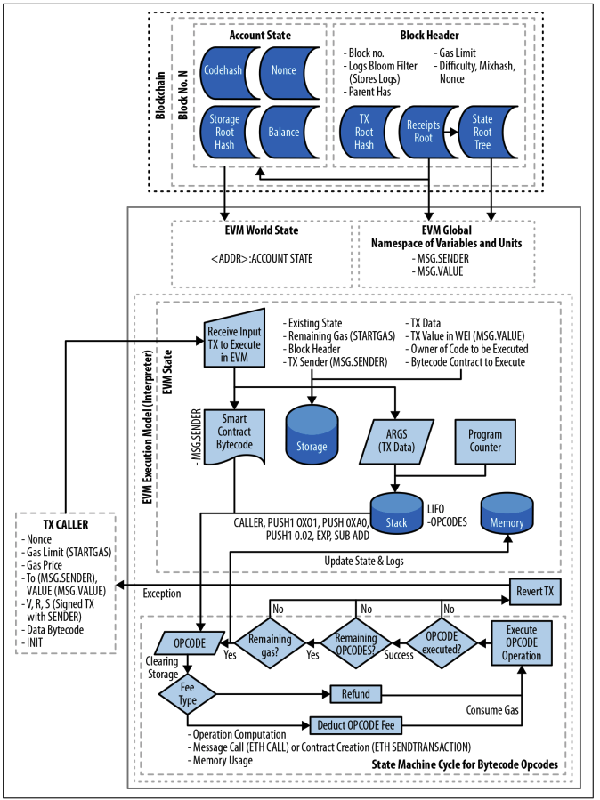

# [마스터링 이더리움] 13장. 이더리움 가상 머신

본 포스트는 서적 *마스터링 이더리움*의 13장 *이더리움 가상 머신* 파트를 정리한 포스트입니다. 해당 파트에서 소개되는 실습 내용은 제외하고,개념적인 내용만 정리하였습니다.

##  EVM

### 개요

EVM은 스마트 컨트랙트 배포 및 실행을 처리하는 이더리움의 일부이다. 이더리움에서의 대부분의 작업은 EVM에서 수행된다. 하나의 EOA에서 다른  EOA로의 간단한 값을 전송하는 트랜잭션은 EVM이 필요없지만, 그 외 모든 것은  EVM에 의한 상태 업데이트를 수반한다. 넓게 보면, EVM은 자체 영구 데이터 저장소가 있는 수백만 개의 실행 가능 객체를 가진 전 세계의 탈중앙화된 컴퓨터라 할 수 있다.

EVM은 유사 튜링 완전 상태 머신이다. 이에 대한 설명은 아래에서 자세히 하겠습니다.

### 동작 및 구성 요소

EVM은 메모리 내의 모든 값을 스택에 저장하는 스택 기반 아키텍처로, 256  비트의 단어 크기로 동작한다.

EVM은 다음과 같이 주소지정이 가능한 데이터 구성요소를 가진다.

- 불변 **프로그램 코드 ROM** : 바이트코드 저장
- 휘발성 **메모리** : 모든 위치가 명시적으로 0으로 초기화
- 영구 **스토리지**  : 0으로 초기화

### EVM 명령어(바이트코드 연산)

EVM은 일반적인 프로그래밍 언어가 갖는 대부분 작업의 바이트코드 연산을 제공한다

- 산술 및 비트 논리 연산
- 실행 컨텍스트 조회
- 스택, 메모리 및 스토리지 접근
- 흐름 제어 작업
- 로깅 호출 및 기타 연산자

이 외에도, 계정 정보 및 블록 정보에 접근할 수 있다.

### 기존 기술과의 비교

우선, EVM은 일반적인 VM에 비해, 훨씬 제한된 영역에서 작동한다. EVM은 계산 엔진일 뿐이며, JVM 사양과 유사한 계산 및 스토리지 추상화를 제공한다.

또한, 실행 순서가 외부에서 구성되기 때문에 스케줄링 기능이 없다. 클라이언트가 어떤 순서로 실행되어야 하는지를 결정한다. 이런 의미에서 단일 스레드라 할 수 있다.

마지막으로, 인터페이스할 실제 물리적인 장비가 없다. 이더리움 월드 컴퓨터는 완전히 가상 환경이다.

### EVM 아키텍처 및 실행 컨텍스트

[그림 13-1 EVM(Ethereum Virtual Machine) 아키텍처 및 실행 컨텍스트](https://user-images.githubusercontent.com/39115630/216258316-8d4741e6-8f50-4eef-b723-89af97e5d0f5.png)

## 이더리움 상태

**EVM 작업**은 이더리움 프로토콜에 정의된 대로 스마트 컨트랙트 코드의 실행 결과로 유효한 상태 변화를 계산하여 **이더리움 상태를 업데이트**하는 것이다. 외부 주체가 트랜잭션 생성, 수락 및 주문을 통해 상태 변화를 시작한다는 사실을 반영한다. 

### 이더리움 상태 구성

이더리움 상태를 가장 상위 레벨에서 보면 이더리움 **월드 상태**(world state)가 있다. 월드 상태는 이더리움 주소를 계정(account)에 매핑한 것으로, 각 이더리움 주소는 이더 잔액, 논스, 계정의 스토리지, 계정의 프로그램 코드를 의미한다. 자세히 상태보면 다음과 같다.

- 이더 잔액(balance) : 계좌가 소유한 웨이
- 논스(nonce)
  - EOA일 경우, 성공적으로 전송한 트랜잭션의 수
  - 컨트랙트 계정일 경우, 생성된 컨트랙트의 수
- 계정의 스토리지(storage) : 스마트 컨트랙트에서만 사용하는 영구 데이터 저장소
- 프로그램 코드 : 스마트 컨트랙트 계정일 때만 존재하는 컨트랙트 계정 코드

### EVM 실행 단계

EVM의 실행을 걸쳐 이더리움의 상태를 업데이트는 과정을 다음과 같다.

1. 트랜잭션이 스마트 컨트랙트 코드를 실행하면,  EVM은 생성 중인 현재 블록 및 처리 중인 특정 트랜잭션과 관련하여 필요한 모든 정보로 인스턴스화된다.

2. EVM의 **프로그램 코드 ROM에는 컨트랙트 계정 코드**가 로드되고, 프로그램 카운터는 0으로 설정되며, **메모리는 모두 0으로 설정**되고, **스토리지는 컨트랙트 계정의 스토리지에서 로드**되어, 모든 블록 및 환경 변수가 설정된다. 

3. 주요 변수는 이 실행을 위한 가스 공급량이며,  트랜잭션의 가스 한도로 지정된 양과 동일한 가스 공급량이 제공된다.

4. 코드 실행이 진행되면서, 실행된 작업의 가스 비용에 따라 공급받았던 가스가 감소한다. 

5. 가스 부족 예외의 경우,

   1. 어떤 시점에서 잔여 가스가 0으로 감소하면, '가스 부족' 예외가 발생하고, 트랜잭션이 중단된다. 

   2. 이더리움 상태는 변경되지 않으며, 단지 송금자의 논스가 증가되고, 채굴 비용이 송금자로부터 채굴자에게 지급된다.  (채굴자가 이미 그 시점까지 전산 작업을 수행하였기에, 수수료가 부과되고 보상을 해야 함)

   3. 트랜잭션이 실행되고 있던 샌드박스 버전이 완전히 삭제된다.

      :bulb: EVM은 완료전까지 이더리움 월드 상태의 샌드박스 사본에서 실행되고 있는데, 어떤 이유로든 실행을 완료할 수 없는 경우, 이 샌드박스 버전은 완전히 삭제된다.

6. 실행이 성공적으로 완료된 경우, 실제 상태가 호출된 컨트랙트의 저장 데이터 변경, 생성된 새로운 컨트랙트 및 시작된 모든 이더 잔액 전송을 포함하여 샌드박스 버전과 일치하도록 업데이트된다.

## 튜링 완전성과 가스

### 이더리움과 튜링 완전성

어떤 종류의 프로그램이라도 실행할 수 있다면 그 시스템 또는 프로그래밍 언어는 **튜링 완전**이다. 하지만, 튜링 완전 시스템에서는 일부 프로그램은 영원히 실행될 수 있으며, 사전에 종료 여부를 알 수도 없다. 이 문제를 **정지 문제**라고 한다. 

이더리움은 "유사" 튜링 완료 머신이다. 이더리움은 이 정지 문제를 해결하기 위해 미리 최대 계산량을 지정해두고, 계산량을 다 수행한 후에도 프로그램이 종료되지 않는다면 EVM이 프로그램을 중단한다. 최대 계산량은 고정되어 있지 않고 조정될 수도 있다. 하지만 특정 시점에서는 한계가 주어져 있기 때문에, 계산량을 너무 많이 소비하는 트랜잭션은 중단된다.

### 가스

가스란, 이더리움 블록체인에서 작업을 수행하는 필요한 계산 및 스토리지 자원을 측정하는 이더리움의 단위이다. 이더리움은 트랜잭션 또는 컨트랙트에 의해 수행되는 각 작업에 고정된 양의 가스를 설정해두었다. 

가스는 이더리움의 (휘발성) 가격과 채굴자에 대한 보상 버퍼 역할과 DoS(Denial-of-Service) 공격에 대한 방어 수단 역할을 한다. 트랜잭션 개시자는 소비하는 계산, 대역폭 및 스토리지 자원에 비례하여 가스(비용)를 지급해야 하므로, 공격자가 스팸 트랜잭션을 보내지 못하게 한다.

발신자는 각 가스 단위에 대해 가스 가격을 지정하여 시장이 이더 가격과 컴퓨팅 운영 비용 간의 관계를 결정할 수 있게 한다. 채굴자들은 펜딩되어 있는 트랜잭션들 중에 더 높은 가스 가격을 지불하려는 트랜잭션을 선택할 수 있는데, 발신자는 더 높은 가스 가격을 제공하여 채굴자에게 트랜잭션을 포함하고 더 빨리 확인하도록 유도할 수 있다.

가스와 관련하여 사용되는 용어들로는 다음과 같이 존재한다.

- 가스 **한도** : 하나의 트랜잭션을 수행하는 데 주어지는 최대 가스의 양(최대 계산량)

- 가스 **비용** : EVM에 사용되는 계산 및 스토리지의 척도로, 특정 작업을 수행하는 데 필요한 가스 단위 수
- 가스 **가격** : 가스 단위당 지급하고자 하는 이더의 양

- **채굴 비용** : 가스 비용 * 가스 가격
- **잔여 가스** : 가스 한도 - 가스 비용
- **환불 이더** : 잔여 가스 * 가스 가격

#### 블록 가스 한도

블록 가스 한도는 하나의 블록이 처리할 수 있는 전체 가스 양을 의미한다. 이를 통해, 한 블록에 들어갈 수 있는 트랜잭션 건수를 제한한다. 만약 채굴자가 현재 블록 가스 한도를 초과하는 가스가 필요한 트랜잭션을 포함하려 한다면, 그 블록은 네트워크에 의해 거절된다.

블록 가스 한도는 채굴자들에 의해서 집합적으로 결정된다. 이더리움에는 채굴자가 가스 한도에 투표할 수 있는 메커니즘이 내장되어 있다.

#### 네거티브 가스 비용

네거티브 가스 비용은 환불되는 가스 비용을 뜻한다. 이더리움은 컨트랙트 실행 중에 사용된 가스 중 일부를 환불함으로써 사용된 저장 변수 및 계정을 삭제하도록 권장한다.

네거티브 가스 비용이 드는 작업에는 두 가지가 있다.

첫 번째는 컨트랙트를 삭제하는 작업이다. 이는, 24,000 가스의 환급 가치가 있다. 두 번재는 0이 아닌 값에서 0으로 저장 주소를 변경하는 작업이다. 이는 15,000 가스의 환급 가치를 지닌다. 다만, 이더리움은 환불 시스템의 악용을 막기 위해, 최대 환불액은 사용된 총 가스양의 반으로 설정해 두었다.

