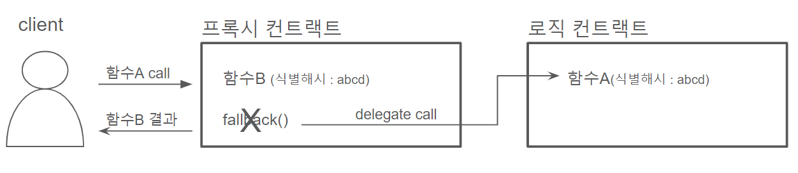

# 업그레이더블 컨트랙트


업그레이더블 컨트랙트(upgradeable contract)란 저장된 데이터는 그대로 유지된 채, 기능 로직이 수정 가능한 컨트랙트를 의미한다. 

일반적으로 스마트 컨트랙트는 한 번 배포된 이상 수정이 불가능한 것으로 알려져있다. 실제로도 이더리움에서는 모든 트랜잭션은 불변(immutable)하기에, 배포된 컨트랙트 자체는 수정할 수 없다. 때문에 전통적인 패턴으로는 배포된 컨트랙트에 대해서는 기능의 추가, 버그 수정이 불가능하다. 컨트랙트의 수정이 불가피할 경우에는 새로운 컨트랙트를 배포하고, 이전 컨트랙트의 정보를 다시 저장시킨 후, 새로운 컨트랙트를 사용하는 수 밖에 없다.

이러한 한계를 극복하기 위해 프록시 패턴을 사용하여 컨트랙트를 업그레이드 가능하도록 배포하는 방안이 제안되었다. 


## 기본 원리

우선, 프록시란 클라이언트가 사용하려는 실제 대상인 것처럼 위장해서 요청을 받는 대리인을 의미한다. 프록시는 요청의 일부 부가기능만을 수행하고, 최종적으로 타겟에게 요청을 위임하는 구조를 가진다. 

업그레이더블 컨트랙트란 데이터 저장을 담당하는 프록시 컨트랙트를 두고, 실제 기능 수행은 별도의 타겟 컨트랙트에게 위임하는 컨트랙트를 의미한다. 프록시 컨트랙트는 타겟 컨트랙의 주소를 저장해두고, 사용자의 요청이 올 때마다 해당 주소에게 요청을 위임시킨다. 만약, 로직의 변경이 필요한 경우에는 로직 컨트랙트만을 새로 배포한 후에, 프록시 컨트랙트가 가지고 있는 타겟의 주소를 새 컨트랙트의 주소로 변경해준다. 클라이언트 입장에서는 자신이 바라보고 있는 컨트랙트의 주소와 내부 정보의 변동 없이, 새로운 로직을 사용할 수 있다.


이때, '데이터 저장은 프록시 컨트랙트에 하고, 실제 기능 수행은 타겟 컨트랙트에게 위임' 할 수 있게 해주는 것이 `delegatecall`이다.

`delegatecall`은 이더리움의 opcode 중 하나로, **다른 컨트랙트의 코드를 사용하되 실행 환경(Context)은 기존 컨트랙트에서 수행**될 수 있도록 한다. 예를 들어, A 컨트랙트가 B 컨트랙트를 호출할 때, `delegatecall`을 이용하게 되면 B 컨트랙트의 Code를 사용하지만, Storage는 A 컨트랙트를 사용하게 된다. 트랜잭션 실행의 컨텍스트(Context)가 그대로 유지되는것이 `delegatecall`의 핵심이다.


:bulb: account 기본 구조

- nonce :  EOA에서 보내진 트랜잭션 갯수를 세는 지표
- balance : 이 주소가 가지는 있는 이더(웨이) 수량
- storageRoot(storage hash) : 계정 저장 공간을 인코딩하는 머클 트리의 루트 노드 해시값
- code hash : 계정이 가지는 EVM에서의 실행 코드를 나타내는 해시값


이처럼 deletecall를 이용한 프록시 패턴이 업그레이더블 컨트랙트를 구현하는 기본 개념이다.


## 프록시 패턴에서 발생하는 문제들

프록시 패턴을 사용할 때, 일반적인 컨트랙트 개발과 동일하게 개발한다면 몇가지 문제들이 발생한다.


### 초기화 문제

프록시 패턴에서는 로직 컨트랙트의 초기 상태를 설정할 때, `constructor()`을 사용할 수 없다.

`constructor()`는 컨트랙트가 배포될 때 단 한 번만 실행되며, 이미 배포된 컨트랙트는 constructor 관련 정보를 가지고 있지 않는다. 프록시 컨트랙트는 이미 배포된 상태의 로직 컨트랙트를 바라보기 때문에, 프록시 컨트랙트에서 로직 컨트랙트의 `construct()`를 실행시킬 방법은 없다. 

또한, 데이터 저장은 프록시 컨트랙트에 해야하는 로직 컨트랙트 입장에서, 프록시 컨트랙트에 연결되기 이전에 초기 상태를 설정하는 것은 아무런 의미도 없다.


### 충돌문제

프록시 패턴에서는 3가지의 충돌 문제가 발생할 수 있다.


#### case 1. 프록시의 변수와 로직 컨트랙트의 변수간 슬롯 충돌

솔리디티는 컨트랙트의 변수를 **선언된 순서에 맞춰서 스토리지 공간에 저장**한다. 예를 들어, 첫번째 변수는 스토리지의 첫번째 slot에 배정되며, 두번째 변수는 두번째 slot에 배정되는 식이다. (단, 동적 변수는 예외적으로 해시된 위치의 스토리지 슬롯에 배정)

따라서, 기능 컨트랙트가 내부 변수를 가지고 있는 경우, 프록시의 기능 컨트랙트 주소를 저장하는 변수와 충돌이 발생하게 된다.


#### case 2. 로직 컨트랙트 업그레이드 시, 슬롯 충돌

두번째로, 이전 버전의 로직 컨트랙트와 업그레이드된 새로운 버전의 로직 컨트랙트의 스토리지 충돌 가능성이 있다. 예를 들어서, 기존의 로직 컨트랙트는 변수1, 변수2, 변수3을 가지고 있었고, 새로운 버전의 로직 컨트랙에 변수 하나가 추가된다고 해보자.이때 기존의 변수들 다음에 선언되면 기존 버전과 슬롯이 충돌나지 않지만, 변수간 선언 순서가 섞이게 된다면 슬롯 충돌이 발생한다.


#### case 3. 프록시 컨트랙트와 로직 컨트랙트 간의 함수 충돌  (proxy selector clashing)

마지막으로 프록시 컨트랙트와 로직 컨트랙트 간 함수 레벨에서 충돌이 발생하는 경우가 존재한다. 

프록시에서 타겟 컨트랙트에 로직을 위임할 때 로직별 위임 함수를 작성하는 것이 아닌, `fallback` 함수를 통해 `delegatecall`를 호출하는 방식을 사용한다. 프록시 컨트랙트에 존재하지 않는 함수 식별자를 통해 호출하게 되면, 자연스럽게 `fallback` 함수로 이어져 `delegatecall`로 로직 컨트랙트의 함수를 호출하게 되는것이다.

```solidity
// SPDX-License-Identifier: MIT
// OpenZeppelin Contracts (last updated v5.0.0) (proxy/Proxy.sol)

function _fallback() internal virtual {
    _delegate(_implementation());
}
```

그런데 만약 EVM이 인식하기에 기능 컨트랙트의 함수와 같은 함수가 프록시에 존재할 경우, fallback을 통한 위임이 아닌 프록시의 함수가 수행된다. 특히 EVM은 함수를 식별할 때, 함수 시그니처를 해싱한 후 앞 4바이트만 사용하기에 이러한 경우는 꽤나 빈번하게 발생할 수 있다. 같은 컨트랙트 내부에서는 솔리디티 컴파일리가 함수의 충돌을 방지하지만, 프록시와 타겟 컨트랙트는 별도의 컨트랙트임으로 함수명과 파라미터등이 다른 경우에도 얼마든지 충돌이 발생할 수 있다.




## 구현

이러한 문제점들을 방지하기 위해서는 다음의 사항들을 고려하며 컨트랙트들을 구현해야 한다.


### 초기화 함수

프록시 패턴에서는 constructor의 역할을 초기화 함수 (initialize)에게 맡긴다. 초기화 함수를 통해서 로직 컨트랙트의 초기 상태를 프록시에 저장할 수 있도록 한다. 이때 초기화 함수는 `initializer` modifier를 적용시켜, **배포 버전당 단 한 번만 실행**되는 것을 보장해야 한다. 이 구조는 각 버전 내에서의 재실행을 방지하지만, 로직 컨트랙트의 업그레이드가 초기화를 추가적으로 필요로하는 경우 새로운 초기화 단계를 생성할 수 있도록 한다.


### EIP-1967(Standard Proxy Storage Slots)

프록시의 변수와 로직 컨트랙트의 변수간 슬롯 충돌을 방지하게 위해 EIP-1967은 스토리지 슬롯을 순차적인 방식이 아닌 **슬롯을 랜덤에 가깝게(pseudo-random) 배정**하는 방식을 사용한다. 프록시의 변수를 `keccak256({변수명})-1` (변수의 이름을 keccak256으로 해싱한 후 1을 뺀 값)의 슬롯에 직접적으로 배정한다. keccak256 해시값을 슬롯 위치로 사용한다면, 슬롯이 충돌할 확률을 무시 가능할 정도로 낮기에 충돌 방지를 보장할 수 있게 된다. 

:memo: [참고] 1을 빼는 이유

keccak256 해시값은 유사 난수이기 때문에, account에서 keccak256을 사용해서 슬롯을 배정을 하고 있었다면 슬롯이 충돌될 가능성이 있다. 따라서 결과값에서 1을 뺌으로써 역상이 없는 난수를 만들어 충돌할 가능성을 없앤다. 


### 상속

로직 컨트랙의 버전간 슬롯 충돌을 방지하기 위해서는, 버전을 업그레이드할 때 1.기존 변수들의 순서를 유지하고, 2.새로운 변수는 기존 변수들 이후에 선언되어야 한다. 이 룰을 지키면서 차기 버전의 컨트랙트를 개발하는 방식도 있겠지만 상속을 활용한다면 무의식적인 실수를 방지할 수 있다. 솔리디티의 상속은 상태 변수 간의 순서를 유지하여, 이를 활용한다면 업그레이드 전반에 걸쳐 storage layout을 일관성있게 유지하게 해준다.


### Transparent 패턴 /  UUPS 패턴

proxy selector clashing 문제를 막기 위해서, 호출한 계정의 권한에 따라서 호출 가능한 함수를 분리시키는 방법을 사용한다.


우선, Transparent 패턴은 `msg.sender`를 키로 사용하여 프록시에서 함수를 사용할지 로직에서 함수를 사용할지를 결정한다. 만약 `msg.sender`가 프록시의 관리자 주소와 같다면, `delegatecall`에 의해 함수가 호출되지 않는다. 만약 `msg.sender`가 관리자 주소이 아니라면, 프록시는 `delegatecall`만 사용하고 프록시에 정의된 다른 함수는 사용하지 않는다. 


UUPS도 동일한 방식으로 `msg.sender`를 키로 사용한다. 유일한 차이점은 **로직 컨트랙트를 업그레이드하는 함수를 어디에 두느냐**이다. 

Transparant proxy Pattern에서는 업그레이드 함수가 프록시에 둔다. 따라서, 로직 컨트랙트를 변경하는 방식은 업그레이드와 상관 없이 변하지 않는다.

반대로 UUPS에서는 업그레이드하는 함수가 로직 컨트랙트에 구현되어 있다. 이로 인해 업그레이드 매커니즘이 시간이 지남에 따라 변경될 수 있다. 특히, **새로운 버전의 로직 컨트랙트가 업그레이드 매커니즘을 포함하지 않는다면, 더 이상 업그레이드를 할 수 없는 상태가 되어버린다**. 


이 두가지 패턴 중에서 UUPS 패턴이 더 권장된다. 업그레이더블이 가지는 버그와 기능 수정의 장점을 가지면서도, 일정 단계 이후에는 절대 변하지 않음을 보장할 수 있기 때문이다. 다만, 이 패턴을 사용할 때에는 업그레이드 옵션을 실수로 제거하지 않도록 신중한 주의가 필요하다. 


## 응용

추가적으로, 프록시 패턴을 응용해서 나올 수 있는 형태들에 대해서 알아보겠다.


### 로직 컨트랙트 재사용

프록시 패턴에서 로직 컨트랙트는 재사용이 가능하다. 여러 개의 프록시 컨트랙트들이 하나의 로직 컨트랙들을 바라보게 할 수 있다. 이러한 구조는 ERC-20, ERC-1400과 같인 토큰을 발행하는 경우처럼, 로직은 고정되어 있고 서로 다른 토큰들만 만들어내는 상황에서 유용하게 사용된다. 


### 비콘[^1]  프록시 (Beacon Proxy) 패턴

로직 컨트랙트를 재사용할 때, 각각의 프록시마다 로직 컨트랙트의 주소를 직접적으로 소유하게 된다면, 로직 컨트랙트를 업그레이할 때 모든 프록시들이 바라보는 주소를 하나씩 변경해야 한다. 해당 로직 프록시를 바라보는 프록시들이 많을 때에는 단순히 주소를 변경하는 것에도 많은 시간과 gas 비용이 발생할 것이다.

비콘 프록시 패턴에서는 로직 컨트랙트의 주소를 비콘 컨트랙트에 저장해두고, 프록시들은 비콘 컨트랙트로부터 로직 컨트랙트의 주소를 받아와서 호출하게 된다. 따라서, 비콘 컨트랙트 내의 주소만 변경하면, 프록시들이 바라보는 로직 컨트랙트의 주소를 한번에 변경할 수 있다. 

[^1]: 항공·항해·교통의 표지 및 신호


단, 매번 비콘 컨트랙트로부터 로직 컨트랙트의 주소를 받아와야 하므로, 성능과 gas 상의 비효율이 발생한다. 


## 참고자료

- rareskills,EIP 1967 Storage Slots for Proxies,https://www.rareskills.io/post/erc1967

- Eszymi,Proxy — Transparent Proxy Pattern & UUPS, https://medium.com/coinmonks/transparent-proxy-pattern-uups-d7416916789f
- Aiden Park,[업그레이더블 컨트랙트 씨-리즈],https://medium.com/@aiden.p/%EC%97%85%EA%B7%B8%EB%A0%88%EC%9D%B4%EB%8D%94%EB%B8%94-%EC%BB%A8%ED%8A%B8%EB%9E%99%ED%8A%B8-%EC%94%A8-%EB%A6%AC%EC%A6%88-part-1-%EC%97%85%EA%B7%B8%EB%A0%88%EC%9D%B4%EB%8D%94%EB%B8%94-%EC%BB%A8%ED%8A%B8%EB%9E%99%ED%8A%B8%EB%9E%80-b433225ebf58
